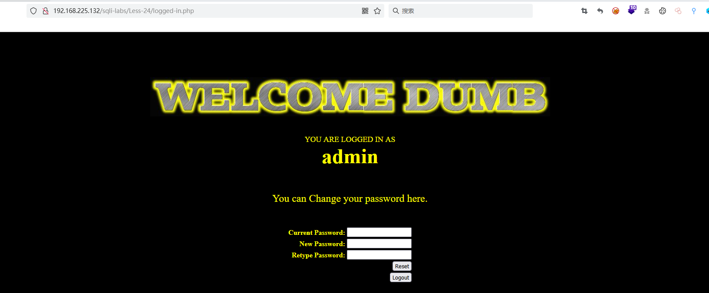
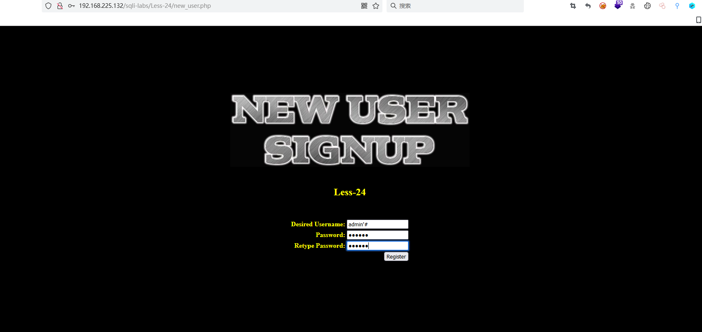
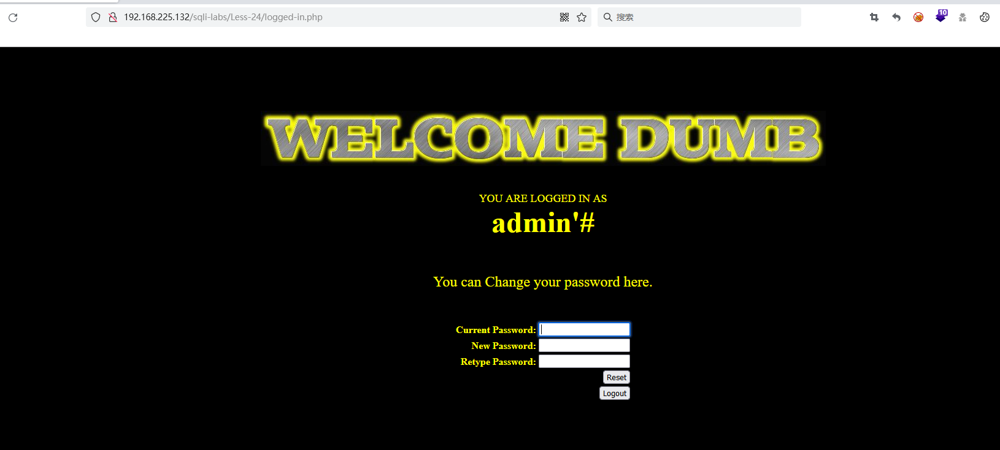
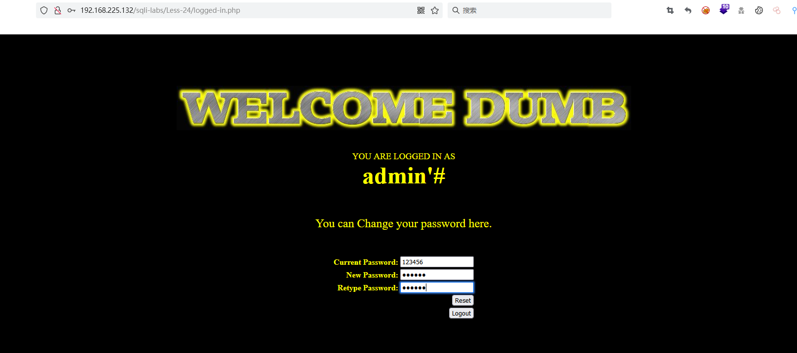
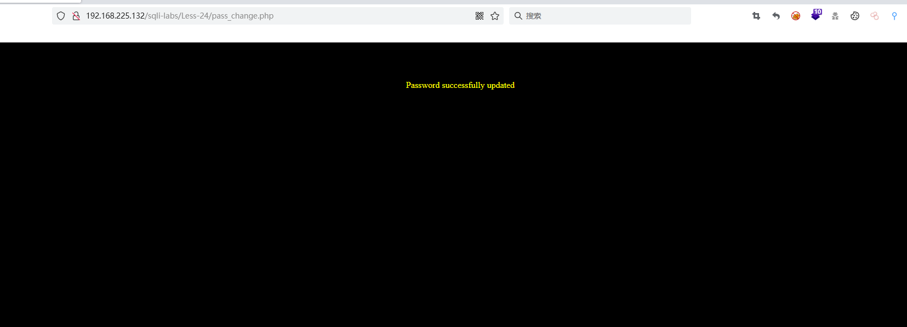
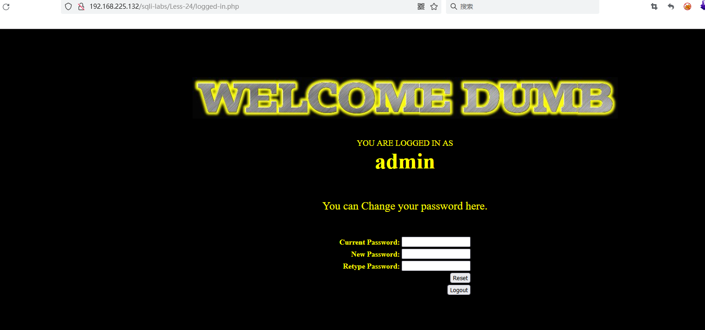
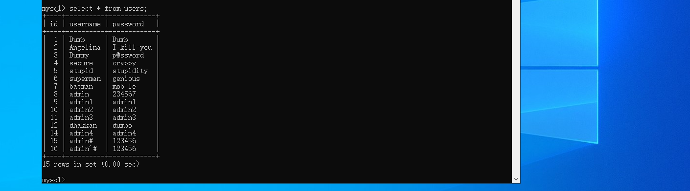

# Less - 24

---

# 通关教程

---

## 1、判断注入点

---

输入用户名和密码，登入后会显示你的用户名，下面的输入框就是改密码

​​

在输入用户名和密码的位置试了很多次，发现用户名和密码的位置是没有注入点的。这里我们先点击右下角的 New User click here，创建一个admin'#的账户，密码为123456

​​

​​

回到主页面后，使用创建的admin'#账户进行登入

​                      

在这里更改admin的密码，将123456改为234567

​​

​​

这时我们再回到主页面，发现我们可以使用234567登入admin的账户

​​

​​

```bash
-- 开始注入，我们在这里，如果注册了一个账户admin
  username= admin'#  curr_pass=123456   
-- 并进行，修改密码
	pass = 234567

-- 开始执行修改操作
  "UPDATE users SET PASSWORD='234567' where username='admin'#' and passwoorrd ='123456 ";
 -- 注：csdn有审计，过滤password，这里的passwoorrd相对于password

-- 实际执行，看似我们是修改admin'#,实际上是修改了admin的密码
  "UPDATE users SET PASSWORD='234567' where username='admin'
```

‍
